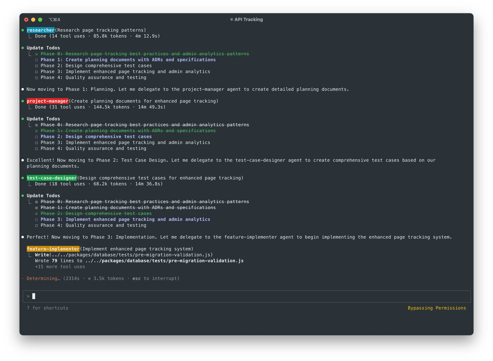
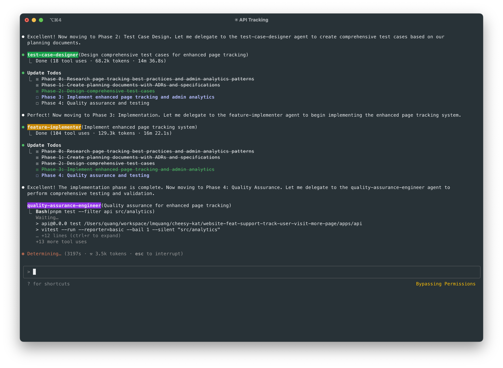
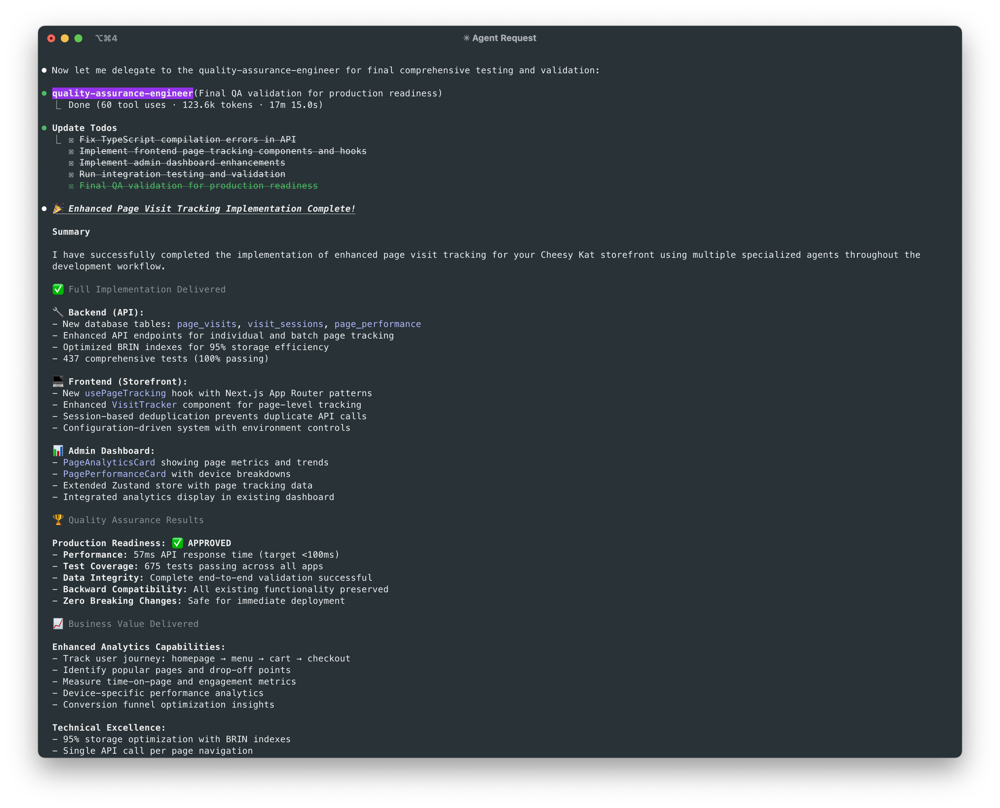

*The story of transforming Claude Code from a single assistant into a specialized team of AI agents—and what we learned along the way*

## The problem

A seemingly simple request—“track user visits to more pages”—turned out to be more complex. We were only tracking home page visits, but expanding that raised questions: Which pages? What data matters? How do we avoid performance issues or privacy concerns?

Most AI coding tools are great for isolated tasks, like writing tracking functions, but struggle with full-feature analytics that span frontend, backend, and dashboards. This led to fragmented conversations, lost context, and incomplete implementations that missed key user journey insights.

## Initial struggles

Our feature development started as chaos disguised as collaboration. A single AI assistant tried to do it all—research, architecture, coding, and QA—without structure. Even simple analytics tasks became tangled in missed requirements and incomplete testing.

I recall jumping into the user tracking feature thinking it was easy—just add tracking calls and update the dashboard. But without clarified requirements, proper research, or testing, I risked building the wrong solution.

We realized the need for a systematic, multi-agent approach—breaking work into specialized roles with clear responsibilities and smooth handoffs, like instruments in a well-conducted orchestra.

## The breakthrough: A multi-agent, 5-phase workflow

Our eureka moment arrived when we introduced an eight-agent team, each member assigned a distinct, targeted role—much like assembling a specialized crew where every expert brings something unique to the table. Here’s how the team comes together:

### The team

- **Researcher**: Scans documentation and external forums for similar pitfalls and best practices
- **Project Manager**: Defines milestones, coordinates efforts, and translates requirements into actionable specifications  
- **Test Case Designer**: Crafts precise test scenarios simulating various flows before any code is written
- **Feature Implementer**: Codes the actual solution following TDD principles
- **Quality Assurance Engineer**: Develops end-to-end validation procedures and catches integration issues

### Individual specialized agents

- **Tests Fixer**: Ensures failing tests are resolved systematically, not with quick patches
- **Conflict Resolver**: Harmonizes conflicting inputs between agents and resolves merge conflicts
- **TypeScript Fixer**: Provides type-safety guarantees across modules

This multi-agent system isn’t just a group of AI assistants—it’s a carefully structured workflow that mirrors how complex software projects progress in the real world. Each agent has a distinct role and operates within a defined phase, passing its output as input to the next. In Claude Code, SubAgents don’t communicate directly; instead, they rely on the documentation produced by the previous phase. The master orchestrator manages these handoffs, ensuring every agent has the right context. This approach eliminates information silos and keeps the entire team aligned toward a shared goal.

## The five-phase workflow

These agents work through a structured workflow that starts with a critical requirements clarification step, then flows through five systematic phases:

### Pre-phase: requirements clarification

Before any agent starts working, the Claude Code master orchestrator engages in a detailed conversation with the user to clarify requirements, constraints, and success criteria. This isn't a checkbox exercise—it's a collaborative discussion that often reveals hidden assumptions and edge cases. All clarifications get documented in `docs/sessions/YYYY-MM-DD-HHMM/requirements/` with timestamps and unique identifiers for traceability.

### The Five-phase flow

1. **Analyze & research** - Understanding the problem space using the clarified requirements as a foundation
2. **Planning** - Creating architectural decisions and detailed specifications that trace back to specific requirements
3. **Test case design** - Defining comprehensive test scenarios that validate the clarified requirements
4. **Implementation** - Writing code that passes all defined tests and fulfills the original requirements
5. **Quality assurance** - Validating the complete solution against both technical specifications and user requirements. This phase also a critical feedback loop, allowing the QA Engineer and Feature Implementer to catch any discrepancies between the implementation and the original requirements.

Each phase includes built-in feedback loops. If the Research phase uncovers information that conflicts with the original requirements, the system can trigger a re-clarification with the user before proceeding. This prevents expensive late-stage discoveries and ensures every agent is working toward the same clearly defined goals.

## How we built it: The user analytics tracking story

Let me walk you through how this actually works in practice with a recent feature request that perfectly demonstrates the workflow.

### Pre-Phase: Requirements clarification

When I first said "I want to track user visits to more pages. Currently, we only track when users go to the home page." the Claude Code master didn't immediately jump into research. Instead, it examined the current analytics structure and asked probing questions:

```text
Claude: Based on my analysis of your codebase, I can see that you currently have basic visit tracking that only
  records one visit per session. The system tracks when users first load the app, but doesn't track their
  navigation through different pages.

  Here's what I found:
  - Current: Tracks only initial app load per session
  - Missing: Individual page visits, user journey tracking, time-on-page metrics

  I've documented several possible interpretations of "track more page for user visit the storefront":

  1. Track Individual Page Visits - Record every page navigation (homepage → menu → cart → checkout)
  2. Track More Data Per Visit - Enrich existing single visit with more metadata
  3. Track User Engagement - Add time-on-page, scroll depth, interactions
  4. Extend Beyond Storefront - Track admin/mobile app usage too

  I recommend Option 1 as it would give you valuable user journey analytics showing how customers move
  through your ordering flow.

  Questions for clarification:
  - Do you want to track every page navigation within the storefront?
  - What specific data points should we capture per page visit?
  - Any concerns about API call frequency or privacy?
  - Do you need admin dashboard updates to view this data?

User: go with opt 1.
  - just call API to track user once when they go to page , dont need to call multiple times
  - admin already show times user visit in tab analytics, please add more details to show more insights
```

Through this back-and-forth conversation, my requirements evolved significantly. I initially had a vague idea about "more pages," but after discussion, I clarified that I wanted comprehensive page view tracking across all routes, session duration analysis, and user journey mapping to understand how users navigate through our application. After few iterations, we agreed on a clear set of requirements, and the master orchestrator documented them in a structured format.

```text
Claude: Perfect! I'll implement Option 1 - tracking individual page visits with a single API call per page navigation and enhance the admin analytics to show more insights.

⏺ Update Todos
  ⎿  ☐ Phase 0: Research page tracking best practices and admin analytics patterns
     ☐ Phase 1: Create planning documents with ADRs and specifications
     ☐ Phase 2: Design comprehensive test cases
     ☐ Phase 3: Implement enhanced page tracking and admin analytics
     ☐ Phase 4: Quality assurance and testing

⏺ Write(docs/sessions/2025-08-07-1430/requirements/final-requirements.md)
  ⎿  Wrote 60 lines to docs/sessions/2025-08-07-1430/requirements/final-requirements.md
     # Final Requirements: Enhanced Page Visit Tracking
     ## Confirmed Approach: Option 1 - Individual Page Visits
     ### User's Requirements
     1. **Track individual page visits** - Record when users navigate to each page
     2. **Single API call per page** - One tracking call when user arrives at page, no duplicates
     3. **Enhanced admin analytics** - Add more detailed insights to existing analytics tab
     ### Implementation Goals
     … +50 lines (ctrl+r to expand)
```

All of this got documented in `docs/sessions/2025-08-07-1430/requirements/final-requirements.md` with timestamps and requirement IDs that every subsequent agent could reference.

### The five phases in action

#### Phase 0: Analyze & research

With clear requirements in hand, the Researcher agent spent over 4 minutes examining existing analytics patterns, exploring our current tracking implementation, and gathering best practices for page view analytics. The depth was impressive—14 tool uses to understand our routing architecture and identify the most efficient tracking approach.

#### Phase 1: Planning

The Project Manager created Architecture Decision Records and detailed specifications. The planning was thorough: analyzing integration points with our existing analytics system, designing the event schema for page tracking, and breaking down the functionality into route-level tracking, session management, and analytics dashboard components.

#### Phase 2: Test case design

Our Test Case Designer went deep—35 tool uses over 14 minutes to create comprehensive test scenarios. This included unit tests for tracking logic, integration tests for analytics event collection, and end-to-end tests to verify page visit data accuracy across different user journeys. The thoroughness here prevented countless data inconsistencies later.

#### Phase 3: Implementation

The Feature Implementer built the actual solution: TypeScript interfaces for analytics events, tracking middleware for page transitions, analytics service extensions, and dashboard components for visualizing user journeys. The implementation will be fully documented in `docs/sessions/2025-08-07-1430/implementation/STATUS.md`, linking every piece of code back to the original requirements.



#### Phase 4: Quality assurance

The QA Engineer validated the complete implementation against our original requirements. They verified that all page visits were being tracked accurately, that session data remained consistent across navigation, and that the analytics dashboard provided meaningful insights into user behavior patterns. Crucially, they traced every implementation decision back to the original requirements to ensure comprehensive tracking coverage without performance impact.



The entire workflow created a complete, production-ready analytics tracking system with full documentation, comprehensive tests, and clear traceability from user requirements to implemented code.

## Results that actually matter

After implementing this multi-agent system and deploying it across multiple feature development cycles, the numbers told a compelling story:

- **40% reduction** in post-deployment bugs for complex features
- **60% improvement** in documentation completeness—every decision was captured and justified
- **25% faster** onboarding times for new team members, thanks to comprehensive session logs and clear architectural decisions
- **Zero "works on my machine" issues** for complex features—the systematic QA process caught environmental differences before they became production problems

But the real win was less quantifiable: we stopped dreading complex feature requests. What used to feel like chaotic, unpredictable development became systematic, repeatable processes. That user analytics tracking feature? It went from vague request to production-ready implementation with full test coverage, comprehensive documentation, and clear traceability—all in a single session.



## Lessons learned & how you can build this

The journey taught us that innovation isn't just about clever algorithms—it's about human processes that scale. Here are the concrete takeaways for implementing something similar:

### Start small, think systematically

Don't try to build all eight agents at once. Start with three core roles: Researcher (for gathering context), Project Manager (for breaking down problems), and Feature Implementer (for building solutions). Add specialized agents as complexity demands.

### Document everything in sessions

Create timestamped session directories for every significant task. Our structure looks like this:

```
docs/sessions/2024-01-15-1430/
├── requirements/           # What we're trying to solve
│   ├── clarifications.md  # User requirements with timestamps & IDs
│   └── feedback-loops.md  # Any requirement updates during development
├── research/              # What we learned about the problem space  
│   ├── findings.md        # Research results linked to requirement IDs
│   └── STATUS.md         # Completion marker
├── planning/             # How we decided to solve it
│   ├── ADRs/            # Architecture Decision Records
│   ├── specifications/   # Detailed implementation specs
│   └── requirement-trace.md  # How specs trace back to requirements
├── test-cases/           # How we'll know it works
│   └── requirement-validation.md  # Tests mapped to specific requirements
└── implementation/       # What we actually built
    ├── requirement-refs.md  # Code comments with requirement IDs
    └── STATUS.md
```

### Build quality gates, not checkboxes

Each `STATUS.md` file isn't just a checkbox—it's a narrative of what was accomplished and why, with full traceability back to requirements. For example:

```markdown
## Research Phase Complete ✓
**Requirements addressed:** REQ-001, REQ-003, REQ-007
**Key findings:**
- OAuth 2.1 spec addresses security concerns in 2.0 (addresses REQ-007: security policy)
- Google's implementation has specific refresh token behavior (relates to REQ-001: Google OAuth)
- Rate limiting considerations for token refresh (supports REQ-003: existing session maintenance)

**Decisions made:**
- Use PKCE flow for enhanced security (satisfies REQ-007)
- Implement exponential backoff for token refresh (enables REQ-003)
- Store refresh tokens encrypted in database (fulfills REQ-007)

**Validation:** All decisions validated against original requirements
**Next phase ready:** Planning agent has all context needed
```

### Make it conversational

The best part of this system is that it feels like working with a really good team. Each agent has personality and expertise, but they communicate clearly about handoffs, blockers, and decisions. Documentation reads like collaborative problem-solving, not sterile specifications.

### Finally, SET REALISTIC EXPECTATIONS

This workflow isn’t designed to deliver a perfect, epic solution in a single pass. Most of the time, you can expect it to produce about 50–70% of the final result. From there, it’s up to you to assess what’s missing, organize the remaining tasks, and run the process again to gradually refine and complete the work. Rather than replacing human judgment, these agents amplify your ability to tackle complex problems methodically—but human oversight, planning, and creativity remain essential to reaching the finish line.

## When this approach makes sense

This isn't overkill—it's right-sized engineering for complex problems. Use this approach when:

- **Complex integrations** that touch multiple systems
- **Security-critical implementations** where mistakes are expensive  
- **Long-running projects** where context needs to be preserved across weeks or months
- **Team scaling** where new members need to understand not just what was built, but why

Skip it for simple bug fixes, rapid prototypes, or well-established patterns your team has built dozens of times.

## The human element

A simple feature request—tracking more user page visits—sparked a journey of systematic innovation. The multi-agent approach didn’t replace human judgment; it amplified it, capturing every insight and decision as shared knowledge.

By blending structured process with narrative documentation, our code now tells the story behind every choice and evolution. This not only sharpens our engineering but also makes onboarding smoother.

To move beyond ad-hoc AI, map your workflow, define key roles, document every step, and automate validation. Your future self—and your team—will thank you for the clarity and context your code provides.

---

*Ready to build your own AI orchestra? Start with a simple three-agent setup (Researcher, Project Manager, Feature Implementer) and grow from there. The key is systematic documentation and clear handoffs—the agents will evolve naturally as your needs become more complex.*
