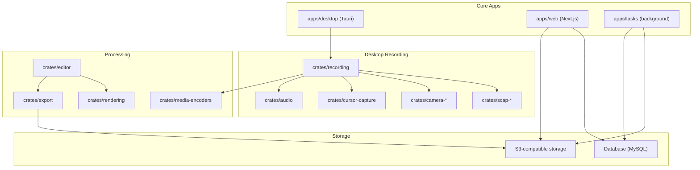
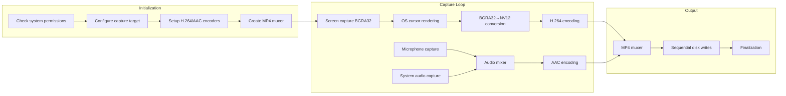

[Cap](https://github.com/CapSoftware/Cap) is an open-source, cross-platform screen recording system. It provides desktop and web apps for recording, editing, and sharing videos. All components are modular and can be self-hosted.

This documentation is a technical breakdown of Cap's Instant mode screen recording implementation. It describes the architecture, performance characteristics, and trade-offs made in the current implementation.


## Components

Cap is organized as a monorepo with two main types of components:

**Apps** — TypeScript/JavaScript applications that provide user interfaces and services:
- **apps/web** — Next.js 14 web application (sharing, management, dashboard).
- **apps/desktop** — Tauri v2 desktop app (recording, editing) with SolidJS.
- **apps/tasks** — Background processing service for AI and post-processing.

**Crates** — Rust libraries that handle performance-critical operations:
- **crates/recording** — Core recording functionality and pipeline management.
- **crates/camera*** — Platform-specific camera capture implementations.
- **crates/scap-*** — Screen capture implementations (ScreenCaptureKit, Direct3D, etc.).
- **crates/media-encoders** — Video/audio encoding modules with hardware acceleration.
- **crates/rendering** — Video rendering and compositing engine.
- **crates/editor** — Non-destructive editing system for advanced recording modes.
- **crates/export** — Output generation in various formats (MP4, GIF, WebM).
- **crates/cursor-capture** — Cursor movement and click tracking.

This architecture separates performance-critical capture/processing (Rust) from user interface logic (TypeScript).

Note: The architecture shows all available components. Instant mode uses a subset of these - specifically, it does not use the camera crate or the cursor-capture crate (which provides advanced cursor tracking for other modes). Instant mode embeds the cursor directly via OS APIs.

### Architecture



## Instant Screen Recording

Instant mode produces a single MP4 file that can be played immediately. While the file requires no post-processing for playback, standard MP4 editing tools can be used for trimming, cropping, or other modifications. This mode trades built-in editing features for reduced complexity and faster file availability.

### Recording Flow

The instant recording pipeline consists of three phases:



This high-level flow is implemented through platform-specific capture APIs that provide the raw frames for processing.

### Platform-Specific Capture Implementation

```rust
// crates/recording/src/sources/screen_capture/mod.rs
#[cfg(windows)]
mod windows;  // Windows.Graphics.Capture
#[cfg(target_os = "macos")]
mod macos;    // ScreenCaptureKit
```

**macOS (ScreenCaptureKit)**:
- Unified API for screen + system audio
- Native cursor compositing
- Display stream capability up to 120fps (instant mode uses 30fps)
- Typical latency: 16-20ms (measured via custom timestamps)

**Windows (Windows.Graphics.Capture)**:
- Direct3D11 capture pipeline
- Separate WASAPI for audio loopback
- Manual cursor rendering
- GPU-accelerated color conversion

Both platforms capture frames in BGRA32 format, which includes the desktop content and cursor. The following section details how these visual elements are processed.

### Image Recording

The image recording subsystem handles three critical aspects: cursor capture, pixel format conversion, and resolution management.

#### Cursor Capture

Instant mode embeds the cursor directly into the video frames during capture:

```rust
// Instant mode: force_show_cursor = true
create_screen_capture(&inputs.capture_target, true, 30, system_audio.0, start_time)
```

**Platform differences**:
- **macOS (ScreenCaptureKit)**: 
  - Cursor composited natively by the OS
  - Hardware-accelerated rendering
  - No additional CPU overhead
  - Captures at display refresh rate (but instant mode samples at 30fps)
  
- **Windows (Direct3D11)**:
  - Manual cursor rendering required
  - Cursor image fetched separately
  - Composited during BGRA→NV12 conversion
  - May show slight lag on high-refresh displays

**Trade-offs of embedded cursor**:
- ✅ Frame-accurate sync, no post-processing required
- ❌ Cannot modify cursor after recording (size, visibility, style)

Note: Instant mode prioritizes immediate availability over post-capture cursor editing.

#### Pixel Format Conversion

The captured BGRA32 frames (with cursor already composited) undergo transformation:

1. **Native formats**: OS provides BGRA32 (GPU framebuffer format)
2. **Encoder requirements**: H.264 requires YUV color space (NV12)
3. **Bandwidth reduction**: 
   - BGRA32: 32 bits/pixel (4 bytes)
   - NV12: 12 bits/pixel (1.5 bytes)
   - **Result**: 62.5% size reduction before encoding

4. **Performance at scale**:
   ```
   1080p@30fps BGRA32: 1920×1080×4×30 = 248.832 MB/s (237.3 MiB/s)
   1080p@30fps NV12:   1920×1080×1.5×30 = 93.312 MB/s (89.0 MiB/s)
   ```

**GPU-accelerated conversion**:
```rust
// crates/gpu-converters/src/nv12_rgba/mod.rs
pub struct NV12ToRGBA {
    device: wgpu::Device,
    queue: wgpu::Queue,
    pipeline: wgpu::ComputePipeline,
    bind_group_layout: wgpu::BindGroupLayout,
}
```

The conversion preserves cursor quality while maintaining color accuracy across the frame.

#### Resolution Strategy

While capture happens at native resolution (including high-DPI displays), instant mode applies automatic downscaling when necessary:

1. **Capture resolution**: Always native display resolution
   - 5K iMac: 5120×2880
   - 4K display: 3840×2160
   - Ultrawide: 3440×1440

2. **Encoding resolution** (instant mode):
   - **Fixed**: Maximum 1080p (1920×1080)
   - **Frame rate**: Target 30fps (captures every 33.33ms, may reduce to 24fps under system stress)
   - **Downscaling**: Automatic if source > 1080p

3. **Downscaling pipeline**:
   - GPU compute shaders when available
   - Lanczos/bicubic filtering for sharp text
   - Cursor remains crisp during downscaling
   - Maintains even dimensions (H.264 requirement)

**Cursor considerations during downscaling**:
- High-DPI cursors scaled proportionally
- Sub-pixel positioning preserved
- Animation timing maintained
- Click indicators (if present) scaled appropriately

With the image capture pipeline complete, the next component is the audio recording system that runs in parallel.

### Audio Recording

The audio recording subsystem runs in parallel with video capture, handling multiple responsibilities:

1. **Source Management**: Captures from microphone and/or system audio with platform-specific APIs
2. **Audio Mixing**: Combines multiple sources into a single stereo stream at 48kHz
3. **Buffering Strategy**: Maintains elastic buffers to handle timing variations
4. **AAC Encoding**: Compresses audio to 320 kbps constant bitrate

The following sections detail each component of the audio pipeline.

#### Audio Sources

Instant mode supports two audio sources that can be used individually or combined:

```rust
// Microphone audio (optional)
if let Some(audio) = audio {
    let sink = audio_mixer.sink(*audio.audio_info());
    let source = AudioInputSource::init(audio, sink.tx, SystemTime::now());
    builder.spawn_source("microphone_capture", source);
}

// System audio (optional)
if let Some(system_audio) = system_audio {
    audio_mixer.add_source(system_audio.1, system_audio.0);
}
```

**Microphone capture**:
- **Sample format**: Float32 PCM
- **Sample rate**: 48kHz (industry standard for digital audio; resampled if necessary)
- **Channels**: Mono or stereo based on device
- **Buffer depth**: 64 slots for queuing (~83ms at 48kHz, balances latency vs. reliability)
- **Processing**: Noise suppression available

**System audio capture**:
- **macOS**: Captured via ScreenCaptureKit alongside video
  - Zero additional latency
  - Synchronized with screen content
  - Requires screen recording permission only
  
- **Windows**: WASAPI loopback capture
  - Separate API from screen capture
  - ~10-20ms additional latency (1-2 video frames at 30fps)
  - Requires explicit alignment with video
  - May need additional permissions

#### Audio Mixing

The `AudioMixer` combines multiple sources into a single stream:

```rust
pub struct AudioMixer {
    sources: Vec<AudioSource>,
    output_tx: Sender<(ffmpeg::frame::Audio, f64)>,
}

// Output configuration
AudioInfo {
    sample_rate: 48000,  // 48kHz: professional audio standard
    channels: 2,         // Stereo output for spatial audio preservation
}
```

**Mixing pipeline**:
1. **Input normalization**: All sources resampled to 48kHz
2. **Channel mapping**: 
   - Mono mic → Stereo (duplicated to both channels)
   - Stereo system audio → Passthrough
3. **Level mixing**: Simple additive mixing (no compression)
4. **Overflow prevention**: Soft clipping at ±1.0 (prevents harsh digital distortion)

#### Audio Buffering

Audio uses elastic buffering to handle timing variations:

```rust
pub struct AudioBuffer {
    pub data: Vec<VecDeque<f32>>,  // Per-channel queues
    pub frame_size: usize,         // 1024 samples (AAC frame requirement)
    config: AudioInfo,
    frame: FFAudio,
}
```

**Buffer management**:
- **Accumulation**: Samples collected until frame_size reached (1024 samples)
- **Timing tolerance**: Can buffer up to 100ms without drops (4,800 samples)
- **Underrun handling**: Inserts silence to maintain sync
- **Overrun handling**: Drops oldest samples (rare)

#### Audio Encoding

Audio is compressed using AAC for broad compatibility:

```rust
// AAC encoder configuration
const OUTPUT_BITRATE: usize = 320 * 1000;  // 320 kbps (high quality, ~2.4MB/min)
const SAMPLE_FORMAT: Sample = Sample::F32(Type::Planar);
```

**Encoding parameters**:
- **Codec**: AAC-LC (Low Complexity)
- **Bitrate**: 320 kbps constant bitrate
- **Frame size**: 1024 samples (21.3ms @ 48kHz - AAC standard frame)
- **Latency**: ~64ms total (3x frame size for buffering + encoding)

Note: 320 kbps chosen for maximum compatibility while maintaining high quality. Variable bitrate (VBR) could reduce file size by 20-30% but was avoided due to compatibility concerns with some video players and streaming services.

**Quality considerations**:
- 320 kbps provides transparency for most content (comparable to streaming services)
- Voice remains clear even with background music
- System sounds preserved without artifacts
- Suitable for professional presentations

With both image and audio capture systems defined, the next major challenge is maintaining synchronization.

### Audio-Video Synchronization

Audio-video synchronization is a critical technical challenge in screen recording. Timing errors exceeding 40ms are perceptible to viewers and degrade the viewing experience.

**Real-world example**: Imagine recording someone waving and saying "Hello!"
```
What happens without proper sync:
┌─────────────┬─────────────┬─────────────┬──────────┬───────────┐
│   0ms       │   33ms      │   66ms      │   100ms  │   133ms   │
├─────────────┼─────────────┼─────────────┼──────────┼───────────┤
│ Video:      │ Hand starts │ Hand mid    │ Hand at  │ Hand      │
│             │ moving      │ wave        │ peak     │ returning │
├─────────────┼─────────────┼─────────────┼──────────┼───────────┤
│ Audio       │ (silence)   │ (silence)   │ "He-"    │ "-llo!"   │
│ (50ms late):│             │             │          │           │
└─────────────┴─────────────┴─────────────┴──────────┴───────────┘

Result: The person appears to speak after their hand wave, creating an unnatural viewing experience.

With proper sync:
┌────────┬─────────────┬─────────────┬─────────────┬─────────────┐
│   0ms  │   33ms      │   66ms      │   100ms     │   133ms     │
├────────┼─────────────┼─────────────┼─────────────┼─────────────┤
│ Video: │ Mouth opens │ Hand starts │ Hand mid    │ Hand at     │
│        │             │ moving      │ wave        │ peak        │
├────────┼─────────────┼─────────────┼─────────────┼─────────────┤
│ Audio: │ "He-"       │ "-llo!"     │ (trailing)  │ (silence)   │
└────────┴─────────────┴─────────────┴─────────────┴─────────────┘

Result: Proper coordination between speech and gesture
```

#### The Synchronization Challenge

Multiple factors make A/V sync difficult in screen recording:

**Independent hardware clocks**:
```
Video clock: Display refresh (60Hz, 120Hz, etc.)
Audio clock: Sample rate oscillator (48kHz ± 0.01%)
System clock: CPU high-resolution timer

Drift example over 1 hour:
- Video: 30fps × 3600s = 108,000 frames expected
- Audio: 48000Hz × 3600s = 172,800,000 samples expected
- With 0.01% clock drift: 17,280 sample difference = 360ms desync
- Cap's correction: Maintains <40ms offset through elastic buffering
```

**Variable capture latencies**:
- Screen capture: 5-20ms (varies by GPU load)
- Microphone: 10-50ms (depends on buffer size)
- System audio: 20-100ms (especially on Windows)
- Network cameras: 100-500ms (USB/compression delays)

#### Master Clock Architecture

Cap uses a video-driven master clock design:

```rust
// Instant recording timing
struct InstantRecordingActorState {
    segment_start_time: f64,  // Wall clock reference
    // Video frames provide timing heartbeat
}

// Fixed video frame intervals
const FRAME_DURATION_30FPS: f64 = 1.0 / 30.0;  // 33.33ms
```

**Why video as master?**
1. **Predictable intervals**: Exactly 33.33ms per frame
2. **User expectation**: Dropped audio less noticeable than frozen video
3. **Simpler pipeline**: Audio can adapt buffer size, video cannot
4. **Display sync**: Aligns with monitor refresh rate

#### Timestamp Management

Each media source maintains its own timestamps, which must be correlated:

```rust
// Video timestamp (from capture)
video_pts = capture_time - recording_start_time

// Audio timestamp calculation
audio_pts = sample_position / sample_rate
// But must align to video frames:
aligned_audio_pts = round(audio_pts / FRAME_DURATION) * FRAME_DURATION
```

**Dual timestamp system**:
```rust
// Wall clock for absolute reference
segment_start_time: f64  // Unix timestamp

// Monotonic clock for relative timing
let elapsed = Instant::now() - start_instant;
let pts = elapsed.as_secs_f64();
```

This prevents system clock adjustments from causing sync issues.

#### Elastic Audio Buffering

Audio uses elastic buffering to adapt to video timing. Here's how it handles our "Hello!" example:

```rust
pub struct AudioBuffer {
    pub data: Vec<VecDeque<f32>>,  // Can grow/shrink
    pub frame_size: usize,         // Target size (1024)
    config: AudioInfo,
}

impl AudioBuffer {
    fn read_frame(&mut self, video_pts: f64) -> Option<AudioFrame> {
        let target_samples = self.samples_for_video_pts(video_pts);
        
        if self.available_samples() < target_samples * 0.8 {
            // Underrun: repeat samples or insert silence
            self.handle_underrun(target_samples)
        } else if self.available_samples() > target_samples * 1.2 {
            // Overrun: drop oldest samples
            self.handle_overrun(target_samples)
        } else {
            // Normal operation
            self.read_samples(target_samples)
        }
    }
}
```

**Example: Processing "Hello!" audio**
```
Video Frame 1 (0ms): Need 1,600 audio samples for 33.33ms
├─ Buffer has 1,500 samples of "He-" sound
├─ Status: Underrun (93%)
└─ Action: Duplicate last 100 samples to fill gap

Video Frame 2 (33ms): Need next 1,600 samples
├─ Buffer has 1,650 samples of "-llo!" 
├─ Status: Normal (103%)
└─ Action: Read exactly 1,600 samples

Video Frame 3 (66ms): Need next 1,600 samples
├─ Buffer has 2,100 samples (mic catching up)
├─ Status: Overrun (131%) 
└─ Action: Drop oldest 500 samples to stay in sync
```

**Buffer dynamics**:
- **Target level**: 21-42ms of audio (1-2 frames)
- **Underrun threshold**: <80% of target
- **Overrun threshold**: >120% of target
- **Adaptation rate**: Gradual to avoid artifacts

#### Platform-Specific Synchronization

**macOS (Unified capture)**:
```objc
// ScreenCaptureKit provides synchronized timestamps
SCStreamHandler {
    didOutputVideoFrame: (frame, timestamp) {
        // Video and audio share same time base
        video_pts = CMTimeGetSeconds(timestamp)
    }
    didOutputAudioData: (data, timestamp) {
        audio_pts = CMTimeGetSeconds(timestamp)
        // Timestamps are pre-synchronized by the OS
    }
}
```

**Windows (Separate APIs)**:
```rust
// Manual synchronization required
let capture_delay = estimate_capture_latency();
let audio_delay = measure_wasapi_latency();

// Correlate using system clock
video_pts = video_capture_time - recording_start;
audio_pts = audio_capture_time - recording_start - (audio_delay - capture_delay);
```

#### Synchronization Quality Metrics

The pipeline monitors sync quality in real-time:

```rust
struct SyncMetrics {
    avg_offset: f64,      // Running average offset
    max_offset: f64,      // Worst case seen
    drift_rate: f64,      // ms/minute
    corrections: u32,     // Number of adjustments
}

// Acceptable thresholds
const MAX_SYNC_ERROR: f64 = 0.040;  // 40ms
const DRIFT_THRESHOLD: f64 = 0.001; // 1ms/minute
```

**Sync preservation strategies**:
1. **Frame dropping policy**: Drop P-frames first, preserve I-frames for seeking
2. **No resampling**: Avoid audio quality loss
3. **Minimal correction**: Small, gradual adjustments (<5ms per second)
4. **Early detection**: Monitor drift continuously

When frames must be dropped:
- P-frames dropped first (minimal visual impact)
- I-frames preserved to maintain seekability
- Audio never dropped (more noticeable than video drops)

#### Muxer Synchronization

The MP4 muxer enforces final synchronization by interleaving audio and video data:

```rust
// Interleaving based on DTS (Decode Time Stamp)
loop {
    let next_video = video_queue.peek();
    let next_audio = audio_queue.peek();
    
    match (next_video, next_audio) {
        (Some(v), Some(a)) => {
            if v.dts <= a.dts {
                write_video_sample(v)?;
                video_queue.pop();
            } else {
                write_audio_sample(a)?;
                audio_queue.pop();
            }
        }
        (Some(v), None) => {
            write_video_sample(v)?;
            video_queue.pop();
        }
        (None, Some(a)) => {
            write_audio_sample(a)?;
            audio_queue.pop();
        }
        (None, None) => break,
    }
}
```

**Example: Muxing the "Hello!" sequence**
```
Queue state during muxing:
┌──────────────────────────────────────────────────────────────┐
│ Video Queue: [V0:0ms] [V1:33ms] [V2:66ms] [V3:100ms]         │
│ Audio Queue: [A0:0ms] [A1:21ms] [A2:42ms] [A3:64ms] [A4:85ms]│
└──────────────────────────────────────────────────────────────┘

Muxing order (by timestamp):
1. Write V0 (0ms)    - Mouth opening
2. Write A0 (0ms)    - "He-" sound begins  
3. Write A1 (21ms)   - "He-" continues
4. Write V1 (33ms)   - Hand starts moving
5. Write A2 (42ms)   - "-llo!" begins
6. Write A3 (64ms)   - "-llo!" continues
7. Write V2 (66ms)   - Hand mid-wave
8. Write A4 (85ms)   - Sound trailing off
9. Write V3 (100ms)  - Hand at peak

Result: Synchronized playback with correct frame interleaving
```

**Edit lists for start alignment**:
```
// If audio starts 50ms late:
Video track: [edts] media_time=0, duration=full
Audio track: [edts] media_time=50ms, duration=full-50ms
```

This aligns playback start for both tracks.

With audio and video streams synchronized, the following section illustrates how the complete recording unfolds over time.

### Screen Recording Timeline

The instant recording pipeline orchestrates multiple parallel activities across a precise timeline. Here's how a typical recording session progresses from start to finish.

#### Recording Timeline Overview

```
Timeline: T+0s      T+1s         T+2s         T+3s         T+60s
          START     Recording... Recording... Recording... STOP
          |         |            |            |            |
          
INITIALIZATION (T-50ms to T+0ms):
├─ Permission check: ~10ms
├─ Display enumeration: ~20ms  
├─ Encoder setup: ~15ms
└─ File creation: ~5ms

FIRST SECOND (T+0ms to T+1000ms):
├─ Frame captures: 30 frames @ 33.33ms intervals
├─ Audio samples: 48,000 samples captured
├─ Processing pipeline fills: ~100ms warmup
├─ First I-frame encoded: T+50ms
└─ First muxed chunk written: T+1000ms

STEADY STATE (T+1s to T+59s):
├─ Consistent 30fps capture (1,740 frames total)
├─ Audio buffer maintains 21-42ms depth
├─ P-frames every 33ms, I-frames every 2s
├─ File grows at 142.7MB/minute (18.7 Mbps + 320 kbps)
└─ CPU usage stable (see Performance Measurement appendix)

FINALIZATION (T+60s to T+60.1s):
├─ Last frame captured: T+60.000s
├─ Encoder flush: ~50ms
├─ Moov atom generation: ~30ms
├─ File handle close: ~20ms
└─ Ready to share: T+60.100s
```

#### Initialization Phase (T-50ms to T+0ms)

Before recording begins, the pipeline performs rapid initialization:

```rust
// Permission and display setup
let display = check_permissions_and_get_display().await?;  // 10-20ms

// Parallel initialization
tokio::join!(
    setup_video_encoder(),     // 15ms
    setup_audio_encoder(),     // 10ms
    create_output_file(),      // 5ms
);

// Start capture sources
let (screen_source, screen_rx) = create_screen_capture(
    &capture_target, 
    true,  // force_show_cursor
    30,    // fps
    system_audio_tx,
    start_time
).await?;
```

**Critical setup tasks**:
- Verify screen recording permissions
- Initialize GPU resources for color conversion
- Allocate encoding buffers
- Create output.mp4 with write streaming enabled

#### First Frame Critical Path (T+0ms to T+50ms)

The first frame establishes timing for the entire recording:

```
T+0ms:    Recording start signal
T+5ms:    Screen capture begins
T+16ms:   First BGRA frame captured (with cursor)
T+20ms:   Color conversion starts (BGRA→NV12)
T+25ms:   NV12 frame ready for encoding
T+35ms:   H.264 encoder produces I-frame
T+40ms:   First audio samples arrive
T+45ms:   Audio buffer begins accumulating
T+50ms:   First encoded frame ready for muxing
```

**First frame importance**:
- Establishes PTS baseline (0.000)
- Creates I-frame for random access
- Larger size (~150KB) vs P-frames (~50KB)
- Sets quality baseline for encoding

#### Steady State Timeline (T+50ms ongoing)

Once initialized, the pipeline operates in a predictable pattern:

```
Every 33.33ms (30fps):
├─ Capture new screen frame
├─ Check audio buffer levels
├─ Encode previous frame
├─ Write completed frames to muxer
└─ Update synchronization metrics

Every 21.33ms (AAC frame):
├─ Accumulate 1024 audio samples
├─ Mix microphone + system audio
├─ Encode AAC frame
└─ Queue for muxing

Every 1 second:
├─ Flush muxer buffer to disk
├─ Update file size metrics
├─ Check disk space remaining
└─ Report health to UI

Every 2 seconds:
└─ Insert H.264 I-frame for seeking
```

#### Parallel Activity Coordination

Multiple threads work simultaneously without blocking:

```
Thread Pool Usage:
┌─────────────────┬─────────────┬─────────────────┬──────────────┐
│ Capture Thread  │ GPU Thread  │ Encoder Thread  │ I/O Thread   │
├─────────────────┼─────────────┼─────────────────┼──────────────┤
│ Screen capture  │ BGRA→NV12   │ H.264 encode    │ MP4 write    │
│ Cursor overlay  │ Downscaling │ AAC encode      │ Disk flush   │
│ Timestamp       │ GPU upload  │ Rate control    │ Stats update │
└─────────────────┴─────────────┴─────────────────┴──────────────┘

Audio Thread:
├─ Microphone capture (continuous)
├─ System audio capture (continuous)  
├─ Mixing and buffering
└─ Drift compensation
```

#### Resource Timeline

System resource usage follows a predictable pattern:

```
CPU Usage Timeline:
0-50ms:   ████████ 25% (initialization spike)
50-1000ms: ████ 10% (warmup)
1s-59s:    ███ 7% (steady state)
59s-60s:   █████ 12% (finalization)

Memory Timeline:
Start:     100MB (buffers allocated)
+10s:      165MB (pipeline filled)
+60s:      165MB (constant - no leaks)

Disk I/O Timeline:
0-1s:      ██ 2.3MB (first chunk + headers)
1s-59s:    ████████ 142.7MB/min (consistent)
59s-60s:   █ 100KB (moov atom)
```

#### Frame Timing Precision

The 30fps cadence must be maintained precisely:

```
Ideal:    0.000  33.333  66.667  100.000  133.333...
Actual:   0.000  33.334  66.668  100.001  133.335...
Drift:    0.000  +0.001  +0.001  +0.001   +0.002...

Correction applied every 60 frames (2 seconds):
- Reset accumulator to prevent drift buildup
- Align to nearest vsync boundary
- Maintain monotonic timestamps
```

#### End-of-Recording Timeline (T+59.9s to T+60.1s)

The finalization phase produces a valid MP4 file:

```
T+59.900s: User clicks stop
T+59.933s: Last frame captured
T+59.950s: Stop signal to all threads
T+59.960s: Audio buffer drained
T+59.970s: Final frames encoded
T+59.980s: Muxer flushes remaining data
T+60.000s: Generate moov atom:
           ├─ Calculate total duration
           ├─ Build seek tables (stss)
           ├─ Create chunk offsets (stco)
           └─ Write track headers
T+60.050s: Rewrite file header (faststart)
T+60.080s: Close file handles
T+60.100s: Signal completion to UI
```

**Finalization completes**:
- All captured frames are encoded
- Audio extends slightly past video (normal)
- Moov atom allows progressive playback
- File is fully seekable
- No partial frames or corruption

With this complete timeline view of the recording process, the synchronized audio and video streams are ready for final encoding and packaging.

### MP4 Muxing Implementation

The `MP4AVAssetWriterEncoder` creates a standard MP4 file with the following structure:

1. **File type box (ftyp)**:
   ```
   - Major brand: mp42
   - Compatible brands: mp42, isom
   - Version: 0
   ```

2. **Media data box (mdat)**:
   - Interleaved samples in decode order
   - Chunk-based organization
   - No random access without moov

3. **Movie box (moov)**:
   - **mvhd**: Movie header (duration, timescale)
   - **trak** (video):
     - tkhd: Track header
     - mdia/minf/stbl: Sample tables
     - stts: Sample timing
     - stss: Sync samples (keyframes)
     - stco: Chunk offsets
   - **trak** (audio):
     - Similar structure for AAC track

4. **Faststart optimization**:
   ```
   Initial: [ftyp][mdat][moov]
   Final:   [ftyp][moov][mdat]  // Enables progressive download
   ```

The faststart optimization allows progressive playback during download.

### Encoding Configuration

Cap uses FFmpeg's codec support with the following configuration for real-time encoding:
```rust
// Hardware encoder selection priority
1. VideoToolbox (macOS)
2. NVENC (NVIDIA)
3. QuickSync (Intel)
4. AMF (AMD)
5. Software x264 (fallback)
```

**H.264 parameters**:
- **Preset**: "ultrafast" (optimized for real-time)
- **Profile**: High (when supported by hardware encoder, falls back to Main)
- **Level**: Auto (based on resolution)
- **B-frames**: 0 (reduce latency)
- **Reference frames**: 3
- **Rate control**: Calculated based on resolution (≈18.7 Mbps for 1080p@30fps)

**AAC parameters**:
- **Sample rate**: 48 kHz
- **Bitrate**: 320 kbps
- **Channels**: Stereo when available, mono fallback
- **Profile**: AAC-LC (Low Complexity)

These encoding parameters balance quality with the performance constraints of real-time capture.

### Performance Characteristics

The instant mode pipeline resource usage is as follows:

| Component | CPU Usage* | Memory | Notes |
|-----------|-----------|---------|-------|
| Screen capture | 1-3% | 20MB | OS-handled |
| BGRA→NV12 | 2-5% | 50MB | GPU when available |
| H.264 encode | 3-8% | 80MB | Hardware accelerated |
| AAC encode | 1-2% | 10MB | Hardware when available |
| MP4 muxing | <1% | 5MB | Sequential writes |

*CPU percentages are estimates and due to parallel execution and shared resources, individual components may not sum to the total in actual measurement.

**Throughput metrics**:
- 1080p@30fps: ~248.8 MB/s raw → 18.7 Mbps encoded
- Audio: 1.5 Mbps raw → 320 kbps encoded

These resource usage levels allow concurrent operation with other applications on typical hardware.

### Error Handling

The instant mode pipeline implements error recovery across all components, prioritizing recording continuity over quality when failures occur.

Errors are logged to system telemetry (when enabled) with the following metrics:
- `dropped_frames_count`
- `audio_underrun_count` 
- `encoder_fallback_count`
- `sync_correction_count`
- `disk_space_warnings`

#### Permission & Initialization Errors

**Screen recording permission denied**:
```rust
// macOS: Direct user to System Preferences
// Windows: Retry with fallback to BitBlt API
match check_screen_permission() {
    Err(PermissionDenied) => {
        show_permission_dialog();
        return Err("Screen recording requires permission");
    }
    Ok(_) => continue,
}
```

**Audio device unavailable**:
```rust
// Continue recording without audio rather than failing
match init_microphone() {
    Err(_) => {
        log_warning("Microphone unavailable, continuing without audio");
        None
    }
    Ok(mic) => Some(mic),
}
```

#### Runtime Capture Errors

**Frame drops and recovery**:
```rust
// Monitor frame timing and adapt
if elapsed > FRAME_DURATION * 1.5 {
    // Missed frame deadline
    stats.dropped_frames += 1;
    
    if stats.dropped_frames > 10 {
        // Persistent issues - reduce capture rate
        reduce_framerate_to_24fps();
    }
} else {
    // Reset counter on successful capture
    stats.dropped_frames = 0;
}
```

**Encoder failures with fallback chain**:
```
1. Try hardware encoder (VideoToolbox/NVENC)
   ↓ Fails (GPU overloaded)
2. Try alternative hardware (QuickSync)
   ↓ Fails (not available)  
3. Fall back to software x264
   ↓ Fails (CPU overloaded)
4. Reduce resolution to 720p and retry
   ↓ Success - continue recording
```

#### Resource Management

**Disk space monitoring**:
```rust
// Check available space every second
fn monitor_disk_space(&self) -> Result<()> {
    let available = get_free_space(&self.output_path)?;
    
    match available {
        0..=100_000_000 => {      // <100MB
            self.stop_recording();
            Err("Insufficient disk space")
        }
        100_000_000..=500_000_000 => {  // 100-500MB (0.7-3.5 minutes at 142.7MB/min)
            self.show_warning("Low disk space");
            self.reduce_quality();  // Switch to lower bitrate
            Ok(())
        }
        _ => Ok(())  // Sufficient space
    }
}
```

**Memory pressure handling**:
```rust
// Adapt buffer sizes based on available memory
let buffer_size = match available_memory() {
    0..=1_000_000_000 => 32,      // <1GB: minimal buffers
    1_000_000_000..=4_000_000_000 => 64,   // 1-4GB: standard
    _ => 128,                      // >4GB: larger buffers
};
```

#### Synchronization Recovery

**Audio drift correction**:
```rust
// Detect and correct audio/video drift
if audio_pts - video_pts > MAX_DRIFT {
    // Audio running ahead
    audio_buffer.drop_samples(drift_samples);
    log_event("Dropped {} audio samples to maintain sync", drift_samples);
} else if video_pts - audio_pts > MAX_DRIFT {
    // Video running ahead  
    audio_buffer.insert_silence(drift_samples);
    log_event("Inserted {} silence samples to maintain sync", drift_samples);
}
```

#### Graceful Degradation Priority

When multiple errors occur, the system follows this degradation hierarchy:

1. **Maintain recording** - Never stop unless critical failure
2. **Preserve video** - Drop audio before dropping video
3. **Reduce quality** - Lower resolution/framerate before failing
4. **Simplify pipeline** - Disable effects, cursor, etc.
5. **Alert user** - Clear indication of degraded state

**Example cascade**:
```
Normal:     1080p30 + audio + cursor → 142.7MB/min
Degraded 1: 1080p24 + audio + cursor → 115MB/min (thermal throttle)
Degraded 2: 720p24 + audio + cursor  → 65MB/min (memory pressure)
Degraded 3: 720p24 + no audio        → 60MB/min (audio failure)
Emergency:  480p15 + no audio        → 20MB/min (critical resources)
```

This error handling strategy maintains recording continuity when possible.

**User-facing error states**:
- Recording indicator changes color (green→yellow→red)
- Toast notifications for degraded quality
- Final recording includes metadata about any quality reductions

### Constraints & Trade-offs

Instant mode implements specific trade-offs to produce recordings that are available immediately with low resource usage.

#### Feature Constraints

**What instant mode CANNOT do**:

| Feature | Why It Is Excluded | Impact |
|---------|-------------------|--------|
| Camera overlay | Requires real-time compositing (+30% CPU) | No picture-in-picture presentations |
| Cursor customization | Cursor baked into frames during capture | Cannot enhance or hide cursor after recording |
| Pause/resume | Implementation choice for simplicity* | Must stop and start new recording |
| Variable quality | Encoders locked during capture | Quality decisions must be made upfront |
| Built-in editing | Not included in instant mode** | Use Studio mode or external tools |
| Multiple audio tracks | Single AAC stream in MP4 | Cannot separate mic/system audio later |

*MP4 supports pause/resume through segment concatenation or edit lists, but instant mode prioritizes one-click simplicity over complex timeline management.

**The MP4 files produced by instant mode are standard format and fully compatible with video editing software (FFmpeg, Adobe Premiere, DaVinci Resolve, etc.). Instant mode omits built-in editing features to maintain simplicity and reduce complexity.

#### Technical Trade-offs

**Performance vs. Flexibility**:
```
Cap Instant Mode:       Traditional Screen Recorders (OBS, etc.):
├─ Single encoding pass         ├─ Capture raw → encode → remux
├─ Direct-to-MP4 muxing         ├─ MKV/FLV → convert to MP4
├─ 5-15% CPU usage (typical)    ├─ 20-40% CPU usage  
├─ 165MB memory                 ├─ 400MB+ memory
├─ Direct MP4 output            ├─ Intermediate format → MP4
└─ Ready in <100ms              └─ Ready in 5-30 seconds
```

**Quality vs. File Size**:
- **Current**: 1080p30 @ 18.7 Mbps video + 320 kbps audio = 142.7 MB/minute
- **Alternative 1**: 4K30 @ 50 Mbps video + 320 kbps audio = 377.4 MB/minute (2.6x larger)
- **Alternative 2**: 1080p60 @ 25 Mbps video + 320 kbps audio = 189.9 MB/minute (1.3x larger)
- **Decision**: 1080p30 balances quality with reasonable file sizes

#### Design Philosophy

The constraints reflect three core principles:

1. **Immediate Availability**
   - No waiting for processing
   - No intermediate files
   - Direct upload capability

2. **Universal Compatibility**
   - Standard MP4 container
   - H.264/AAC codecs work everywhere
   - No special players required

3. **Predictable Performance**
   - Consistent resource usage
   - No surprise CPU spikes
   - Works on modest hardware

#### Ideal Use Cases

**Instant mode excels at**:
- Short demos and explanations (1-10 minutes)
- Bug reports and issue documentation  
- Meeting recordings and presentations
- Social media content (sub-5 minute videos)
- Live troubleshooting sessions
- Educational content without heavy editing needs

**Instant mode struggles with**:
- Long recordings (>30 minutes due to file size)
- Content requiring post-production
- Multi-camera or complex audio setups
- Recordings needing precise editing
- Ultra-high quality requirements (4K/60fps)

These trade-offs target users who need to record and share screen content quickly without post-processing requirements.

## Summary

Cap's instant screen recording mode uses platform-native APIs, GPU acceleration, and synchronization mechanisms to achieve:

- **One-click recording** with no configuration required
- **Low resource usage** (5-10% CPU on M1 Max, 10-15% on i7-12700K)
- **Immediate sharing** with standard MP4 output
- **Professional quality** at 1080p30 with synchronized audio
- **Cross-platform consistency** between macOS and Windows

The single-pass architecture trades post-processing flexibility for reduced latency and simplified implementation. The design prioritizes immediate file availability, universal playback compatibility, and predictable resource usage.

This breakdown examined the instant recording pipeline from permission checks through final MP4 output.

---

*Disclaimer: Additional appendices covering Performance Measurement Methodology, Platform Support & Limitations, Security & Privacy Considerations, and Known Issues have been excluded from this document to keep it focused on the core technical implementation.*
