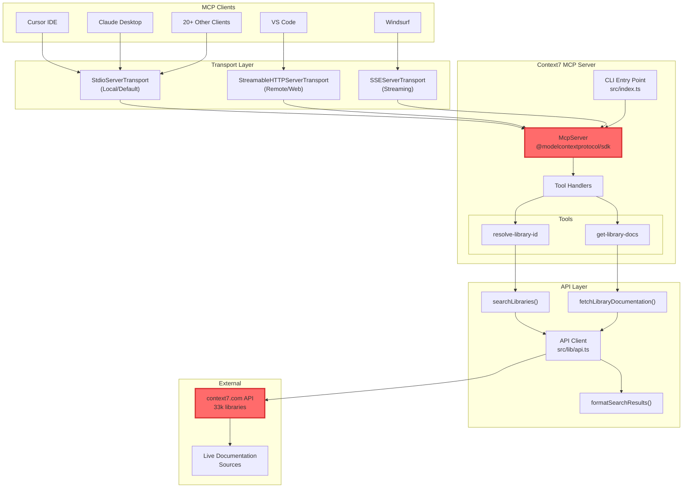
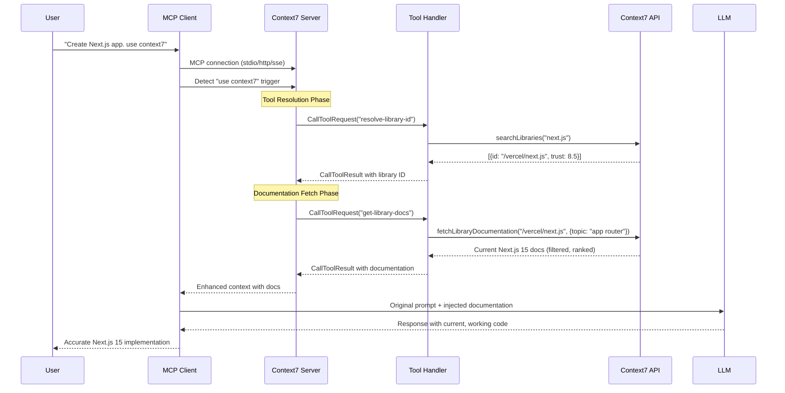

## Overview

Context7 MCP is a Model Context Protocol server that solves one of the most frustrating problems in AI-assisted development: LLMs generating broken code based on outdated documentation. Unlike traditional approaches that rely on stale training data or inefficient documentation scraping, Context7 provides real-time, version-specific documentation injection directly into LLM prompts through the MCP protocol.

### The problem is real

LLMs are trained on data that's months or years old. When you ask Claude or GPT-4 to generate Next.js 15 code, it might confidently produce examples using APIs that were deprecated three versions ago. Even worse, it might hallucinate functions that never existed. Developers waste 15-45 minutes per debugging session fixing these issues - time that compounds across teams and projects.

**Context7's core innovation**: It maintains a continuously updated index of >33k library documentations, pre-processes them for LLM consumption, and injects the exact documentation needed at the moment of code generation. No more broken imports, no more non-existent APIs, no more version mismatches.

### Key technical advances

- **Real-time documentation injection**: Intercepts prompts containing `use context7` and enriches them with current docs
- **Intelligent library resolution**: Converts natural language ("Next.js") to Context7 IDs (`/vercel/next.js`)
- **Token-aware filtering**: Pre-processes docs with proprietary ranking to fit within context windows
- **Multi-transport architecture**: Supports stdio, HTTP, and SSE for different deployment scenarios
- **Zero-configuration activation**: Works with 20+ MCP clients without workflow changes

### Architecture components

**MCP Protocol Layer**:

- `McpServer` instance handling tool registration and request routing
- Two primary tools: `resolve-library-id` and `get-library-docs`
- Zod schema validation for type-safe tool parameters

**Transport Layer**:

- `StdioServerTransport`: Direct process communication (default)
- `StreamableHTTPServerTransport`: RESTful HTTP for remote deployments
- `SSEServerTransport`: Server-Sent Events for real-time streaming

**API Integration Layer**:

- `searchLibraries()`: Library name to ID resolution
- `fetchLibraryDocumentation()`: Documentation retrieval with filtering
- Token management and response formatting

### Real-world impact

**Before Context7**: "Create a Next.js app with app router" → Generic response based on Next.js 12 training data → Broken code → Manual documentation lookup → Trial and error → 30+ minutes wasted

**With Context7**: "Create a Next.js app with app router. use context7" → Real Next.js 15 docs injected → Working code with current APIs → 0 minutes debugging

## How it works

### Architecture overview

Context7 MCP implements a sophisticated pipeline that intercepts LLM prompts, identifies library references, fetches current documentation, and seamlessly injects it into the conversation context.



### Request flow

The magic happens in a carefully orchestrated sequence that takes milliseconds but saves hours of debugging:



### Transport mechanisms

Context7's transport layer adapts to different deployment scenarios:

```typescript
// CLI argument processing
const program = new Command()
  .option("--transport <stdio|http|sse>", "transport type", "stdio")
  .option("--port <number>", "port for HTTP/SSE transport", "3000");

// Transport factory pattern
async function main() {
  const options = program.opts();
  let transport: ServerTransport;

  switch (options.transport) {
    case "stdio":
      transport = new StdioServerTransport(); // Direct process I/O
      break;
    case "http":
      transport = new StreamableHTTPServerTransport(); // RESTful
      server = await startHttpServer(parseInt(options.port));
      break;
    case "sse":
      transport = new SSEServerTransport(); // Real-time streaming
      server = await startSseServer(parseInt(options.port));
      break;
  }

  await mcpServer.connect(transport);
}
```

## Data structures and algorithms

### Core data models

Context7 uses carefully designed data structures to manage library metadata and documentation efficiently:

```typescript
// Library search response structure
interface SearchResponse {
  id: string; // Context7-compatible ID like "/vercel/next.js"
  name: string; // Human-readable name
  description: string; // Library purpose
  codeSnippetsCount: number; // Available examples (quality indicator)
  trustScore: number; // 0-10 authority score
  versions?: string[]; // Available versions
}

// MCP tool schemas with Zod validation
const resolveLibraryIdSchema = z.object({
  libraryName: z.string().describe("Library name to search"),
});

const getLibraryDocsSchema = z.object({
  context7CompatibleLibraryID: z.string().describe("Exact Context7 ID"),
  topic: z.string().optional().describe("Focus area like 'routing', 'hooks'"),
  tokens: z
    .number()
    .optional()
    .default(10000)
    .transform((val) =>
      val < DEFAULT_MINIMUM_TOKENS ? DEFAULT_MINIMUM_TOKENS : val
    ),
});

// Documentation response with metadata
interface DocumentationResponse {
  content: string; // Processed documentation text
  metadata: {
    lastUpdated: string;
    version: string;
    source: string;
  };
  snippets: CodeSnippet[]; // Extracted code examples
  relevanceScore: number; // Proprietary ranking score
}
```

### Library resolution algorithm

The intelligent matching algorithm prioritizes accuracy over fuzzy matching:

```typescript
async function searchLibraries(query: string): Promise<SearchResponse[]> {
  const response = await fetch(
    `${BASE_URL}/api/search?q=${encodeURIComponent(query)}`,
    {
      headers: {
        "User-Agent": "Context7-MCP/1.0",
        Accept: "application/json",
      },
    }
  );

  const results = await response.json();

  // Proprietary ranking algorithm
  return results
    .filter((lib) => lib.trustScore >= 7) // Quality threshold
    .sort((a, b) => {
      // Exact name matches first
      if (a.name.toLowerCase() === query.toLowerCase()) return -1;
      if (b.name.toLowerCase() === query.toLowerCase()) return 1;

      // Then by trust score and snippet count
      const scoreA = a.trustScore * 100 + a.codeSnippetsCount;
      const scoreB = b.trustScore * 100 + b.codeSnippetsCount;
      return scoreB - scoreA;
    })
    .slice(0, 5); // Return top 5 matches
}
```

### Token-aware documentation filtering

Context7's filtering algorithm ensures documentation fits within LLM context windows:

````typescript
class DocumentationProcessor {
  private readonly DEFAULT_MINIMUM_TOKENS = 10000;
  private readonly SAFETY_BUFFER = 0.9; // Use 90% of available tokens

  async fetchLibraryDocumentation(
    libraryId: string,
    options: { topic?: string; tokens?: number }
  ): Promise<string> {
    const maxTokens = options.tokens || this.DEFAULT_MINIMUM_TOKENS;
    const effectiveLimit = Math.floor(maxTokens * this.SAFETY_BUFFER);

    // Fetch full documentation
    const fullDocs = await this.fetchFromAPI(libraryId);

    // Topic-based filtering if specified
    let filtered = options.topic
      ? this.filterByTopic(fullDocs, options.topic)
      : fullDocs;

    // Proprietary ranking and truncation
    return this.rankAndTruncate(filtered, effectiveLimit);
  }

  private rankAndTruncate(content: string, tokenLimit: number): string {
    // Segment documentation into chunks
    const chunks = this.segmentContent(content);

    // Score each chunk by relevance
    const scored = chunks.map((chunk) => ({
      content: chunk,
      score: this.calculateRelevance(chunk),
    }));

    // Greedy selection within token budget
    scored.sort((a, b) => b.score - a.score);

    let result = [];
    let currentTokens = 0;

    for (const chunk of scored) {
      const chunkTokens = this.estimateTokens(chunk.content);
      if (currentTokens + chunkTokens <= tokenLimit) {
        result.push(chunk.content);
        currentTokens += chunkTokens;
      }
    }

    return result.join("\n\n");
  }

  private calculateRelevance(chunk: string): number {
    let score = 0;

    // Prioritize code examples
    if (chunk.includes("```")) score += 100;

    // API references and function signatures
    if (chunk.match(/function|class|interface|type/)) score += 50;

    // Import statements (crucial for avoiding hallucinations)
    if (chunk.includes("import") || chunk.includes("require")) score += 75;

    // Configuration examples
    if (chunk.includes("config") || chunk.includes("setup")) score += 40;

    return score;
  }
}
````

## Technical challenges and solutions

### Challenge 1: Outdated training data vs real-time documentation

**The problem**: LLMs are trained on historical data with cutoff dates. Next.js 15 released yesterday? Your LLM still thinks Next.js 13 is cutting edge. This creates a fundamental disconnect where AI assistants confidently generate code using deprecated APIs, removed functions, or patterns that no longer work.

**The solution**: Real-time documentation injection at the prompt level

```typescript
// Tool handler intercepts prompts and injects current docs
server.tool(
  "get-library-docs",
  "Fetches current library documentation",
  getLibraryDocsSchema,
  async ({ context7CompatibleLibraryID, topic, tokens }) => {
    // Fetch documentation updated within last 24 hours
    const docs = await api.fetchLibraryDocumentation(libraryID, {
      topic,
      tokens,
      maxAge: 24 * 60 * 60 * 1000, // 24 hour cache
    });

    // Inject version-specific information
    const enhanced = `
# Current Documentation (Last updated: ${new Date().toISOString()})
# Library Version: ${docs.metadata.version}
# Breaking Changes: ${docs.metadata.breakingChanges || "None"}

${docs.content}
    `;

    return {
      content: [{ type: "text", text: enhanced }],
    };
  }
);
```

**Why this works**: By injecting documentation at request time rather than relying on training data, Context7 ensures the LLM always has access to the latest APIs, patterns, and best practices.

### Challenge 2: Context window limitations

**The problem**: Modern LLMs have context windows ranging from 8K to 200K tokens. Naive documentation injection could easily consume the entire context, leaving no room for the actual conversation or causing the LLM to "forget" important instructions.

**The solution**: Intelligent ranking and token-aware filtering

```typescript
class TokenBudgetManager {
  // Adaptive allocation based on context window size
  allocateTokens(totalContext: number): TokenAllocation {
    const allocation = {
      systemPrompt: 500, // Fixed overhead
      conversation: Math.floor(totalContext * 0.3), // 30% for chat history
      documentation: Math.floor(totalContext * 0.5), // 50% for docs
      response: Math.floor(totalContext * 0.2), // 20% for generation
    };

    // Enforce minimum documentation tokens
    if (allocation.documentation < DEFAULT_MINIMUM_TOKENS) {
      // Steal from conversation history if needed
      const deficit = DEFAULT_MINIMUM_TOKENS - allocation.documentation;
      allocation.documentation = DEFAULT_MINIMUM_TOKENS;
      allocation.conversation = Math.max(
        1000,
        allocation.conversation - deficit
      );
    }

    return allocation;
  }
}
```

**The trick**: Context7's proprietary ranking algorithm scores documentation chunks by relevance (code examples > API signatures > prose) and greedily selects the most valuable content within the token budget.

### Challenge 3: Library name ambiguity

**The problem**: Users might type "React", "react.js", "ReactJS", or "Facebook React" - all referring to the same library. Simple string matching fails, and fuzzy matching can return wrong libraries entirely.

**The solution**: Multi-factor library resolution

```typescript
interface LibraryMatcher {
  // Weighted scoring across multiple signals
  scoreMatch(query: string, library: SearchResponse): number {
    let score = 0;

    // Exact name match (highest weight)
    if (library.name.toLowerCase() === query.toLowerCase()) {
      score += 1000;
    }

    // Partial matches
    const queryTokens = query.toLowerCase().split(/[\s\-\.]+/);
    const nameTokens = library.name.toLowerCase().split(/[\s\-\.]+/);
    const commonTokens = queryTokens.filter(t => nameTokens.includes(t));
    score += commonTokens.length * 100;

    // Trust score factor (libraries with higher trust are preferred)
    score += library.trustScore * 10;

    // Code snippet availability (quality indicator)
    score += Math.min(library.codeSnippetsCount, 100);

    // Description relevance
    if (library.description.toLowerCase().includes(query.toLowerCase())) {
      score += 50;
    }

    return score;
  }
}
```

### Challenge 4: Multi-client compatibility

**The problem**: Different MCP clients (Cursor, VS Code, Claude Desktop, etc.) have different configuration formats, transport preferences, and connection methods. A one-size-fits-all approach doesn't work.

**The solution**: Adaptive transport layer with client detection

```typescript
class TransportAdapter {
  private sseTransports = new Map<string, SSEServerTransport>();

  async handleConnection(request: Request, response: Response) {
    const userAgent = request.headers["user-agent"];
    const transport = this.detectOptimalTransport(userAgent);

    switch (transport) {
      case "sse":
        // Windsurf prefers SSE for real-time updates
        return this.handleSSE(request, response);

      case "http":
        // VS Code works best with HTTP
        return this.handleHTTP(request, response);

      default:
        // Cursor, Claude use stdio
        return this.handleStdio();
    }
  }

  private detectOptimalTransport(userAgent: string): string {
    if (userAgent.includes("Windsurf")) return "sse";
    if (userAgent.includes("Code")) return "http";
    if (userAgent.includes("Cursor") || userAgent.includes("Claude"))
      return "stdio";
    return "stdio"; // Safe default
  }
}
```

## What we would do differently

### Current limitations and future improvements

**Documentation versioning**: Currently, Context7 serves the latest documentation by default. A better approach would include:

```typescript
// Proposed improvement: Version-aware documentation
interface VersionedDocRequest {
  libraryId: string;
  version?: string; // "15.0.0" or "latest" or "^14.0.0"
  preferStable?: boolean; // Avoid RC/beta versions
}

// This would enable:
// "Create Next.js 14 app" -> Specifically Next.js 14 docs
// "Create Next.js app" -> Latest stable version
```

**Intelligent caching strategy**: The current approach fetches documentation on every request. An improved design would:

- Cache documentation locally with smart invalidation
- Pre-fetch commonly used libraries during idle time
- Use ETags for efficient cache validation
- Implement differential updates for documentation changes

**Multi-language support**: While Context7 supports documentation in multiple languages, the filtering could be smarter:

```typescript
// Better: Language-aware filtering
interface LanguageAwareFilter {
  detectCodeLanguage(prompt: string): string[]; // ["typescript", "python"]
  filterDocsByLanguage(docs: string, languages: string[]): string;
  preserveLanguageSpecificExamples(docs: string): string;
}
```

**Private package support**: Many organizations need documentation for internal packages:

```typescript
// Proposed: Private registry support
interface PrivateRegistry {
  authenticate(credentials: Credentials): Promise<Token>;
  indexPrivatePackages(registry: string): Promise<Library[]>;
  servePrivateDocs(packageId: string, token: Token): Promise<string>;
}
```

### Architectural enhancements

**Event-driven architecture**: The current request-response model could benefit from event streaming:

```typescript
// Better: Event-driven documentation updates
class DocumentationEventStream {
  async *streamUpdates(libraryId: string) {
    yield { type: "metadata", data: await this.fetchMetadata(libraryId) };
    yield { type: "quickstart", data: await this.fetchQuickStart(libraryId) };
    yield { type: "api", data: await this.fetchAPIReference(libraryId) };
    yield { type: "examples", data: await this.fetchExamples(libraryId) };
  }
}
```

**Machine learning for relevance**: The ranking algorithm could learn from usage patterns:

```typescript
// Proposed: ML-based ranking
class AdaptiveRanker {
  private model: TFLiteModel;

  async rank(
    chunks: DocumentChunk[],
    context: Context
  ): Promise<DocumentChunk[]> {
    // Score based on historical success
    const scores = await this.model.predict({
      chunks,
      userProfile: context.user,
      projectType: context.project,
      previousQueries: context.history,
    });

    return chunks.sort((a, b) => scores[b.id] - scores[a.id]);
  }
}
```

### The bottom line

Context7 MCP elegantly solves a real problem that every developer faces: LLMs generating outdated or broken code. Its architecture is clean, the implementation is thoughtful, and the results are immediately valuable. While there's room for improvement in versioning, caching, and private package support, the current implementation already saves developers hours of debugging time per week.

The true innovation isn't just the technology - it's the recognition that the gap between LLM training and real-world documentation is a solvable problem. By bridging this gap with MCP, Context7 transforms AI coding assistants from frustrating approximators into reliable partners.
