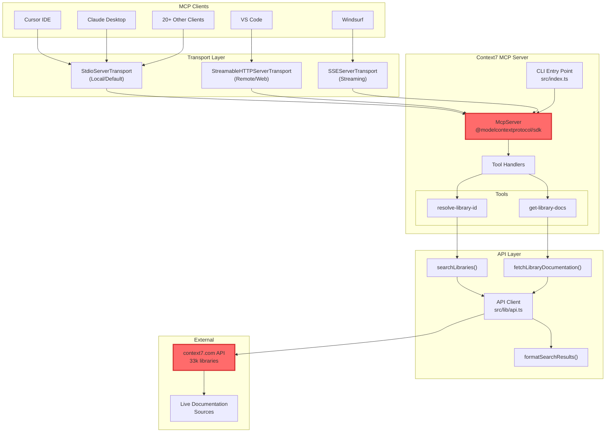
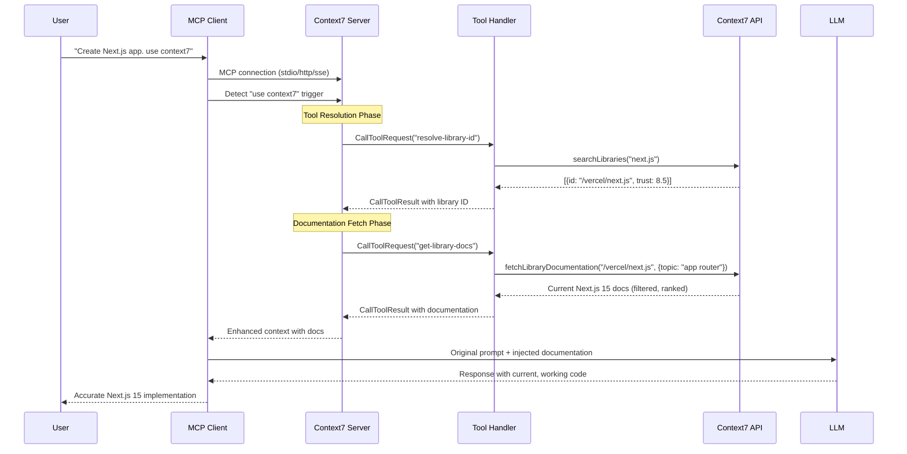

## Overview

Context7 MCP is a Model Context Protocol server that fundamentally changes how LLMs generate code. Unlike traditional approaches that rely on stale training data frozen months in the past, Context7 injects real-time, version-specific documentation directly into LLM prompts at the moment of generation. No more broken imports, no more hallucinated APIs, no more debugging code that worked in v13 but breaks in v15.

### The problem is real

LLMs are trained on historical snapshots. When you ask Claude or GPT-4 to generate Next.js 15 code today, it confidently produces examples using APIs deprecated three versions ago - or worse, functions that never existed. Developers waste 15-45 minutes per debugging session fixing these hallucinations. Multiply that across teams and projects, and we're talking about thousands of hours lost to outdated training data.

**Context7's core innovation**: It maintains a continuously updated index of >33k library documentations and injects the exact documentation needed at the moment of code generation. The trick is the MCP protocol integration - your LLM gets current docs without changing your workflow.

### Key technical advances

- **Real-time documentation injection**: Intercepts prompts containing `use context7` and enriches them with current docs
- **Intelligent library resolution**: Converts natural language ("Next.js") to Context7 IDs (`/vercel/next.js`)
- **Token-aware filtering**: Server-side ranking ensures docs fit within context windows
- **Multi-transport architecture**: Supports stdio, HTTP, and SSE for different deployment scenarios
- **Zero-configuration activation**: Works with 20+ MCP clients without workflow changes

### Architecture components

**MCP Protocol Layer**:

- `McpServer` instance handling tool registration and request routing
- Two primary tools: `resolve-library-id` and `get-library-docs`
- Zod schema validation for type-safe tool parameters

**Transport Layer**:

- `StdioServerTransport`: Direct process communication (default)
- `StreamableHTTPServerTransport`: RESTful HTTP for remote deployments
- `SSEServerTransport`: Server-Sent Events for real-time streaming

**API Integration Layer**:

- `searchLibraries()`: Library name to ID resolution
- `fetchLibraryDocumentation()`: Documentation retrieval with filtering
- Token management and response formatting

### Real-world impact

**Before Context7**: "Create a Next.js app with app router" → Generic response based on Next.js 12 training data → Broken code → Manual documentation lookup → Trial and error → 30+ minutes wasted

**With Context7**: "Create a Next.js app with app router. use context7" → Real Next.js 15 docs injected → Working code with current APIs → 0 minutes debugging

## How it works

### Architecture overview

The magic happens through a sophisticated pipeline that intercepts LLM prompts, identifies library references, fetches current documentation, and seamlessly injects it into the conversation context. The entire process takes milliseconds but saves hours of debugging.



### Request flow

Under the hood, Context7 orchestrates a carefully designed sequence that transforms outdated LLM knowledge into current, working code:



### Transport mechanisms

Context7's transport layer is fundamentally adaptive - it detects your client and chooses the optimal communication method:

```typescript
// Actual CLI argument processing from Context7 MCP
const program = new Command()
  .option("--transport <stdio|http|sse>", "transport type", "stdio")
  .option("--port <number>", "port for HTTP/SSE transport", "3000")
  .allowUnknownOption() // let MCP Inspector / other wrappers pass through
  .parse(process.argv);

// Validate and set transport type
const allowedTransports = ["stdio", "http", "sse"];
if (!allowedTransports.includes(cliOptions.transport)) {
  console.error(
    `Invalid --transport value: '${cliOptions.transport}'. Must be one of: stdio, http, sse.`
  );
  process.exit(1);
}

// The clever bit: Auto-detection based on client
const TRANSPORT_TYPE = (cliOptions.transport || "stdio") as
  | "stdio" // Cursor, Claude Desktop
  | "http" // VS Code extensions
  | "sse"; // Windsurf, streaming clients
```

## Data structures and algorithms

### Core data models

Context7 uses carefully designed data structures that balance completeness with efficiency:

```typescript
// The actual types from Context7 MCP implementation
export interface SearchResult {
  id: string; // Context7-compatible ID like "/vercel/next.js"
  title: string; // Human-readable name
  description: string; // Library purpose
  branch: string; // Git branch for versioning
  lastUpdateDate: string; // When docs were last updated
  state: DocumentState; // Document processing state
  totalTokens: number; // Total documentation tokens
  totalSnippets: number; // Available code examples (quality indicator)
  totalPages: number; // Number of documentation pages
  stars?: number; // GitHub stars (popularity signal)
  trustScore?: number; // 0-10 authority score (optional)
  versions?: string[]; // Available versions for selection
}

export interface SearchResponse {
  error?: string; // Error message if search fails
  results: SearchResult[]; // Array of search results for LLM selection
}

// Document states reflect processing pipeline
export type DocumentState = "initial" | "finalized" | "error" | "delete";
```

### Library resolution algorithm

The trick here is Context7 doesn't try to be smart about matching - it returns results and lets the LLM decide:

```typescript
// Actual implementation: Simple API call with smart error handling
export async function searchLibraries(
  query: string,
  clientIp?: string
): Promise<SearchResponse> {
  try {
    const url = new URL(`${CONTEXT7_API_BASE_URL}/v1/search`);
    url.searchParams.set("query", query);

    const headers = generateHeaders(clientIp);
    const response = await fetch(url, { headers });

    if (!response.ok) {
      const errorCode = response.status;

      // Rate limiting protection
      if (errorCode === 429) {
        console.error(
          `Rate limited due to too many requests. Please try again later.`
        );
        return {
          results: [],
          error: `Rate limited due to too many requests. Please try again later.`,
        } as SearchResponse;
      }

      // Generic error handling
      console.error(`Failed to search libraries. Error code: ${errorCode}`);
      return {
        results: [],
        error: `Failed to search libraries. Error code: ${errorCode}`,
      } as SearchResponse;
    }

    return await response.json();
  } catch (error) {
    console.error("Error searching libraries:", error);
    return {
      results: [],
      error: `Error searching libraries: ${error}`,
    } as SearchResponse;
  }
}
```

Why this works: The LLM evaluates results based on:

- Name similarity (exact matches prioritized)
- Description relevance to query intent
- Documentation coverage (`totalSnippets` as quality signal)
- Trust score (7-10 considered authoritative)
- Document state (prefer "finalized" over "initial")

### Token-aware documentation filtering

The clever bit is Context7 enforces a minimum token guarantee while keeping the client simple:

```typescript
// Actual implementation from Context7 MCP
const DEFAULT_MINIMUM_TOKENS = 10000;

server.tool(
  "get-library-docs",
  "Fetches up-to-date documentation for a library",
  {
    context7CompatibleLibraryID: z
      .string()
      .describe("Exact Context7-compatible library ID"),
    topic: z.string().optional().describe("Topic to focus documentation on"),
    tokens: z
      .preprocess(
        (val) => (typeof val === "string" ? Number(val) : val),
        z.number()
      )
      // The trick: Never go below minimum for quality
      .transform((val) =>
        val < DEFAULT_MINIMUM_TOKENS ? DEFAULT_MINIMUM_TOKENS : val
      )
      .optional()
      .describe(
        `Maximum tokens of documentation (min: ${DEFAULT_MINIMUM_TOKENS})`
      ),
  },
  async ({
    context7CompatibleLibraryID,
    tokens = DEFAULT_MINIMUM_TOKENS,
    topic = "",
  }) => {
    // Fetch with token budget
    const fetchDocsResponse = await fetchLibraryDocumentation(
      context7CompatibleLibraryID,
      { tokens, topic },
      clientIp
    );

    if (!fetchDocsResponse) {
      return {
        content: [
          {
            type: "text",
            text: "Documentation not found or not finalized for this library.",
          },
        ],
      };
    }

    // Return raw documentation - ranking happens server-side
    return {
      content: [
        {
          type: "text",
          text: fetchDocsResponse,
        },
      ],
    };
  }
);
```

The magic happens on Context7's servers - proprietary ranking algorithms select the most valuable documentation chunks within the token budget. This keeps the MCP server lightweight while allowing continuous algorithm improvements.

## Technical challenges and solutions

### Challenge 1: Outdated training data vs real-time documentation

**The problem**: LLMs are frozen in time. Next.js 15 released yesterday? Your LLM still thinks Next.js 13 is cutting edge. This fundamental disconnect causes AI assistants to confidently generate code using deprecated APIs, removed functions, or patterns that no longer work.

**Context7's solution**: Real-time documentation injection through MCP tools. When users include "use context7" in their prompts, the MCP server fetches current documentation from Context7's API and injects it directly into the LLM context. The complexity happens on Context7's servers, not in the MCP client - keeping it fast and maintainable.

### Challenge 2: Context window limitations

**The problem**: Modern LLMs have context windows ranging from 8K to 200K tokens. Naive documentation injection could easily consume the entire context, leaving no room for conversation history or causing the LLM to "forget" important instructions.

**Context7's solution**: Server-side token management with a minimum guarantee of 10,000 tokens. The MCP client sends a token limit, Context7's API applies proprietary ranking to return the most relevant documentation within that budget. Code examples rank higher than prose, API signatures higher than descriptions. The result: maximum value per token.

### Challenge 3: Library name ambiguity

**The problem**: Users type "React", "react.js", "ReactJS", or "Facebook React" - all referring to the same library. Simple string matching fails, fuzzy matching returns wrong libraries entirely.

**Context7's solution**: The `resolve-library-id` tool returns multiple search results with metadata (trust scores, snippet counts, descriptions) and lets the LLM select the most appropriate match. This hybrid approach combines algorithmic search with LLM-powered disambiguation. No complex string matching in the MCP client, just smart delegation.

### Challenge 4: Multi-client compatibility

**The problem**: Different MCP clients (Cursor, VS Code, Claude Desktop) have different configuration formats, transport preferences, and connection methods. A one-size-fits-all approach doesn't work.

**Context7's solution**: Multi-transport support with auto-detection. The CLI accepts `--transport` flags for stdio (default), HTTP, and SSE. The HTTP server creates different endpoints (`/mcp`, `/sse`, `/messages`) to handle various client patterns. This architecture enables the same server to work across 20+ different MCP clients without modification.

## What we would do differently

### Current limitations and future improvements

**Documentation versioning**: Currently, Context7 serves the latest documentation by default. The better approach:

```typescript
// Proposed improvement: Version-aware documentation
interface VersionedDocRequest {
  libraryId: string;
  version?: string; // "15.0.0" or "latest" or "^14.0.0"
  preferStable?: boolean; // Avoid RC/beta versions
}

// This would enable:
// "Create Next.js 14 app" -> Specifically Next.js 14 docs
// "Create Next.js app" -> Latest stable version
```

**Intelligent caching strategy**: The current approach fetches documentation on every request. An improved design would:

- Cache documentation locally with smart invalidation
- Pre-fetch commonly used libraries during idle time
- Use ETags for efficient cache validation
- Implement differential updates for documentation changes

**Private package support**: Many organizations need documentation for internal packages:

```typescript
// Proposed: Private registry support
interface PrivateRegistry {
  authenticate(credentials: Credentials): Promise<Token>;
  indexPrivatePackages(registry: string): Promise<Library[]>;
  servePrivateDocs(packageId: string, token: Token): Promise<string>;
}
```

### Architectural enhancements

**Event-driven architecture**: The current request-response model could benefit from event streaming:

```typescript
// Better: Event-driven documentation updates
class DocumentationEventStream {
  async *streamUpdates(libraryId: string) {
    yield { type: "metadata", data: await this.fetchMetadata(libraryId) };
    yield { type: "quickstart", data: await this.fetchQuickStart(libraryId) };
    yield { type: "api", data: await this.fetchAPIReference(libraryId) };
    yield { type: "examples", data: await this.fetchExamples(libraryId) };
  }
}
```

### The bottom line

Context7 MCP elegantly solves a real problem every developer faces: LLMs generating outdated or broken code. Its architecture is clean, the implementation is thoughtful, and the results are immediately valuable. While there's room for improvement in versioning, caching, and private package support, the current implementation already saves developers hours of debugging time per week.

The true innovation isn't just the technology - it's recognizing that the gap between LLM training and real-world documentation is a solvable problem. By bridging this gap with MCP, Context7 transforms AI coding assistants from frustrating approximators into reliable partners. No more broken imports, no more hallucinated APIs, just working code on the first try.
