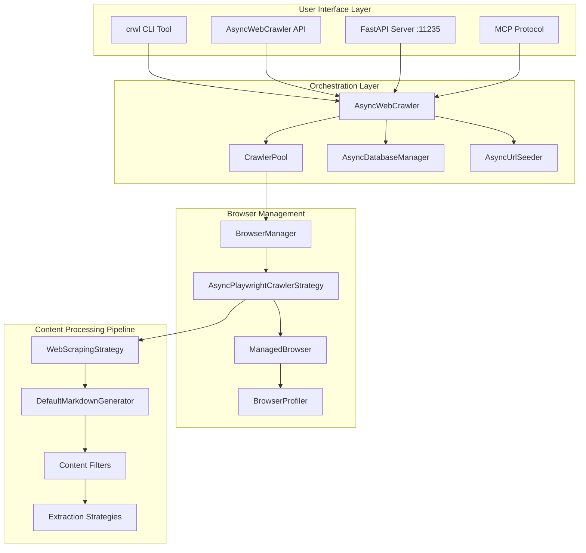
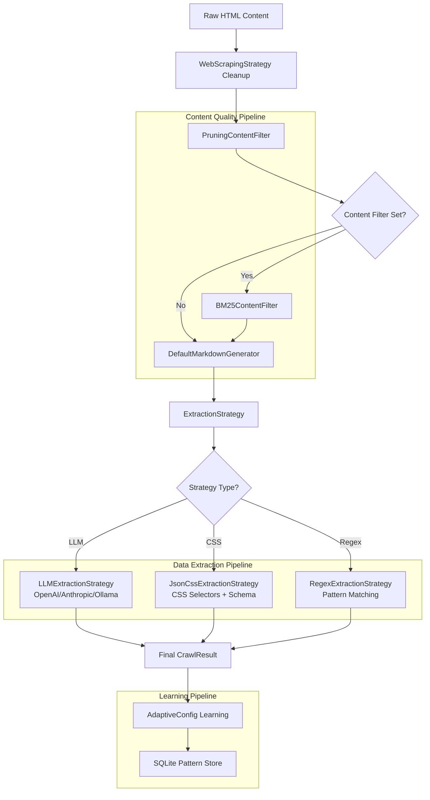

## What Crawl4ai does

Crawl4ai takes a different approach to web crawling compared to traditional scrapers. Instead of just grabbing raw HTML and dumping it out, it actually processes and cleans web content to make it useful for language models and AI applications. Think of it as the difference between photocopying a messy document versus having someone read through it and extract just the important parts.

The framework runs **6x faster** than similar tools while producing much cleaner results. It does this by using smart algorithms that understand what content actually matters on a page, not just where it sits in the HTML structure. The end result is clean Markdown text and well-structured JSON data that AI systems can actually work with.

Different use cases get different benefits. For **RAG systems** (retrieval-augmented generation), you get clean text that keeps track of where it came from while filtering out navigation menus and ads. **AI agents** get structured data that follows consistent schemas, so they don't have to guess at data formats from different websites. **Training datasets** get high-quality web content that's been filtered to remove junk, and **real-time applications** can crawl many pages at once without breaking.

What makes Crawl4ai stand out is how it's built. It doesn't depend on external APIs, so you're not locked into paying for third-party services or hitting rate limits. Everything is designed with AI consumption in mind rather than human reading. You can swap out different extraction methods - CSS selectors, XPath, regex, or even language models - depending on what works best for your specific situation. It also handles tricky scenarios like websites that try to block bots, maintaining browser sessions, and rotating through different IP addresses.

## How it works under the hood

### Core Architecture

Crawl4ai implements a layered architecture with clear separation between orchestration, browser management, and content processing:



### Execution Flow

The `AsyncWebCrawler.arun()` method orchestrates the entire crawling process:

1. **Cache Check**: Query `AsyncDatabaseManager` for existing results
2. **Browser Acquisition**: Get pre-warmed browser instance from `BrowserManager`
3. **Page Navigation**: Use `AsyncPlaywrightCrawlerStrategy` for actual crawling
4. **Content Processing**: Apply `WebScrapingStrategy` for HTML cleaning
5. **Markdown Generation**: Transform content through `DefaultMarkdownGenerator`
6. **Strategy Execution**: Run configured `ExtractionStrategy` for structured data
7. **Result Assembly**: Package everything into `CrawlResult` object
8. **Cache Storage**: Persist results for future use

### Browser Management Strategy

Crawl4ai uses sophisticated browser pooling to handle concurrent requests efficiently:

```python
# Browser pool with pre-warmed instances
class BrowserManager:
    def __init__(self):
        self.browser_pool = {}  # Pre-warmed browsers
        self.session_contexts = {}  # Persistent sessions

    async def get_browser_page(self, config: BrowserConfig):
        # Return existing or create new browser instance
        # Handles session persistence, proxy rotation, anti-detection
```

**Key Features:**

- **Pre-warmed instances**: Browsers ready before requests arrive
- **Session persistence**: Maintain state across multiple crawls
- **Anti-detection**: Randomized fingerprints, user agents, viewport sizes
- **Profile management**: Persistent user data directories for complex workflows

## Data structures and algorithms

### Core Data Structures

**CrawlResult - The Primary Output Object**

```python
@dataclass
class CrawlResult:
    # Basic info
    url: str                    # Final URL after redirects
    success: bool              # Crawl success status
    status_code: int           # HTTP status code

    # Content variants
    html: str                  # Raw HTML content
    cleaned_html: str          # Sanitized HTML
    markdown: MarkdownGenerationResult  # Multiple markdown variants

    # Extracted data
    extracted_content: str     # JSON structured data from strategies
    media: Dict               # Images, videos, tables with metadata
    links: Dict               # Internal/external links with scores

    # Generated assets
    screenshot: str           # Base64 encoded screenshot
    pdf: bytes               # PDF representation
    network_logs: List       # HTTP request/response logs
```

**Configuration Objects Hierarchy**

```python
# Browser-level configuration
BrowserConfig:
    headless: bool = True
    user_data_dir: str = None
    chrome_channel: str = "chrome"
    browser_type: str = "chromium"

# Per-crawl configuration
CrawlerRunConfig:
    cache_mode: CacheMode = CacheMode.ENABLED
    extraction_strategy: ExtractionStrategy = NoExtractionStrategy()
    session_id: str = None
    word_count_threshold: int = 10
    content_filter: ContentFilter = None
```

### Algorithms

The content processing algorithms work together in a specific sequence to transform raw HTML into clean, AI-ready content:



**1. BM25 Content Filtering**

The BM25 filter kicks in during content processing, right after the HTML gets cleaned up but before it becomes final markdown. When you give it a search query, Crawl4AI uses this to keep only the content that actually matches what you're looking for, which makes the output much more focused.

```python
class BM25ContentFilter:
    def __init__(self, user_query: str, bm25_threshold: float = 1.0):
        self.query_terms = user_query.lower().split()
        self.threshold = bm25_threshold

    def filter_content(self, content: str) -> str:
        # Calculate BM25 scores for content chunks
        # Filter chunks below threshold
        # Return high-relevance content only
```

This runs when you set up the `content_filter` parameter in your crawler config. It happens after the basic HTML cleanup but before the final markdown gets generated. The filter breaks content into chunks and scores how well each chunk matches your query terms, then throws out anything that doesn't score high enough.

**2. Strategy Pattern for Extraction**

```python
class ExtractionStrategy(ABC):
    @abstractmethod
    async def extract(self, url: str, html: str) -> str:
        pass

# Concrete implementations
class LLMExtractionStrategy(ExtractionStrategy):
    # Uses OpenAI/Anthropic/Ollama for intelligent extraction

class JsonCssExtractionStrategy(ExtractionStrategy):
    # Uses CSS selectors with JSON schema mapping

class RegexExtractionStrategy(ExtractionStrategy):
    # Pattern-based extraction for structured content
```

**3. PruningContentFilter - The Smart Content Cleaner**

The `PruningContentFilter` is Crawl4AI's main content cleaning workhorse. It runs right after the basic HTML cleanup but before the final markdown gets generated. Its job is to throw out the junk (like navigation menus, ads, and footer links) while keeping the actual content you care about.

```python
class PruningContentFilter:
    def __init__(self, threshold: float = 0.48, threshold_type: str = "dynamic"):
        self.threshold = threshold
        self.threshold_type = threshold_type  # "fixed" or "dynamic"

    def filter_content(self, content: str) -> str:
        # Parse DOM and calculate node scores
        # Apply link density heuristics
        # Use dynamic thresholding for adaptive filtering
        # Return pruned content with high information density
```

**What makes this different from other tools like Boilerpipe:**

- **Smarter link handling**: Instead of just counting links versus text, Crawl4AI actually looks at what kind of links they are and where they appear. A navigation menu gets treated differently than a citation in an article.

- **Works with multiple crawlers**: When you're running several browser instances at the same time, each filter keeps its own state so they don't interfere with each other.

- **Self-adjusting thresholds**: This is the clever bit - the filter adapts to different types of pages:
  - `"fixed"` mode: Every piece of content needs to hit the same score to survive
  - `"dynamic"` mode: The scoring adjusts based on what type of page it's looking at, so it doesn't accidentally remove good content from sparse pages or leave junk on cluttered ones

Everything happens in memory while processing, and the results get cached so you don't have to reprocess the same URL later.

**4. Priority Queue for Deep Crawling**

```python
class BestFirstCrawlStrategy:
    def __init__(self):
        self.url_queue = PriorityQueue()  # (score, url) tuples
        self.visited = set()

    async def crawl(self, start_url: str, max_pages: int):
        while not self.url_queue.empty() and len(self.visited) < max_pages:
            score, url = await self.url_queue.get()
            # Process highest-scoring URLs first
```

**5. Adaptive Learning - Getting Smarter Over Time**

The learning system kicks in after each successful crawl to figure out what worked well and what didn't. It tracks how good the extraction was and adjusts its approach for similar websites in the future. All this learning gets saved to a local SQLite database, so the crawler gets better at handling specific sites over time.

```python
class AdaptiveConfig:
    def __init__(self):
        self.pattern_history = {}  # URL patterns → extraction success
        self.persistence_manager = SQLitePatternStore()

    def learn_from_result(self, url: str, extraction_quality: float):
        # Update pattern weights based on extraction success
        # Persist learned patterns for future sessions
        # Improve future extraction strategies
```

This happens in the background after each crawl finishes and the results are assembled, but before everything gets cached. To avoid constantly hitting the database, it batches up the learning updates and saves them every 10 successful extractions. This keeps things fast during heavy crawling while still building up knowledge about how to handle different types of websites.

## Technical challenges and solutions

### Challenge 1: Browser Anti-Detection

**Problem**: Modern websites use sophisticated bot detection including fingerprinting, behavioral analysis, and CAPTCHA systems.

**Solution**: Multi-layered anti-detection strategy

```python
# Randomized browser fingerprints
browser_config = BrowserConfig(
    user_agent_mode="random",  # Rotate user agents
    viewport_width=random.randint(1024, 1920),
    viewport_height=random.randint(768, 1080),
    locale=random.choice(["en-US", "en-GB", "de-DE"]),
    timezone_id=random.choice(["America/New_York", "Europe/London"])
)

# Stealth techniques
magic=True  # Enable stealth mode
proxy_config=ProxyConfig(rotation_enabled=True)
```

**Key techniques:**

- **Fingerprint randomization**: User agents, viewport sizes, locales
- **Behavioral simulation**: Human-like scrolling, mouse movements, delays
- **Proxy rotation**: Distribute requests across multiple IP addresses
- **Session persistence**: Maintain cookies and state like real users

### Challenge 2: Large-Scale Concurrent Crawling

**Problem**: Memory exhaustion and resource contention when crawling thousands of URLs concurrently.

**Solution**: Memory-adaptive dispatching with intelligent resource management

```python
class MemoryAdaptiveDispatcher:
    def __init__(self, memory_threshold: float = 0.8):
        self.memory_threshold = memory_threshold
        self.active_crawlers = 0

    async def dispatch_crawl(self, url: str):
        current_memory = psutil.virtual_memory().percent / 100
        if current_memory > self.memory_threshold:
            await self.wait_for_memory_relief()

        # Proceed with crawl only when memory is available
```

**Resource management features:**

- **Semaphore-based rate limiting**: Control concurrent browser instances
- **Memory monitoring**: Dynamic adjustment based on system resources
- **Browser pooling**: Reuse browser instances across requests
- **Graceful degradation**: Reduce concurrency under memory pressure

### Challenge 3: Content Quality for LLMs

**Problem**: Raw web content contains navigation menus, ads, footers, and other noise that degrades LLM performance.

**Solution**: Multi-stage content filtering pipeline

```python
# Stage 1: Structural cleaning
content = WebScrapingStrategy().clean_html(raw_html)

# Stage 2: Heuristic filtering
content = PruningContentFilter(threshold=0.48).filter(content)

# Stage 3: Query-based filtering
content = BM25ContentFilter(user_query="product information").filter(content)

# Stage 4: LLM-based filtering (optional)
content = LLMContentFilter(instruction="Keep only product details").filter(content)
```

**Filtering strategies:**

- **Pruning algorithm**: Remove low-information-density content
- **BM25 relevance**: Keep content relevant to user queries
- **LLM-powered filtering**: Intelligent content selection
- **Citation generation**: Maintain source links for verification

### Challenge 4: Dynamic Content Handling

**Problem**: JavaScript-heavy websites with infinite scroll, lazy loading, and dynamic content generation.

**Solution**: Advanced browser automation with virtual scrolling

```python
# Virtual scroll configuration for infinite content
virtual_scroll_config = VirtualScrollConfig(
    wait_time=2.0,  # Wait between scroll actions
    check_scroll_position=True,  # Detect scroll position changes
    max_scroll_attempts=10,  # Limit scroll attempts
    scroll_delay=1.0  # Delay between scrolls
)

# Execute JavaScript for dynamic content
js_code = [
    "window.scrollTo(0, document.body.scrollHeight);",
    "await new Promise(resolve => setTimeout(resolve, 2000));",
    "return document.querySelectorAll('.dynamic-content').length;"
]
```

**Dynamic content strategies:**

- **Virtual scrolling**: Automatic infinite scroll detection and handling
- **JavaScript execution**: Custom JS code for specific sites
- **Wait strategies**: Smart waiting for content to load
- **Content change detection**: Monitor DOM changes to ensure completeness

## Clever tricks and tips

### Performance Optimizations

**1. Browser Pool Pre-warming**

```python
# Pre-warm browser instances during application startup
async def setup_browser_pool():
    browser_manager = BrowserManager()
    # Create 5 ready-to-use browser instances
    for i in range(5):
        await browser_manager.create_browser_instance()
```

**2. Intelligent Caching Strategy**

```python
# Cache modes for different use cases
cache_config = {
    "development": CacheMode.BYPASS,      # Always fresh content
    "production": CacheMode.ENABLED,      # Use cache when available
    "research": CacheMode.READ_ONLY,      # Never update cache
    "batch_processing": CacheMode.WRITE_ONLY  # Always cache results
}
```

**3. Chunk-based Processing for Large Content**

```python
# Process large documents in chunks to avoid memory issues
def process_large_content(content: str, chunk_size: int = 10000):
    chunks = [content[i:i+chunk_size] for i in range(0, len(content), chunk_size)]
    processed_chunks = [process_chunk(chunk) for chunk in chunks]
    return "".join(processed_chunks)
```

### AI-Specific Features

**1. Schema-based Extraction with Pydantic**

```python
from pydantic import BaseModel

class ProductInfo(BaseModel):
    name: str
    price: float
    description: str
    availability: bool

# LLM extracts data conforming to schema
extraction_strategy = LLMExtractionStrategy(
    schema=ProductInfo.schema(),
    instruction="Extract product information from the page"
)
```

**2. Multiple Markdown Variants**

```python
# Different markdown formats for different use cases
result = await crawler.arun(url)
raw_content = result.markdown.raw_markdown          # Unfiltered
clean_content = result.markdown.fit_markdown        # Filtered for quality
cited_content = result.markdown.markdown_with_citations  # With source links
references = result.markdown.references_markdown    # Citation list
```

**3. Network Traffic Analysis**

```python
# Capture network requests for debugging and analysis
config = CrawlerRunConfig(
    capture_network=True,
    capture_console=True
)

result = await crawler.arun(url, config=config)
# Access network logs for API discovery, performance analysis
network_requests = result.network_logs
console_messages = result.console_messages
```

### CRUD Operations

**Creates:**

- **Browser sessions**: Persistent contexts with cookies, local storage
- **Cached crawl results**: SQLite database storage with TTL
- **Generated assets**: Screenshots (PNG), PDFs, MHTML archives
- **Extracted data**: JSON structured output from various strategies

**Reads:**

- **Web content**: HTML, CSS, JavaScript through Playwright automation
- **Cached results**: Previously crawled content from AsyncDatabaseManager
- **Configuration files**: YAML/JSON extraction schemas and crawler configs
- **URL discovery**: Sitemaps, Common Crawl data, robots.txt

**Updates:**

- **Browser state**: Cookies, session storage, navigation history
- **Cache entries**: Refresh crawled content based on TTL policies
- **Adaptive patterns**: Learning weights for website-specific optimization
- **Link scores**: Priority adjustments based on crawling success

**Deletes:**

- **Expired cache**: Automatic cleanup of old crawl results
- **Browser profiles**: Temporary user data directories after sessions
- **Resource cleanup**: Browser processes, temporary files, memory allocation
- **Failed extractions**: Cleanup partial results from failed crawls

### Deployment Patterns

**1. Docker-based Scaling**

```bash
# Horizontal scaling with Docker Swarm
docker service create \
  --name crawl4ai-cluster \
  --replicas 5 \
  --publish 11235:11235 \
  unclecode/crawl4ai:0.7.0
```

**2. MCP Integration for AI Tools**

```bash
# Connect to Claude, Cursor, or other MCP-compatible tools
# Server-Sent Events transport
curl http://localhost:11235/mcp/sse

# WebSocket transport for real-time crawling
ws://localhost:11235/mcp/ws
```

**3. CLI for Batch Processing**

```bash
# Batch process multiple URLs with deep crawling
crwl https://example.com \
  -e extract_llm.yml \
  -s llm_schema.json \
  -c "scan_full_page=true,delay_before_return_html=2,word_count_threshold=100" \
  -b "headless=true,viewport_width=1280" \
  -o json \
  --bypass-cache \
  -v
```

## Considerations

**Performance Trade-offs:**

- **LLM strategies** provide highest accuracy but cost $0.001-0.01 per page
- **CSS/XPath strategies** are free and fast (~50ms) but require structured HTML
- **Browser pooling** improves performance but increases memory usage
- **Caching** reduces API calls but may serve stale content

**Reliability Concerns:**

- **Anti-detection bypassing** may violate website terms of service
- **Large-scale crawling** can overwhelm target servers without rate limiting
- **Session persistence** requires careful cleanup to avoid memory leaks
- **Browser automation** depends on Playwright which may break with browser updates

**Cost Optimization:**

- Use **hybrid strategies**: Generate schemas once with LLM, reuse with CSS extraction
- Implement **smart caching** to avoid re-crawling unchanged content
- Configure **memory thresholds** to prevent system resource exhaustion
- Apply **content filtering** before expensive LLM processing

---

#### References

- [Crawl4AI GitHub Repository](https://github.com/unclecode/crawl4ai)
- [Crawl4AI Official Documentation](https://docs.crawl4ai.com/)
- [DeepWiki Crawl4AI Analysis](https://deepwiki.com/unclecode/crawl4ai)
