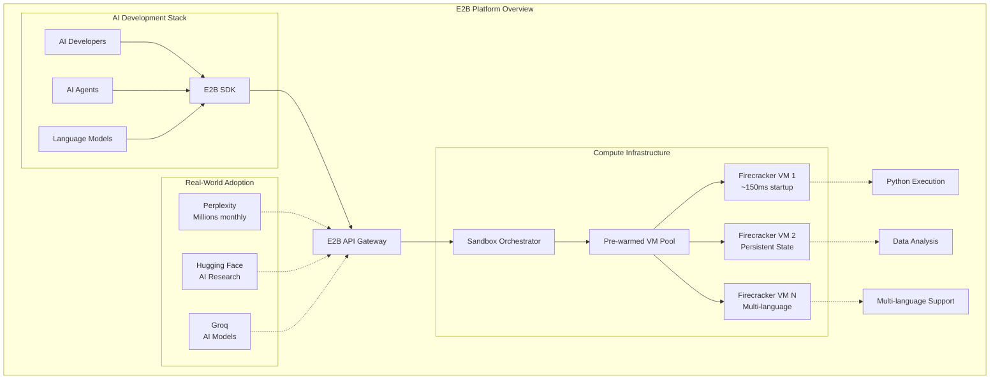
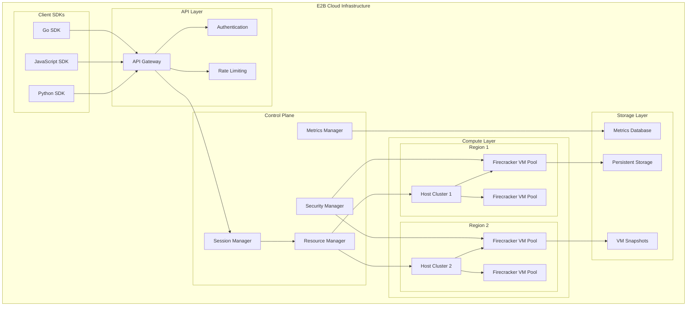
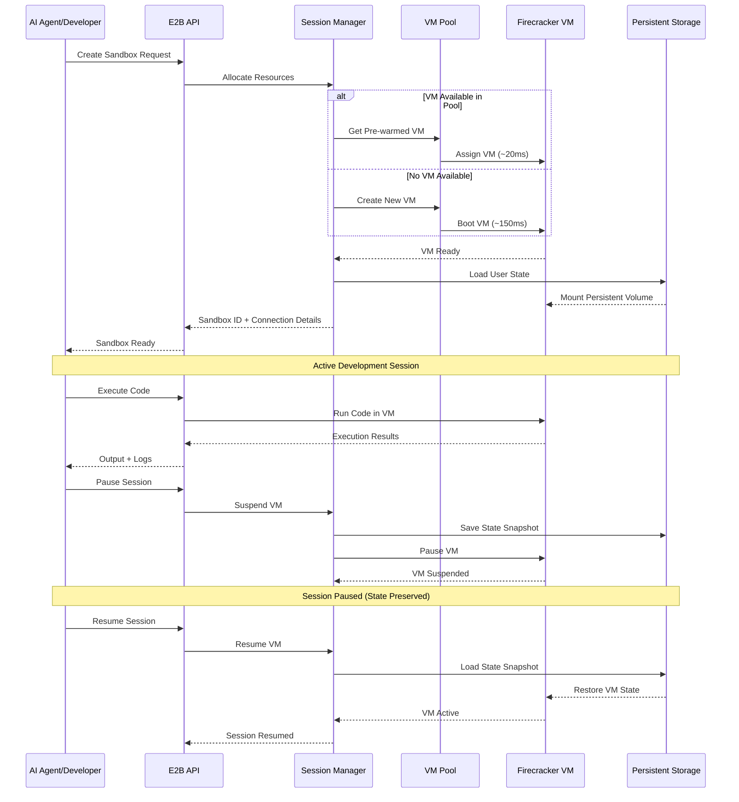
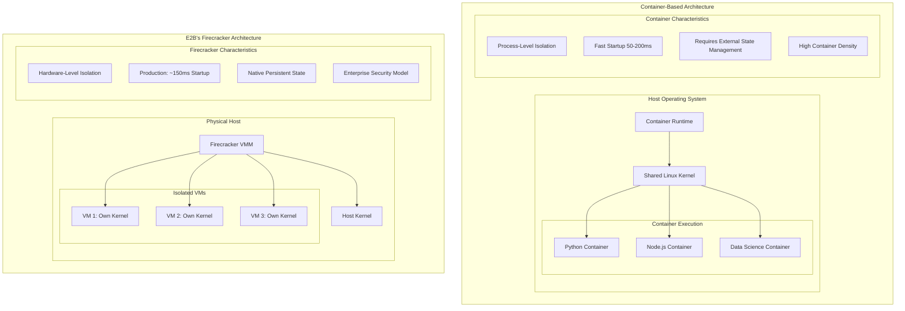
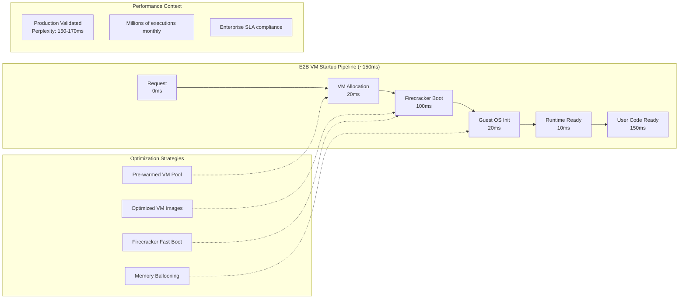
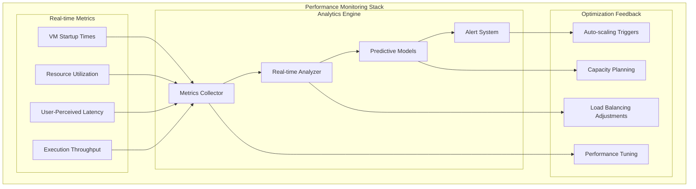
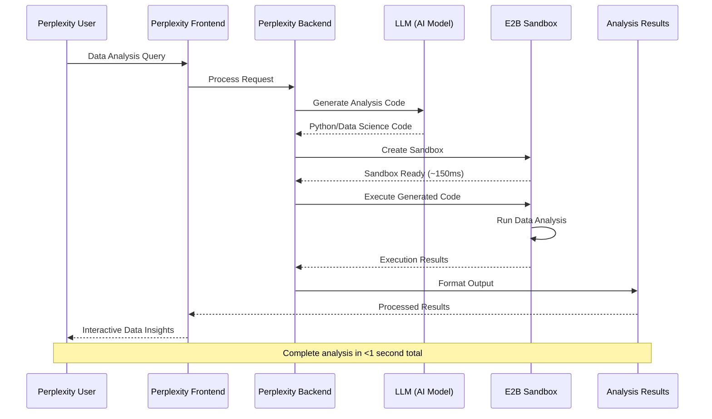
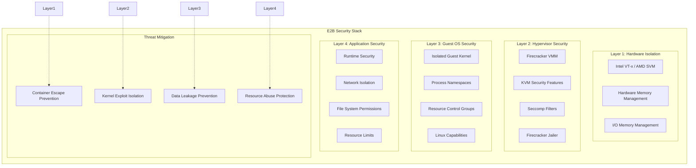
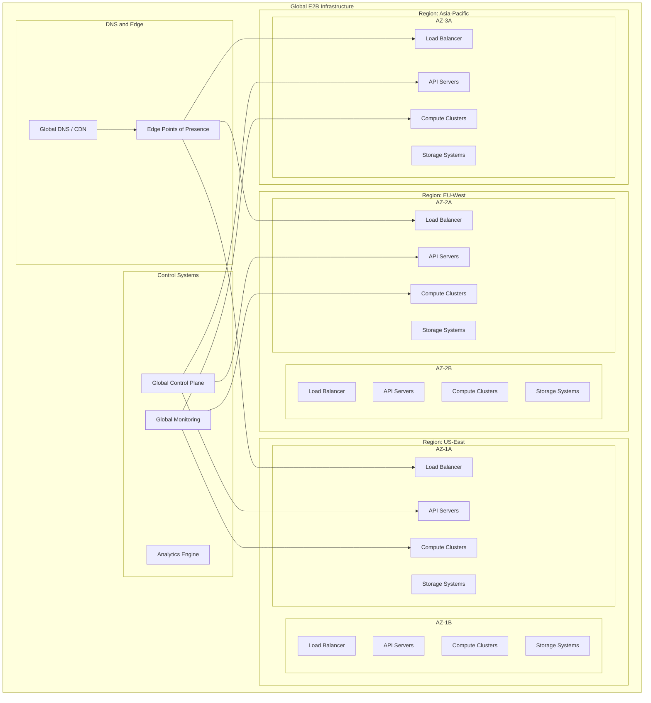

## Abstract

E2B represents a paradigm shift in cloud-based code execution, specifically designed for the AI era. By leveraging Firecracker microVMs instead of traditional containers, E2B achieves sub-200ms startup times while providing hardware-level isolation for untrusted AI-generated code. This technical breakdown analyzes E2B's architecture, performance characteristics, and real-world deployment patterns that have enabled companies like Perplexity, Hugging Face, and Groq to integrate secure code execution into their AI workflows.

---

## Table of Contents

1. [Introduction: The AI Code Execution Challenge](#introduction)
2. [E2B's Technical Architecture](#architecture)
3. [Firecracker vs Containers: Design Decision Analysis](#firecracker-vs-containers)
4. [Performance Engineering and Optimization](#performance)
5. [Real-World Case Studies](#case-studies)
6. [Security and Isolation Models](#security)
7. [Infrastructure and Scaling Patterns](#infrastructure)
8. [Key Technical Insights](#insights)

---

## Introduction: The AI Code Execution Challenge {#introduction}

### The Problem Space

The rise of AI-powered development tools has created unprecedented demand for secure, fast code execution platforms. Unlike traditional development workflows, AI agents require:

- **Rapid iteration cycles** with sub-second response times
- **Untrusted code execution** with complete isolation
- **Persistent development environments** that maintain state
- **Multi-tenant security** for enterprise deployment

### What is E2B?

E2B is an open-source cloud infrastructure platform that runs AI-generated code in secure, isolated sandboxes using lightweight virtual machines that start in approximately 150ms[¹](https://e2b.dev/docs). The platform provides JavaScript/TypeScript and Python SDKs for creating and managing sandboxes, connecting LLMs, and executing code across multiple programming languages.



### Key Innovation: Micro-VM Architecture

E2B's core innovation lies in using **Firecracker microVMs** instead of traditional containers. This architectural choice enables:

- **Hardware-level isolation** with separate kernels per sandbox
- **Sub-200ms startup times** through optimized virtualization
- **Persistent state management** across code executions
- **Enterprise-grade security** suitable for multi-tenant environments

---

## E2B's Technical Architecture {#architecture}

### Core Architecture Components

E2B's architecture is built around several key components optimized for AI workloads:



### Firecracker Integration

E2B leverages **Firecracker**, AWS's open-source virtualization technology, as the foundation for their sandbox infrastructure:

#### Firecracker Advantages for E2B

**Minimal Attack Surface**

- Only 5 emulated devices (virtio-net, virtio-block, virtio-vsock, serial console, minimal keyboard controller)
- ~50,000 lines of code vs millions in traditional hypervisors
- Purpose-built for serverless and container workloads[²](https://firecracker-microvm.github.io/)

**Performance Characteristics**

- Sub-125ms theoretical startup time
- <5 MiB memory footprint per VM
- User-space execution using Linux KVM
- Written in Rust for memory safety

**Security Features**

- Hardware-enforced isolation between VMs
- Minimal device model reduces vulnerabilities
- Built-in rate limiting and metadata service

### Session Lifecycle Management

E2B implements sophisticated session management for persistent development environments:



---

## Firecracker vs Containers: Design Decision Analysis {#firecracker-vs-containers}

### Alternative: Container-Based Architecture

Container platforms represent the conventional approach to code execution isolation:



### Technical Comparison

| Aspect                     | Container Platforms               | E2B Firecracker VMs               | E2B's Advantage                                 |
| -------------------------- | --------------------------------- | --------------------------------- | ----------------------------------------------- |
| **Startup Time**           | 50-200ms (optimal conditions)     | ~150ms (production validated)     | Competitive performance with superior isolation |
| **Isolation Level**        | Process-level (shared kernel)     | Hardware-level (separate kernels) | Stronger security boundaries                    |
| **Memory Overhead**        | ~50-100MB                         | ~100-150MB                        | Comparable resource efficiency                  |
| **Persistent State**       | External volumes/orchestration    | Native VM filesystem              | Simplified state management                     |
| **Multi-tenancy**          | Namespace isolation               | Hardware isolation                | Enterprise-grade tenant separation              |
| **Attack Surface**         | Container runtime + shared kernel | Minimal hypervisor (~50K LOC)     | Reduced attack vectors                          |
| **Operational Complexity** | Moderate                          | High                              | Trade-off for enhanced capabilities             |

### Why E2B Chose Firecracker

E2B's architectural decision was driven by specific AI development requirements:

#### 1. **Performance Requirements**

**Sub-second Response Times for AI Workflows**

- AI agents require immediate feedback for effective iteration
- ~150ms startup enables real-time code execution
- Performance directly impacts user adoption and satisfaction

#### 2. **Security Requirements**

**Hardware-Level Isolation for Untrusted Code**

- AI-generated code is inherently untrusted
- Complete kernel separation prevents cross-tenant attacks
- Enterprise customers require strongest possible isolation

#### 3. **Persistent Development Environments**

**Stateful AI Development Workflows**

- AI agents build complex projects over multiple interactions
- Package installations and file changes must persist
- VM filesystems naturally support persistence

#### 4. **Enterprise Compliance**

**Multi-Tenant Security for Business Customers**

- Regulatory requirements demand strong isolation
- Audit trails require VM-level separation
- Compliance certifications need hardware boundaries

---

## Performance Engineering and Optimization {#performance}

### Startup Time Optimization

E2B's ~150ms startup time represents significant engineering optimization:



### VM Pool Management Strategy

E2B implements sophisticated pre-warming and resource management:

#### Pre-warming Architecture

**Template-Based VM Pool**

```
VM Pool Organization
├── Python Data Science Template Pool
│   ├── Ready VM 1 (pandas, numpy, matplotlib)
│   ├── Ready VM 2 (scikit-learn, tensorflow)
│   └── Ready VM 3 (jupyter, seaborn)
├── Node.js Development Template Pool
│   ├── Ready VM 1 (express, react, typescript)
│   ├── Ready VM 2 (next.js, tailwind)
│   └── Ready VM 3 (node tools, testing)
└── Custom Environment Pool
    ├── User-specific VM 1
    ├── User-specific VM 2
    └── Dynamic allocation pool
```

#### Resource Optimization Techniques

**Memory Management**

- Shared base pages reduce memory footprint
- Copy-on-write for rapid VM cloning
- Memory ballooning for dynamic allocation
- Intelligent garbage collection of unused VMs

**Geographic Distribution**

- VM pools in multiple cloud regions
- Latency-optimized request routing
- Load balancing across availability zones
- Disaster recovery and failover capabilities

### Performance Monitoring and Analytics

E2B implements comprehensive performance monitoring:



---

## Real-World Case Studies {#case-studies}

### Perplexity: Production-Scale AI Data Analysis

Perplexity represents E2B's most prominent success story, implementing advanced data analysis capabilities in just one week[³](https://www.e2b.dev/blog/how-perplexity-implemented-advanced-data-analysis-for-pro-users-in-1-week).

#### Implementation Details

**Scale and Performance**

- **Deployment Timeline**: 1 week from start to production
- **Current Usage**: Millions of E2B sandboxes monthly
- **Startup Performance**: 150-170ms confirmed in production
- **Use Case**: Advanced data analysis for Pro users

#### Technical Architecture



#### Business Impact

**User Experience Transformation**

- Enabled advanced data analysis features for paying customers
- Sub-second response times improved user engagement
- Secure execution of untrusted AI-generated data science code

**Technical Benefits**

- Stateful execution environment for complex analysis
- Multiple data format support (CSV, JSON, Excel)
- Persistent package installations across user sessions

### Hugging Face: AI Research and Model Replication

Hugging Face leverages E2B for replicating and testing advanced AI models[⁴](https://www.e2b.dev/blog/how-hugging-face-is-using-e2b-to-replicate-deepseek-r1).

#### Use Case: DeepSeek-R1 Model Replication

**Implementation Characteristics**

- **Multi-language Support**: Python, JavaScript, C++, Rust
- **Concurrent Execution**: Multiple research scripts simultaneously
- **Rapid Deployment**: "Just a few hours to implement"
- **Research Workflow**: Safe execution of experimental code

#### Technical Requirements Met

**Research Environment Needs**

- Isolated execution for experimental code
- Support for various programming languages and tools
- Persistent environments for long-running experiments
- Secure handling of proprietary research code

### Groq: AI Model Infrastructure

Groq utilizes E2B to power their compound AI models, demonstrating enterprise-scale adoption[⁵](https://e2b.dev/blog/groqs-compound-ai-models-are-powered-by-e2b).

#### Implementation Focus

**AI Model Pipeline Integration**

- Secure execution of AI model inference code
- Support for complex AI workflows
- Integration with existing ML infrastructure
- Enterprise-grade security and compliance

### Manus: Agent-Based Virtual Computing

Manus provides AI agents with virtual computers through E2B integration[⁶](https://e2b.dev/blog/how-manus-uses-e2b-to-provide-agents-with-virtual-computers).

#### Architecture Pattern

**Agent-Computer Interface**

- Full Linux environments for AI agents
- Persistent state across agent interactions
- Complete system access for complex tasks
- Multi-tenant isolation for different agents

---

## Security and Isolation Models {#security}

### Multi-Layer Security Architecture

E2B implements comprehensive security through multiple isolation layers:



### Enterprise Security Features

#### Hardware-Level Isolation Guarantees

**CPU Virtualization Extensions**

- Intel VT-x and AMD SVM provide hardware-assisted virtualization
- Memory Management Unit (MMU) enforces memory isolation
- I/O Memory Management Unit (IOMMU) prevents device-based attacks

**Memory Protection**

- Hardware-enforced page table separation
- No shared memory regions between VMs
- DMA attack prevention through IOMMU

#### Firecracker Security Model

**Minimal Attack Surface**

- Only ~50,000 lines of hypervisor code
- Limited device emulation (5 virtual devices)
- No legacy hardware support reduces complexity
- Rust implementation prevents memory safety vulnerabilities

**Secure-by-Default Configuration**

- No network access by default
- Minimal device model
- Built-in rate limiting
- Metadata service isolation

### Compliance and Audit Features

#### Enterprise Security Requirements

**Multi-Tenant Isolation**

- Complete separation between customer workloads
- Independent security domains per user
- No data leakage possibilities between tenants
- Audit trails at VM level

**Regulatory Compliance Support**

- SOC 2 Type II compliance capabilities
- GDPR data protection compliance
- HIPAA-ready isolation for healthcare data
- Enterprise audit and logging features

#### Security Monitoring and Response

**Real-Time Security Monitoring**

- VM behavior analysis and anomaly detection
- Network traffic inspection and filtering
- Resource usage pattern monitoring
- Automated threat response capabilities

---

## Infrastructure and Scaling Patterns {#infrastructure}

### Global Infrastructure Architecture

E2B operates a globally distributed infrastructure designed for high availability and low latency:



### Auto-Scaling and Resource Management

#### Predictive Scaling Architecture

E2B implements intelligent auto-scaling based on usage patterns and predictive analytics:

**Scaling Triggers**

- Real-time demand monitoring
- Machine learning-based demand prediction
- Geographic usage pattern analysis
- Seasonal and time-based scaling adjustments

**Resource Pool Management**

- Dynamic VM pool sizing across regions
- Intelligent resource allocation algorithms
- Cost-optimized resource utilization
- Automated capacity planning and provisioning

#### Multi-Tenancy and Resource Isolation

**Tenant Isolation Strategies**

- Hardware-level separation for enterprise customers
- Shared resource pools with guaranteed allocation
- QoS enforcement and priority scheduling
- Fair resource sharing algorithms

**Resource Quotas and Limits**

- Per-customer resource quotas
- Usage-based billing and metering
- Resource abuse detection and prevention
- Automated resource cleanup and garbage collection

### Operational Excellence

#### Site Reliability Engineering (SRE)

**Availability and Uptime**

- 99.9%+ availability SLA targets
- Multi-region failover capabilities
- Automated incident detection and response
- Comprehensive disaster recovery procedures

**Performance Monitoring**

- Real-time performance metrics and alerting
- User experience monitoring and optimization
- Capacity planning and performance tuning
- Continuous optimization based on usage data

#### DevOps and Deployment Practices

**Infrastructure as Code**

- Automated infrastructure provisioning
- Version-controlled infrastructure configurations
- Automated testing and validation
- Blue-green deployment strategies

**Continuous Integration/Deployment**

- Automated testing pipelines
- Gradual rollout and canary deployments
- Feature flags and A/B testing
- Automated rollback capabilities

---

## Key Technical Insights {#insights}

### 1. Architecture Decisions Drive Business Outcomes

E2B's choice of Firecracker microVMs over containers demonstrates how technical architecture directly impacts business success:

**Performance Enables New Use Cases**

- Sub-200ms startup times enable real-time AI development workflows
- Interactive user experiences previously impossible with slower container startup
- Performance becomes a competitive moat in the AI development platform space

**Security Drives Enterprise Adoption**

- Hardware-level isolation meets enterprise security requirements
- Compliance capabilities enable regulated industry adoption
- Strong security becomes a business differentiator

### 2. The AI Development Paradigm Shift

E2B's success reflects fundamental changes in how software development works:

**From Containers to AI-Optimized Infrastructure**

- Traditional container platforms designed for predictable workloads
- AI development requires rapid iteration and untrusted code execution
- Purpose-built infrastructure for AI workflows creates new market opportunities

**Persistent Development Environments**

- AI agents build complex projects over multiple interactions
- State preservation across sessions enables sophisticated workflows
- Traditional stateless execution models insufficient for AI development

### 3. Performance Engineering as Product Strategy

E2B's investment in performance optimization represents strategic product development:

**User Experience as Competitive Advantage**

- Performance directly impacts user productivity and satisfaction
- Engineering investment in optimization pays dividends in adoption
- Technical excellence becomes a primary business differentiator

**Infrastructure Sophistication Enables Scale**

- Complex orchestration and optimization systems required for performance
- Investment in engineering capabilities enables competitive positioning
- Technical debt from performance shortcuts avoided through upfront investment

### 4. Security Model Innovation

E2B's security approach demonstrates evolution in cloud security:

**Beyond Container Security**

- Container isolation insufficient for multi-tenant AI workloads
- Hardware-level isolation provides enterprise-grade guarantees
- Security requirements drive fundamental architectural decisions

**Multi-Layer Defense Strategy**

- Hardware, hypervisor, OS, and application-level security
- Defense-in-depth approach reduces single points of failure
- Comprehensive threat model coverage for untrusted code execution

### 5. Platform Economics and Scaling

E2B's business model reflects new economics of AI infrastructure:

**Platform Network Effects**

- Developer adoption drives ecosystem growth
- Enterprise customers require proven platform reliability
- Success breeds success through case study validation

**Infrastructure Investment Requirements**

- High-performance platforms require significant upfront investment
- Operational complexity increases with optimization requirements
- Long-term competitive advantages from infrastructure excellence

---

---

## References and Citations

1. [E2B Documentation - What is E2B?](https://e2b.dev/docs)
2. [Firecracker Official Documentation](https://firecracker-microvm.github.io/)
3. [Perplexity Case Study: Advanced Data Analysis in 1 Week](https://www.e2b.dev/blog/how-perplexity-implemented-advanced-data-analysis-for-pro-users-in-1-week)
4. [Hugging Face Case Study: Using E2B to Replicate DeepSeek-R1](https://www.e2b.dev/blog/how-hugging-face-is-using-e2b-to-replicate-deepseek-r1)
5. [Groq's Compound AI Models are Powered by E2B](https://e2b.dev/blog/groqs-compound-ai-models-are-powered-by-e2b)
6. [How Manus Uses E2B to Provide Agents With Virtual Computers](https://e2b.dev/blog/how-manus-uses-e2b-to-provide-agents-with-virtual-computers)
7. [E2B SDK Reference](https://e2b.dev/docs/sdk-reference)
8. [E2B Sandbox Documentation](https://e2b.dev/docs/sandbox)
9. [E2B Enterprise Solutions](https://e2b.dev/enterprise)
10. [E2B Series A Announcement](http://e2b.dev/blog/series-a)
11. [E2B Cookbook - Code Examples](https://github.com/e2b-dev/e2b-cookbook)
12. [AWS Lambda Firecracker Paper](https://www.usenix.org/system/files/nsdi20-paper-agache.pdf)

---

**About This Analysis**

This technical breakdown analyzes E2B's public documentation, case studies, and architectural information to provide an objective assessment of their AI code execution infrastructure.

**Disclaimer**: This analysis is based on publicly available information. Technical details and performance characteristics may evolve as the platform continues to develop.
