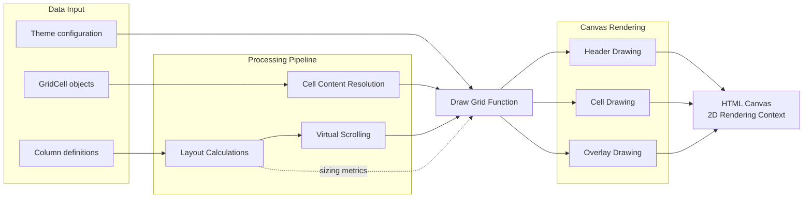
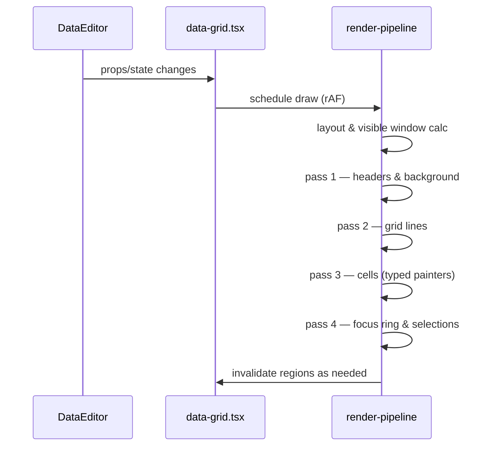

## What the lib does
Glide Data Grid is a canvas-based React data grid system designed for displaying and editing millions of rows with high performance. The system prioritizes performance through lazy cell rendering, virtual scrolling, and damage-based updates.
Key Features: 
- Millions of rows with lazy cell rendering for memory efficiency
- Multiple cell types including numbers, text, markdown, images, and custom renderers
- Built-in editing capabilities with customizable cell editors
- Column operations like resizing, moving, and freezing
- Selection modes for single/multi-select of rows, cells, and columns

## Technical architecture

### Canvas rendering architecture

### Core components
**React shell (`DataEditor`)**

* Owns props, event wiring, focus management, theming, and public API surface.
* Converts declarative props into imperative calls on the internal data‑grid core.

**Core data‑grid**

* Maintains scroll state, selection, column sizing, and render invalidation.
* Executes multi‑stage draw pipeline on a single high‑DPI canvas: background → headers → grid lines → cells → overlays (rings) → blits.
* Relies on finely scoped hooks/utilities for performance: animation queue, image windowing, sprite atlas, and math helpers.

**Editors & overlays**

* Editors are rendered outside the canvas (via portals) and synchronized to cell geometry each frame; they commit edits back via callbacks.

**Resource windowing**

* Images and other heavy assets are fetched/decoded only for cells intersecting the visible window; caches are pruned when the window shifts.

**Theme & styling**

* CSS variables drive theme values, enabling zero‑runtime styling and easier integration with non‑JS styling systems.

### Performance optimizations

| Area        | Technique                                     | Why it helps                                        | Implementation notes                                                    | Gotchas                                                           | Metrics to watch                                  |
| ----------- | --------------------------------------------- | --------------------------------------------------- | ----------------------------------------------------------------------- | ----------------------------------------------------------------- | ------------------------------------------------- |
| Rendering   | **Damage-rect repainting**                    | Repaints only changed regions instead of full grid  | Track dirty cells/rects; merge overlapping rects before draw            | Over-fragmentation can increase draw calls; periodically coalesce | Avg dirty area %, frames with >1 damage rect      |
| Rendering   | **Batch draw within `requestAnimationFrame (rAF)`** | Aligns paints with browser’s frame budget           | Queue invalidations; flush once per rAF                                 | Avoid long batches that exceed \~16ms                             | rAF callback time, dropped frames                 |
| Text        | **Cache text measurements**                   | `measureText` is costly; caching avoids repeat work | Key by (font, size, text); bounded LRU                                  | Memory growth for large vocabularies                              | Cache hit rate, rAF time spent in text            |
| Text        | **Precompute elided strings**                 | Avoids measuring during draw                        | Store truncated text + width per cell                                   | Invalidate on column resize or theme change                       | # of truncations recomputed per resize            |
| Images      | **Reuse decoded bitmaps**                     | Skip re-decode and layout                           | Use `createImageBitmap` where supported; keep a small cache             | Respect cross-origin; release on column change                    | Bitmap cache size, decode time                    |
| Scrolling   | **Native scrolling + position math**          | Offloads to compositor; smoother trackpads          | Avoid JS scroll handlers for each pixel; rely on scroll offsets in draw | Beware wheel delta normalization differences                      | Scroll FPS, main-thread time during scroll        |
| Layout      | **Column/row virtualization**                 | Limits work to visible window                       | Compute visible range + small overscan; skip offscreen                  | Huge column counts may still stress measurement                   | # visible cells drawn per frame                   |
| Layout      | **Memoize column metrics**                    | Prevents recomputation per frame                    | Cache widths, frozen bounds, group headers                              | Invalidate on resize/reorder only                                 | Layout compute time/frame                         |
| Input       | **Coalesce edits/streaming updates**          | Reduces repaint churn                               | Buffer incoming updates; invalidate combined rects                      | Don’t delay user feedback too much                                | Edits/sec, latency to paint                       |
| GC/alloc    | **Avoid allocations in hot paths**            | Cuts GC pauses                                      | Reuse arrays/objects; pre-size buffers                                  | Don’t leak reused objects across async boundaries                 | Alloc rate, GC pause %, heap size                 |
| DPI         | **Scale canvas to devicePixelRatio**          | Crisp text without oversampling                     | Set backing store size = CSS \* DPR; adjust transforms                  | Large DPR increases fill rate; consider cap                       | Fill rate, draw time vs DPR                       |
| Hit testing | **Cheap region checks before precise math**   | Skip expensive geometry for obvious misses          | Test row/column bands, then per-cell                                    | Keep bands in sync with layout cache                              | % events needing precise hit test                 |
| Overlays    | **Use HTML overlays for complex editors**     | Keep canvas simple; leverage native controls        | Absolutely position editors; only mount when active                     | Keep overlay z-index and focus handling robust                    | Overlay mount count/duration                      |
| Data I/O    | **Prefetch & debounce on scroll**             | Hides latency and avoids thrash                     | Predict next range; debounce fetches by rAF/timer                       | Handle rapid direction changes                                    | Cache hit rate, fetches/sec, wait-for-data frames |

---

### Technical challenges addressed

1. **Smooth native scrolling with massive datasets** – Avoids DOM‑per‑cell overhead by painting on a single canvas; maintains scroll precision with a special mode for >\~100M rows.
2. **Deterministic rendering under rapid updates** – Coalesces updates and animation frames; performs draw passes that minimize overdraw and avoid full surface invalidation.
3. **Memory discipline** – Lazy realization of cells, windowed resource caches, reuse pools for images.
4. **Composability** – Typed cell model with custom cell support; non‑intrusive editors that don’t own your data.
5. **Accessibility & interactions** – Keyboard navigation, selection semantics, and focus rings implemented with careful hit‑testing and input plumbing.

#### The outcome

* **Outrageous performance** → lower CPU/GPU time in complex apps (more headroom for your features) and fewer jank‑related support issues.
* **Stable API & TS types** → faster adoption across large codebases; reduced runtime bugs.
* **Lean theming** → no CSS‑in‑JS runtime; smaller bundles and simpler enterprise theming.

#### Competitive advantages

* Canvas pipeline outperforms DOM‑based grids in pathological cases (image‑heavy cells, dynamic sizing, large selections).
* Minimal, event‑driven API makes server‑side data and immutable client stores straightforward.
* First‑class TypeScript across public surface and internals.

### Deep‑dive into technical analysis

#### 1) Rendering pipeline (blit + staged passes)

**Why it’s clever**: Separating “what to paint” from “when/how to paint” allows aggressive batching and eliminates accidental full‑surface redraws. A dedicated blit stage is used for efficient copying of cached regions and cursors.

#### 2) Windowed image loader with pooling & decode scheduling

**Pattern**: Maintain a per‑URL cache keyed to visible cells; defer `img.src` set and `img.decode()` to animation frames; recycle `HTMLImageElement` instances via a small pool to avoid GC churn.

**Why it’s clever**: Moves expensive layout/decoding off the hot draw path and ensures only on‑screen images are live.

#### 3) Compact selection representation & keyboard plumbing

**Pattern**: Selections represented as compact ranges with offsets; mouse and keyboard handlers produce minimal mutations. The focus ring rendering reads from these compact structures.

**Why it’s clever**: Enables O(1)/amortized operations when expanding/shrinking selections; small memory footprint.

#### 4) Column sizing and auto‑measure

**Pattern**: A dedicated hook (`use-column-sizer.ts`) tracks drag sizing and auto‑fit using cell sampling; sizing is decoupled from rendering to avoid layout thrash.

**Why it’s clever**: Prevents synchronous reflows; supports large tables without jank during drag‑resize.

#### 5) Overlay editors via portals

**Pattern**: Editors (text, number, dropdown, markdown) render outside canvas; a geometry tracker maps cell rects to editor DOM; commits travel back through typed events (`onCellEdited`, `onCellsEdited`).

**Why it’s clever**: Keeps the canvas pure for drawing while enabling fully featured, accessible editors with native inputs.

#### 6) Sprite atlas & icon drawing

**Pattern**: A sprite atlas and vector primitives are used to render markers, checkboxes, and UI affordances in a single pass.

**Why it’s clever**: Eliminates per‑cell DOM icons and reduces draw calls, improving cache coherency.

#### 7) Animation queue & invalidation strategy

**Pattern**: A minimal animation queue coalesces many state changes into a single `requestAnimationFrame`, with dirty‑region tracking to limit work.

**Why it’s clever**: Sustains high FPS during rapid updates (e.g., streaming data) without starving input handlers.

#### 8) Theming via CSS variables (no CSS‑in‑JS at runtime)

**Pattern**: Theme tokens are exposed as `--gdg-*` CSS variables and a `useTheme` hook for JS access. No styled‑components dependency in v5+.

**Why it’s clever**: Shrinks runtime and bundle size while making enterprise theming straightforward.

### Engineering decisions (the “why”)

- **Canvas over DOM**: DOM per cell becomes a bottleneck at scale. Canvas centralizes draw costs; hit‑testing and focus are handled explicitly.
- **Event‑driven data**: Keeping user data outside the grid avoids hidden state divergence and simplifies server‑backed models.
- **Split editors**: DOM inputs remain accessible and composable while keeping rendering deterministic.
- **No CSS‑in‑JS runtime**: CSS variables provide theme flexibility without runtime allocations.

### Bottlenecks & improvement opportunities

- **Uneven row heights**: Documented to impact performance without caching. Provide built‑in memoizer for `rowHeight` callbacks.
- **Custom cell text layout**: Offer a text layout cache (LRU keyed by font+string+width) exposed to custom painters.
- **A11y testing surfaces**: Provide a headless testing harness that verifies ARIA flows against screen readers.

### Comparison notes (quick engineering POV)

* **vs AG Grid:** AG Grid packs an enormous feature surface (grouping/aggregation/tree data/server‑side row model). GDG wins when your primary constraint is **render performance at scale** and you can implement app‑specific sorting/filtering yourself.
* **vs React Data Grid (Adazzle):** React Data Grid is DOM‑based and very extensible; GDG’s canvas approach trades DOM flexibility for **scroll smoothness** and **predictable performance** under heavy churn.

## References
- https://github.com/glideapps/glide-data-grid
- https://www.ag-grid.com/
- https://www.codemancers.com/blog/2024-01-17-blog-glide-apps-grid
