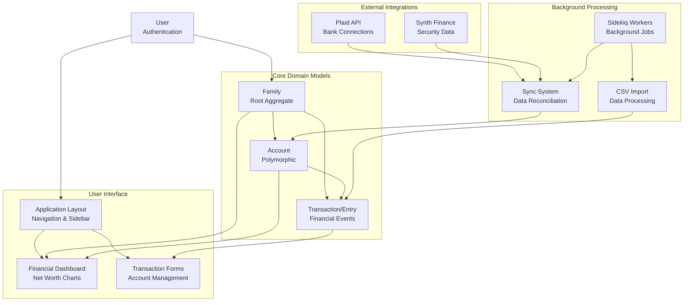
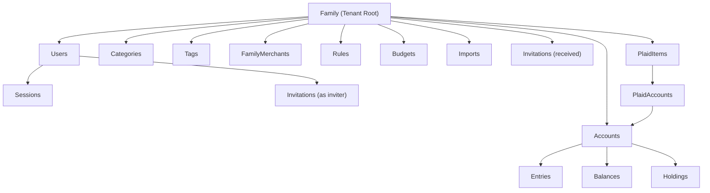
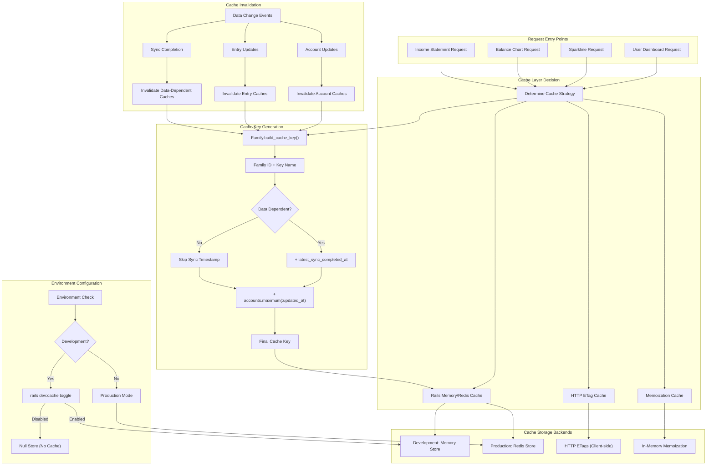
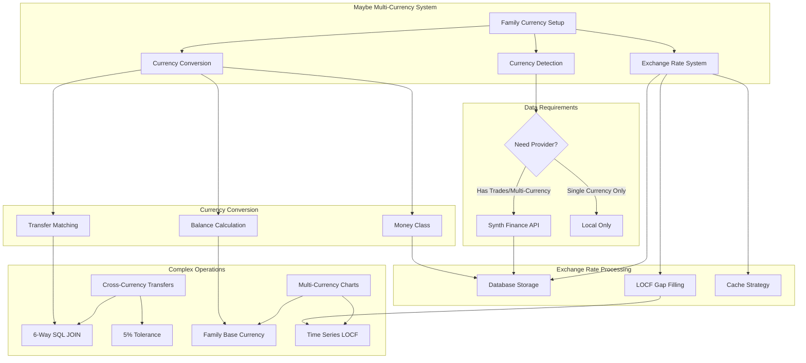

## Overview

Maybe is an open-source personal finance application originally developed as a commercial product with over $1 million in development investment. After the commercial venture ended in 2023, the codebase was open-sourced to enable individuals to manage their finances using a sophisticated, feature-rich platform.

**Key components:**
- **Multi-tenant family-based architecture**: Central organizational structure around families
- **Multi-currency support**: Powered by Synth Finance API for exchange rates
- **Financial institution integration**: Plaid API for US/EU bank connections
- **Manual data management**: CSV imports and manual entry capabilities
- **Investment tracking**: Securities data and portfolio management
- **Self-hosting capabilities**: Complete Docker-based deployment stack

## How it works

### Application Infrastructure
Maybe implements a Rails 7.2 application with specialized subsystems for financial data management, external integrations, and multi-tenant organization. The architecture is built around the Family model as the central aggregate root and tenant boundary.

### Core Data Model

The data model implements a multi-tenant architecture centered around the Family model. Each family serves as an isolated tenant with complete ownership of their financial data, users, and configurations.

#### Primary Models

**Family (Aggregate Root)**
- Central tenant boundary for data isolation
- Owns all financial data (accounts, transactions, categories)
- Stores default currency and family-wide configuration
- Enables shared access for multiple family members

**User (Access Control)**
- Belongs to family, inherits access to all family data
- Supports multiple users per family (spouses, advisors)
- No direct data ownership - all data belongs to family unit

**Account (Financial Foundation)**
- Uses Rails delegated types for account specialization
- Supports checking, savings, credit, investment, loan, property accounts
- Polymorphic design enables type-specific behavior while maintaining unified interface
- Links to financial institutions via Plaid integration

**Entry (Financial Events)**
- Base class for all financial events using polymorphic relationships
- Handles transactions, valuations, and trades through "entryable" pattern
- Provides consistent chronological ordering and amount handling
- Maintains family-level aggregation capabilities

#### Specialized Models

**Transaction**
- Core personal finance activity (purchases, deposits, transfers)
- Automatic transfer detection prevents double-counting in budgets
- Supports categorization and tagging for organization
- Handles complex transfer scenarios between family accounts

**Investment System**
- Security: Investable assets with market data
- Holding: Current positions in investment accounts
- Trade: Buy/sell transactions with quantity, price, fees
- Enables portfolio valuation and performance tracking

**Category & Tag System**
- Categories: Hierarchical organization for budgeting
- Tags: Flexible, non-hierarchical cross-cutting analysis
- Supports both income and expense classification

**Import System**
- Handles CSV imports, Mint exports, other financial software
- Type-specific models (TransactionImport, TradeImport, AccountImport)
- Intelligent format detection and validation
- Robust data migration capabilities

**Institution Integration**
- Institution: Financial institution metadata
- PlaidItem/PlaidAccount: API integration management
- Supports both automated syncing and manual entry
- Fallback mechanisms for connection failures

**Multi-Currency Support**
- Consistent currency storage at account level
- Family-level default currency for aggregation
- Money objects handle conversion and arithmetic
- Exchange rate integration for accurate cross-currency calculations

## Technical Challenges
#### Caching Performance Optimization

**Multi-Layered Caching Architecture**
Maybe implements a comprehensive multi-layered caching strategy to handle the performance demands of financial data processing. The core caching system is built around the Family model's cache key management, which creates cache keys that automatically invalidate when account data changes, using sync timestamps and account update times as invalidation triggers. The system also maintains separate cache versioning for entry-related calculations, ensuring that different types of financial data have appropriate invalidation strategies.

**Family-Level Cache Key Management**
The caching mechanism uses intelligent cache management where the Family model serves as the central cache coordinator. Cache keys are generated using composite timestamps that include latest sync completion times and account update timestamps. This dual-cache approach ensures that account-related changes trigger appropriate cache invalidation while maintaining performance for unchanged data. The system creates hierarchical cache keys that cascade invalidation from family level down to individual account calculations.

**Sparkline Caching Strategy**
The sparkline system implements sophisticated multi-layered caching for chart data through the AccountableSparklinesController, which uses HTTP ETags for client-side caching combined with Rails.cache for server-side storage. Individual accounts implement their own sparkline caching through the Account::Chartable module, creating a hierarchical caching system where both family-level and account-level sparklines are cached independently with 24-hour expiration times. This approach reduces computational overhead for frequently accessed dashboard elements while ensuring data freshness.

**Environment-Specific Cache Configuration**
The development environment provides configurable caching for testing purposes through `rails dev:cache` command, using memory store with 2-day cache headers when enabled, or null store to prevent caching during development. Production environments implement always-on caching with Redis integration, including eager loading for better memory efficiency and improved response times. This environment-specific approach allows developers to test both cached and non-cached scenarios while ensuring production performance.

**Income Statement Cache Optimization**
The income statement system demonstrates sophisticated query-level caching with multiple cache layers, caching family stats, category stats, and totals queries using SQL hash-based cache keys combined with the family's entries cache version for automatic invalidation. This approach ensures that expensive financial calculations are cached appropriately while maintaining accuracy when underlying data changes.

**Cache Invalidation Challenges and Solutions**
Financial data changes frequently through syncs, user updates, and external data imports, making cache invalidation extremely complex. The system addresses this through a multi-trigger invalidation strategy using different cache keys for different data types. Account-related caches invalidate when accounts change, while entry-related caches use separate versioning. The invalidation strategy uses sync-based triggers with latest_sync_completed_at timestamps, account update invalidation using accounts.maximum(:updated_at), entry-based invalidation using entries.maximum(:updated_at), and SQL hash invalidation using MD5 hashes of SQL queries for query-specific caches.

**Balance Calculation Cache Coordination**
Balance calculations involve multiple data sources including entries, holdings, and exchange rates that must be coordinated for cache consistency. The balance calculator uses a sync cache system to coordinate entry flows and holdings calculations, ensuring consistent data access patterns across balance calculations. This prevents cache inconsistencies that could lead to incorrect financial displays while maintaining computational efficiency.

**Administrative Cache Management**
For self-hosted instances, the system provides administrative cache clearing functionality that removes exchange rates, security prices, holdings, and balances. This capability is only available to family admins in self-hosted mode, allowing users to resolve cache-related issues without requiring developer intervention. The cache clearing process is comprehensive, addressing all major cached data types that could become problematic in self-hosted environments.

**Performance Monitoring Integration**
The system includes Public Skylight dashboard integration for monitoring caching effectiveness and identifying performance bottlenecks. This provides transparency into which caching strategies are working effectively and helps identify areas needing optimization. The monitoring integration allows the development team to continuously refine caching strategies based on real-world usage patterns and performance data.

### Multi-Currency Complexity

**Challenge**: Supporting global users requires handling multiple currencies within the same family's financial data. Exchange rate fluctuations, currency conversion accuracy, and meaningful aggregation across currencies present significant technical challenges.

**Solution**: The architecture stores both amount and currency for every financial entry, using the Synth Finance API for real-time exchange rates. The family's default currency serves as the base for aggregation, while individual accounts maintain their native currencies. Money objects handle conversion mathematics with proper precision.

#### Exchange Rate Caching Strategy

**Multi-Layer Caching Architecture**
Maybe implements a sophisticated caching strategy to minimize external API calls while ensuring rate accuracy. The system employs a database-first lookup approach where exchange rates are stored locally in a dedicated ExchangeRate model. When a rate is needed, the system first checks the local cache before making external provider requests to Synth Finance API.

**Cache Optimization Logic**
The caching mechanism uses intelligent cache management where rates are stored with currency pair and date as composite keys, enabling fast lookups for historical data. The system can optionally cache newly fetched rates for future use, reducing redundant API calls for commonly requested currency pairs. Cache invalidation ensures stale rates don't affect calculations while maintaining performance benefits.

#### LOCF (Last Observation Carried Forward) Algorithm

**Gap-Filling Strategy**
LOCF represents the core algorithm for handling missing exchange rate data across weekends, holidays, and provider outages. When the system encounters missing rate data for a specific date, it automatically carries forward the most recent available rate from a previous date.

**Implementation Process**
The LOCF algorithm iterates through each date in a target range, checking for existing rates in both database cache and external providers. When no rate is available from either source, the algorithm uses the previous rate value to fill the gap. This previous rate value is continuously updated as the algorithm progresses through the date range, ensuring continuous data coverage.

**Application Areas**
LOCF is implemented across multiple system components. In exchange rate imports, it ensures continuous rate coverage when external providers don't return weekend or holiday data. For security price data, the same strategy fills gaps in stock and investment prices when markets are closed. In balance chart calculations, LOCF operates at the SQL level using lateral joins to find the most recent balance and exchange rate on or before each chart date.

**Data Consistency Benefits**
The LOCF strategy prevents broken financial charts and ensures consistent calculations even when external data sources have gaps. This approach is particularly crucial for time series analysis where continuous data is essential for accurate trend visualization and portfolio valuation. The algorithm maintains historical accuracy while providing seamless user experience across different market conditions and data provider limitations.

## Clever Tricks and Tips

### Polymorphic Account Architecture with Delegated Types

The system uses Rails' delegated types pattern to implement account specialization while maintaining a unified interface. This approach enables account-type-specific behavior (credit limits for credit cards, interest rates for loans) while preserving common operations like balance calculations and transaction aggregation.

### Intelligent CSV Import with Format Detection

The import system automatically detects various international number formats, column separators, and signage conventions. The system supports US format (1,234.56), European format (1.234,56), and Scandinavian format (1 234,56), with automatic format detection reducing user configuration burden.

### Transfer Auto-Detection Algorithm

Maybe implements sophisticated transfer detection that identifies matching amounts and dates across family accounts. The algorithm accounts for processing delays and amount variations while avoiding false positives that could incorrectly classify legitimate transactions as transfers.

### Git-Style Checkpoint System for Financial Data

The application implements a checkpoint system similar to Git commits, allowing users to create snapshots of their financial state before major changes. This enables safe experimentation with categorization rules and import processes with reliable rollback capabilities.

### Smart Import Template Suggestions

The import system learns from previous successful imports, suggesting column mappings and configurations based on similar import types and file formats. This reduces repetitive configuration for users who regularly import data from the same sources.

### Context-Aware Category Suggestions

The categorization system analyzes transaction descriptions, amounts, and merchant data to suggest appropriate categories. The algorithm learns from user corrections, improving accuracy over time while respecting family-specific categorization preferences.

## Conclusion

Maybe Finance demonstrates how sophisticated financial software can be built using Ruby on Rails while maintaining focus on accuracy, usability, and architectural clarity. The open-sourcing of this million-dollar codebase provides valuable insights into production-grade financial application development.

The architecture successfully balances complexity and maintainability through careful domain modeling, intelligent automation, and user-centric design. The multi-tenant family structure, polymorphic account system, and transfer-aware transaction handling represent thoughtful solutions to common personal finance software challenges.

While the original company has pivoted away from personal finance, the open-source codebase continues to serve as an excellent reference implementation for developers building financial applications. The emphasis on self-hosting capabilities and manual data management makes Maybe particularly valuable for users who prioritize data ownership and privacy in their financial management tools.

The codebase exemplifies how modern web applications can handle complex financial domains while maintaining clean, testable, and deployable architecture suitable for both individual use and community-driven development.
