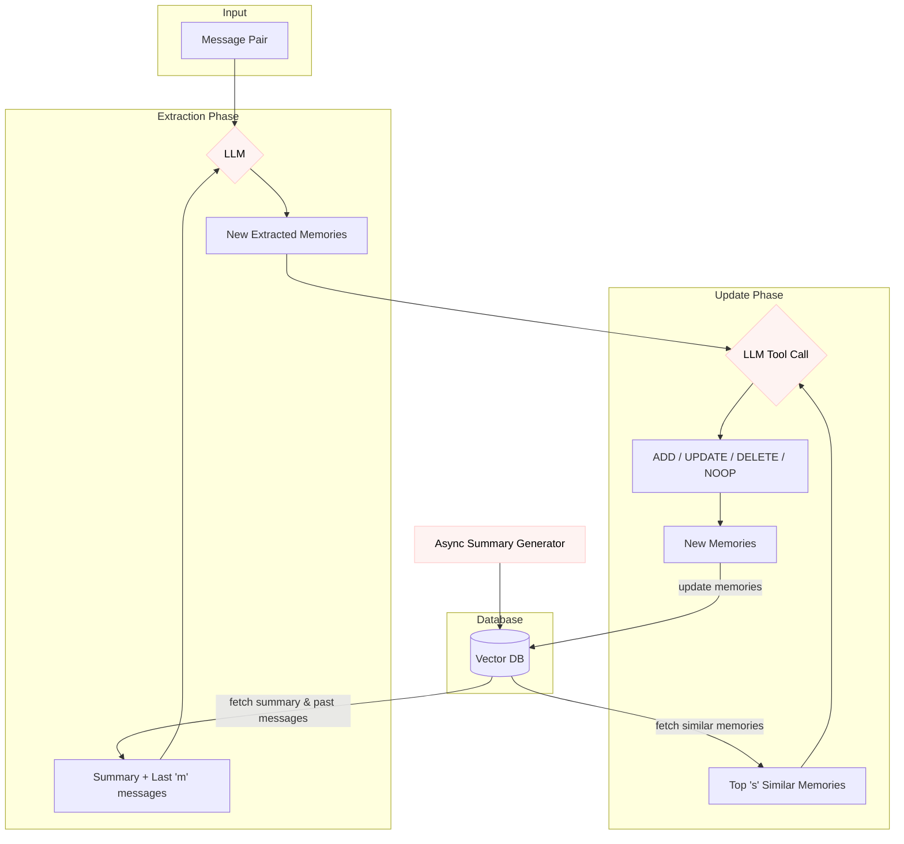
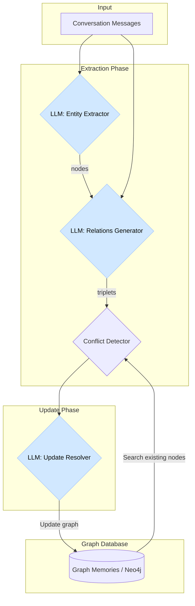
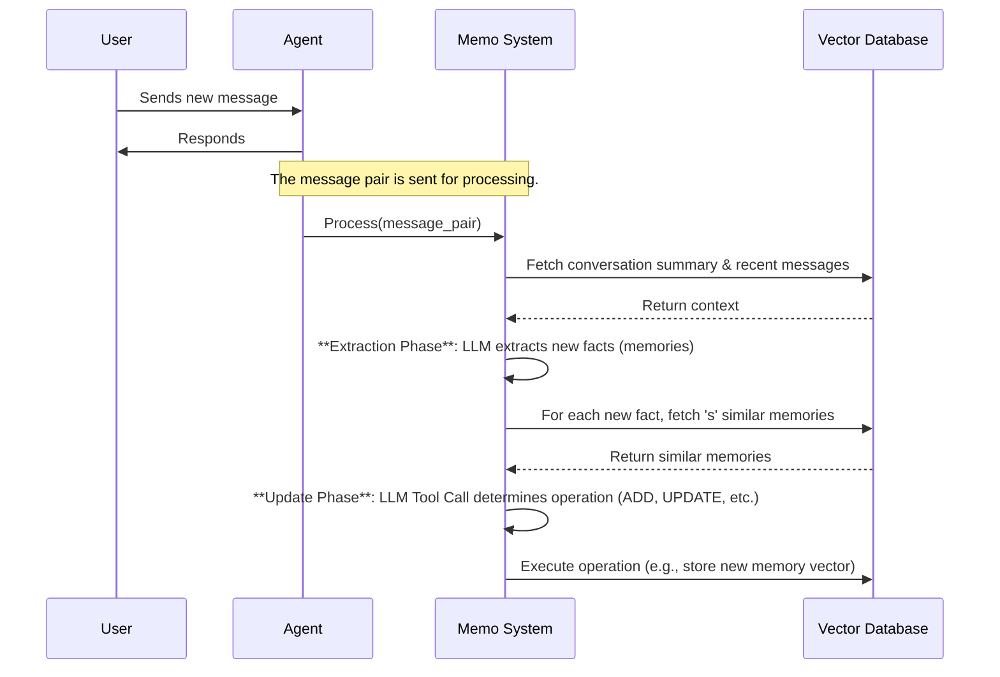
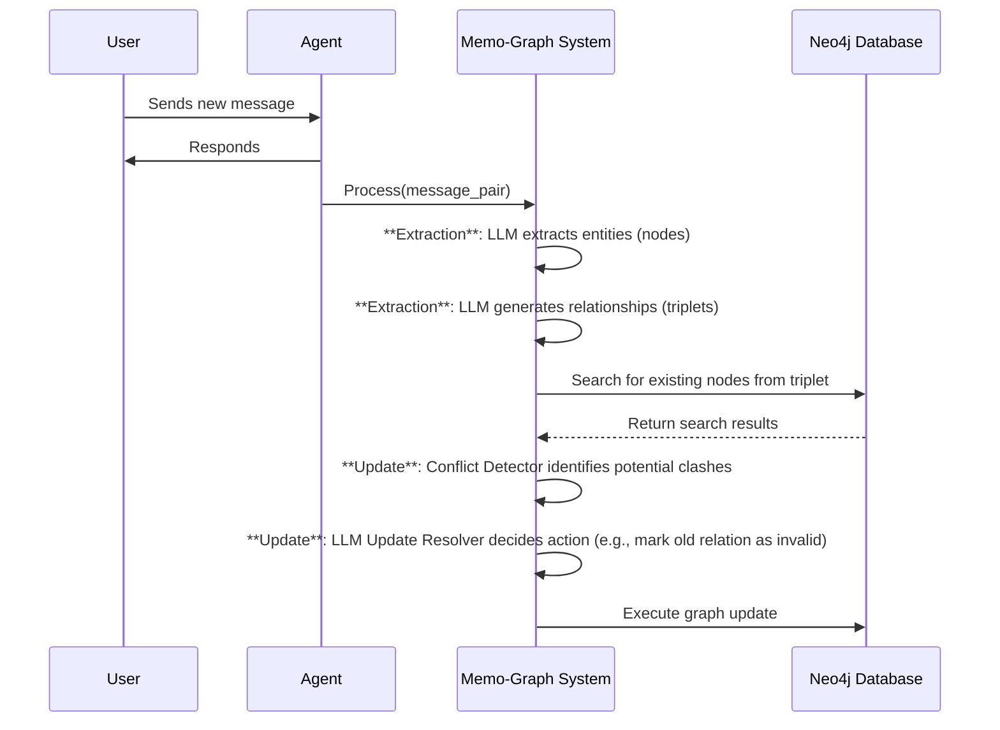

## 1. Overview

**Mem0** is a memory-centric architecture designed to overcome the fixed-context window limitations of Large Language Models (LLMs), enabling consistent, long-term, multi-session conversations. It extracts, consolidates, and retrieves salient information dynamically.

**Mem0-Graph** (MemO⁸) extends Memo by representing memories as a knowledge graph, enabling reasoning over complex relational structures between conversational elements.

## Core Technical Approaches and Innovations

- **Dynamic Memory Pipeline:** Two-phase process—Extraction (identifies important facts) and Update (integrates facts into persistent memory).
- **LLM-Powered Memory Operations:** Uses LLM function-calling to decide ADD, UPDATE, DELETE, or NOOP for memory management.
- **Graph-Based Memory Representation (Memo-Graph):** Models information as a directed labeled graph (entities as nodes, relationships as edges).
- **Dual-Contextual Prompting:** Extraction uses both a long-term summary and recent message history for context.
- **Efficiency and Scalability:** Stores concise facts, reducing token consumption and latency compared to full-context or RAG approaches.

## Key Architectural Components

### Memo Architecture

- **Extraction Phase:** LLM processes new messages, summary, and history to extract salient memory facts.
- **Update Phase:** Retrieves similar memories and uses LLM tool call to manage memory store (ADD/UPDATE/DELETE/NOOP).
- **Vector Database:** Stores memory embeddings for semantic similarity search.

### Memo-Graph Architecture

- **Entity Extractor:** LLM identifies key entities.
- **Relations Generator:** LLM defines relationships, creating triplets (e.g., (Alice, LIVES_IN, San Francisco)).
- **Conflict Detector & Update Resolver:** LLM resolves contradictions, marking outdated relationships as invalid.
- **Graph Database (Neo4j):** Stores nodes and edges of the memory graph.

## Visual Illustration

### Memo System Architecture



### Memo-Graph System Architecture



## 2. What Memo Does

Memo provides AI agents with scalable long-term memory, solving conversational amnesia from fixed context windows.

## Core Capabilities

- **Maintains Conversational Continuity:** Remembers preferences, events, and facts across sessions.
- **Differentiates Information:** Selectively stores salient info, ignoring irrelevant chatter.
- **Self-Corrects and Updates:** Dynamically updates/removes outdated or contradictory info.
- **Reasons Over Relationships (Memo-Graph):** Handles multi-hop and temporal questions.

## Key Features and Use Cases

- **Incremental Processing:** Real-time memory updates, message-by-message.
- **LLM-as-Operator:** LLM performs database-like operations for data integrity.
- **Dual Retrieval (Memo-Graph):** Combines graph traversal and semantic triplet matching.

**Use Cases:**

- Personalized Assistants: Remembers dietary preferences for future suggestions.
- Enterprise Support: Tracks customer history across channels for better resolutions.
- Personal Tutoring: Adapts lessons based on long-term student performance.

## 3. System Architecture

## Component Relationships and Data Flow

### Memo Data Flow



### Memo-Graph Data Flow



## 4. Core Implementation Patterns

## Key Algorithm: Memory Update Logic

The update phase ensures memory store integrity.

```python
# Pseudocode for the memory update logic in Memo
from typing import List, Dict, Optional

class MemoryStore:
        def __init__(self):
                self.memories: Dict[str, Dict] = {} # Stores memory facts
                self.vector_db = VectorDB() # Simulates a vector database

        def classify_operation(self, fact: str) -> str:
                """Uses an LLM to classify the operation for a new fact."""
                similar_memories = self.vector_db.find_similar(fact, top_s=10)
                if not similar_memories:
                        return "ADD"
                # ... more complex logic for UPDATE, DELETE, NOOP
                return "ADD" # Default for example

        def update_memory(self, new_facts: List[str]):
                """Processes a list of new facts and updates the memory store."""
                for fact in new_facts:
                        operation = self.classify_operation(fact)
                        if operation == "ADD":
                                new_id = self.generate_unique_id()
                                self.memories[new_id] = {"content": fact, "status": "ACTIVE"}
                                self.vector_db.add(new_id, fact)
                                print(f"Added new memory: '{fact}'")
                        elif operation == "UPDATE":
                                related_id, related_memory = self.find_related_memory(fact)
                                self.memories[related_id]["content"] = fact
                                self.vector_db.update(related_id, fact)
                                print(f"Updated memory {related_id} with: '{fact}'")
                        elif operation == "DELETE":
                                contradicted_id, _ = self.find_contradicted_memory(fact)
                                del self.memories[contradicted_id]
                                self.vector_db.delete(contradicted_id)
                                print(f"Deleted contradicted memory: {contradicted_id}")
                        elif operation == "NOOP":
                                print(f"No operation needed for fact: '{fact}'")
```

## Technical Implementation Details

- **LLM Engine:** GPT-4o-mini for extraction, classification, and resolution.
- **Vector Embeddings:** Dense embeddings for similarity search (e.g., OpenAI text-embedding-small-3).
- **Graph Database:** Memo-Graph uses Neo4j.
- **Hyperparameters:** `m = 10` (recent messages), `s = 10` (similar memories).
- **Asynchronous Processing:** Summary generation runs independently for up-to-date global context.

## 5. Data Structures and Algorithms

## Key Data Structures

### Memo - Memory Fact (ω)

```python
class MemoryFact:
        id: str
        content: str # e.g., "User is a vegetarian and avoids dairy."
        timestamp: str
        created_by_tool: str
```

### Memo-Graph - Entity Node (v)

```python
class EntityNode:
        id: str
        label: str # e.g., "Person", "Location", "DietaryPreference"
        entity_type: str
        embedding: List[float] # Semantic vector representation
        metadata: Dict[str, any] # e.g., {"creation_timestamp": "..."}
```

### Memo-Graph - Relationship Triplet ((vs, r, vd))

```python
class RelationshipTriplet:
        source_node: EntityNode
        destination_node: EntityNode
        relationship_type: str # e.g., "LIVES_IN", "PREFERS", "IS_A"
```

## Algorithms

- **Memory Extraction (Memo):**
  - Input: New message pair, summary, recent messages.
  - Process: Concatenate inputs, prompt LLM to extract salient facts.
  - Output: List of candidate memory facts.

- **Conflict Resolution (Memo-Graph):**
  - Input: New relationship triplet.
  - Process: Search graph for similar nodes, identify conflicting relationships, resolve via LLM.
  - Output: Updated, consistent knowledge graph.

## Performance Considerations

- **Latency:** Memo p95 latency 1.44s (91% faster than full-context). Memo-Graph p95 latency 2.59s.
- **Token Cost:** Memo averages 7k tokens/conversation, Memo-Graph 14k, much less than full history (~26k tokens).
- **Trade-offs:** Memo is fastest for single-hop queries; Memo-Graph excels at complex, multi-hop/temporal queries.

## 6. Technical Challenges and Innovations

## Problems Solved

- **Context Window Limitation:** Enables long-term memory beyond LLM context window.
- **Conversational Amnesia:** Prevents agents from forgetting preferences or repeating questions.
- **Inefficient Context Retrieval:** Retrieves concise facts, improving LLM signal-to-noise ratio.
- **Reasoning over Time:** Memo-Graph models event sequences for temporal reasoning.

## Unique Approaches

- **LLM as Database Operator:** LLM manages memory integrity (ADD/UPDATE/DELETE/NOOP).
- **Hybrid Contextualization:** Combines global summary and recent messages for extraction.
- **Logical Deletion in Graphs:** Marks conflicting info as invalid, preserving historical data.

## Technical Breakthroughs

- **State-of-the-Art Performance:** Top scores on LOCOMO benchmark, outperforming existing systems.
- **Production-Ready Efficiency:** >90% reductions in latency and token cost.
- **Effective Relational Modeling:** Structured graph representation improves multi-hop/temporal reasoning.
