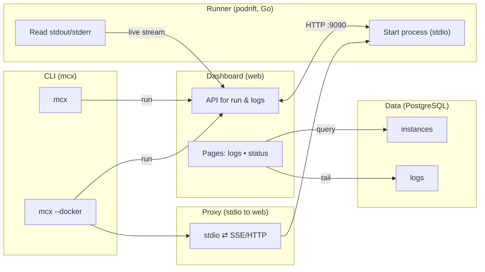
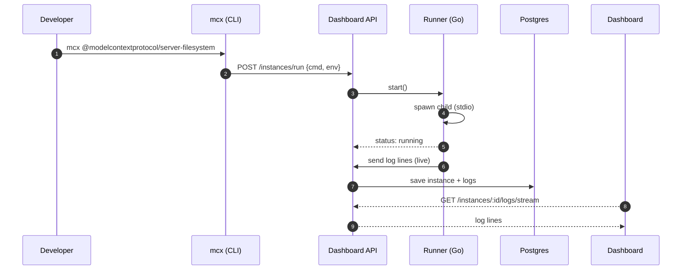
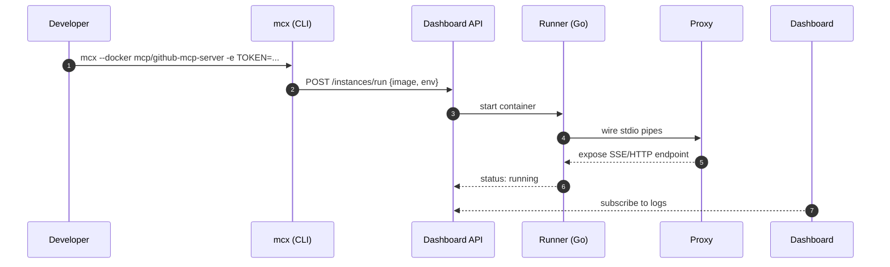

> **TL;DR**
**mathom** helps you run and moniror MCP servers on your own machine. It has a web dashboard, a small Go *runner that starts the servers, and a TypeScript CLI (`mcx`). If a server only talks stdio, mathom can add a small proxy so web clients can talk to it.

## What the app does

* Start servers with `mcx` (from a name, an npm package, or a Docker image). You can pass extra args and env.
* See logs live in a simple dashboard (dark/light).
* Sign in with OAuth (easy in dev, tighten later for prod).
* Use with editors like Claude Desktop or Cursor by setting `command: "mcx"` and `env.MATHOM_URL`.

## How the parts fit together



*In short:* `mcx` asks the API to start a server. The Go runner starts it and streams logs back. If the server is inside Docker and only speaks stdio, the proxy exposes a small web endpoint.

## How it works

* Dashboard – Next.js app with API routes for run and logs. Stores data in Postgres.
* Runner – Go program that starts the server process, watches it, and sends logs.
* TypeScript CLI:

  * `mcx <server>` – run a local stdio server (by name or npm package).
  * `mcx --docker <image> -e KEY=VAL` – run the server in Docker and add the proxy if needed.
* `quickstart.sh` builds/starts everything. 
* `docker-compose.yaml` links the parts for dev.
### Higligted design patterns being used:

* Supervisor (runner): the Go runner starts the server process, watches it, and reports status. Goal: keep the child process healthy and its logs flowing.

* Adapter / Proxy: turns a stdio‑only server into something web clients can talk to (SSE/HTTP). Useful when the tool was never built for the network.

* Command (CLI): mcx has clear subcommands/handlers (e.g., run, --docker). Each command maps to one action. Keeps CLI code small and easy to test.

* Observer (logs via SSE): the UI subscribes to log events from the server and updates the view when new lines arrive. Push, not polling.


### Key flows

#### 1) Run a local stdio server



* **What’s hard**: keeping the child process up, handling fast logs, knowing when the server is “ready”.

#### 2) Run a Docker server that needs the web



* **Note**: the proxy adds a little overhead but lets web clients work.

## Data and CRUD map

| Entity     | Fields (main)                                                  | Created by    | Read by          | Updated by      | Deleted by      |
| ---------- | -------------------------------------------------------------- | ------------- | ---------------- | --------------- | --------------- |
| `Instance` | `id`, `name`, `cmd/image`, `env`, `status`, `pid`, `createdAt` | API on run    | UI, runner       | Runner (status) | API/cleanup job |
| `LogLine`  | `id`, `instanceId`, `ts`, `level`, `text`                      | Runner        | UI/history       | —               | TTL job         |
| `Session`  | `userId`, `provider`, `createdAt`, `expiresAt`                 | Auth callback | API (auth check) | Auth middleware | Expiry/Logout   |

* **Store**: Postgres (ORM).
* **Indexes**: `logs(instanceId, ts)` for fast reads; `instances(status)` for filters.
* **Retention**: set TTL on `logs`.

## How to run it (and why)

```bash
# start everything
./quickstart.sh
```

```bash
# run servers
mcx auth login # need to login to the current terminal session
mcx @modelcontextprotocol/server-filesystem # run a local mcp server
mcx --docker mcp/github-mcp-server -e GITHUB_PERSONAL_ACCESS_TOKEN=... # run a dockerized mcp server
```

```jsonc
// Add the MCP to Claude/Cursor
{
  "mcpServers": {
    "filesystem": {
      "command": "mcx",
      "args": ["@modelcontextprotocol/server-filesystem"],
      "env": { "MATHOM_URL": "http://localhost:5050" }
    }
  }
}
```

* **Why this design**: stdio is simple for local tools; Docker keeps deps clean; the proxy lets web clients talk to stdio servers.
* **Throughput**: log stream scales with lines; keep queues bounded so the UI doesn’t lag.

## Hard parts and how they’re solved

* Stdio vs web: a small proxy turns stdio into SSE/HTTP.
  Why hard: many MCP servers only speak stdio; editors/tools may expect HTTP/SSE.
  Cost: tiny extra latency and memory.

* Fast log streams
Why hard: a noisy server can flood the UI and DB.Fix: use bounded queues/backpressure; batch writes; drop policy with a clear UI note.

* Login without pain (in dev): OAuth via the dashboard; easy defaults in dev; lock it down for prod.
  Why hard: real HTTPS and solid provider setup later.

* Live logs that don’t stall: use SSE for streaming and save logs in the DB.
  Need: TTL and flow control for very chatty servers.

## Small tips

* Use `mcx` instead of `npx` for a cleaner flow.
* `./quickstart.sh` gets you running fast.
* Keep sample configs for Claude/Cursor handy.

## Speed and resource notes

* **SSE** is light for one‑way log streams.
* **Host‑like networking** in dev keeps localhost simple.
* **Docker stdio** is cheaper than writing a full web server.

## Limitations and next steps

* **Lots of logs**: add TTL/compaction and a per‑instance size limit.
* **Teams**: add permissions and audit later.
