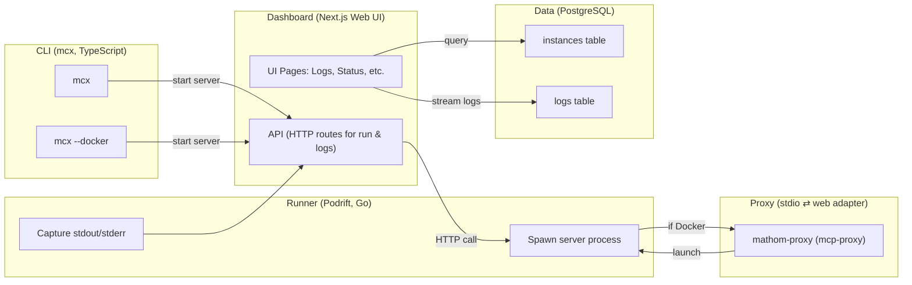
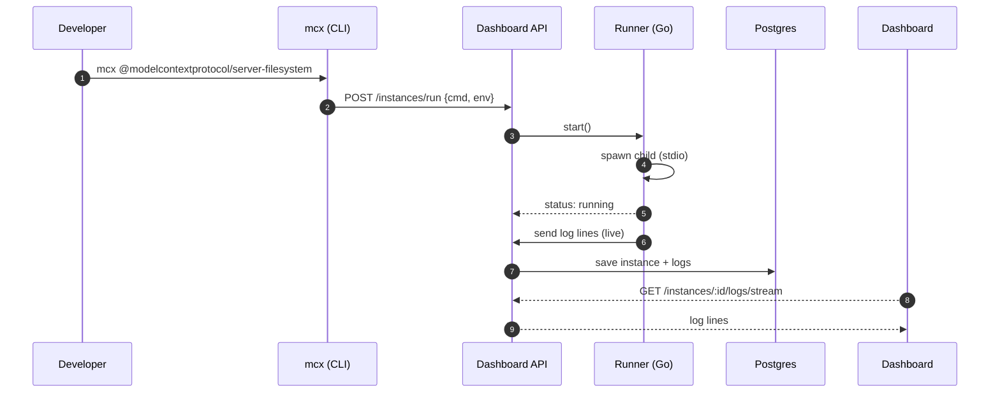
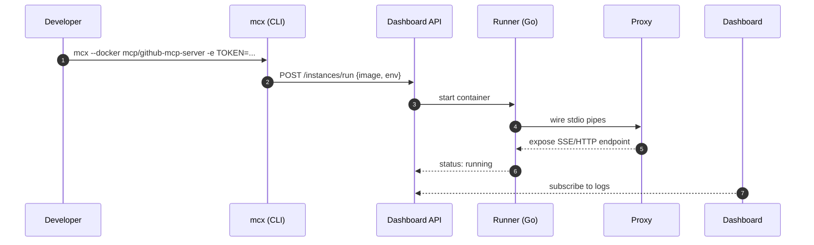

> **TL;DR**
**mathom** helps you run and moniror MCP servers on your own machine. It has a web dashboard, a small Go *runner that starts the servers, and a TypeScript CLI (`mcx`). If a server only talks stdio, mathom can add a small proxy so web clients can talk to it.

## What the app does

* Start servers with `mcx` (from a name, an npm package, or a Docker image).
* Live Monitoring: View real-time logs and status in a modern web UI (supports dark/light themes).
* Authentication: Sign in via OAuth2 (with dev-friendly defaults) to secure the dashboard and server endpoints.
* Editor Integration: Easily use local servers with tools like Claude Desktop or Cursor by configuring them to call mcx and pointing MATHOM_URL to your local Mathom instance.

## How the parts fit together



The system is composed of several cooperating components:
- Dashboard (Next.js Web App): Provides a UI and HTTP API (on port 5050) for starting/stopping servers and streaming logs.

- CLI (mcx - TypeScript): User-facing CLI to send commands to the dashboard API. For example, mcx my-server or mcx --docker some-image triggers the dashboard to launch that server.

- Runner (“Podrift” – Go): A background process that the dashboard API calls to actually spawn processes or containers. It acts as a supervisor: starting the MCP server process (either directly or in Docker), streaming back its stdout/stderr logs, and tracking its status.

- Proxy (Rust mcp-proxy): A lightweight adapter that connects stdio-only servers to the web. It runs the server as a subprocess and exposes an HTTP/SSE endpoint for clients

- PostgreSQL Database: Stores persistent data – instances (running server metadata), log lines, and user sessions.

*In short:* `mcx` asks the API to start a server. The Go runner starts it and streams logs back. If the server is inside Docker and only speaks stdio, the proxy exposes a small web endpoint.

## How it works

- Dashboard & API: The Next.js app serves both the user interface and RESTful endpoints. For example, there’s an POST /instances/run endpoint that the CLI calls to start a new server instance. The dashboard also provides an SSE or similar streaming endpoint for logs (e.g. GET /instances/:id/logs/stream) so the UI can tail logs live.
- CLI (mcx): This thin client finds the local Mathom API (by default at localhost:5050) and sends the appropriate request. It supports different subcommands or flags.
- Go Runner (Podrift): The runner is a Go service responsible for actually executing the server processes. On startup, the dashboard API connects to the runner (likely via HTTP or a local RPC) and instructs it to start a process or container:
  - For a local process, Podrift uses os/exec to spawn the command (e.g., running the npm package via npx or launching a binary). It pipes the stdout/stderr.
  - For a Dockerized server, Podrift uses Docker Engine APIs to run the specified image. It doesn’t run the image’s default entrypoint directly; instead it wraps it with the mathom-proxy if needed (more on that below).
  - Podrift also monitors the process/container status (running, exited, etc.) and reports changes back to the dashboard (which updates the UI and instance status accordingly).

- Data Storage: The Postgres database keeps track of:
  - Instances: Each launched server instance has a record (with fields like id, name, command or image, env vars, status, PID or container ID, start time, etc.).
  - Log Lines: Each stdout/stderr line (or batch of lines) from servers is saved with a timestamp and severity level. These are keyed by instance ID for retrieval
  - Sessions: User login sessions (OAuth provider info, expiry, etc.) to manage authentication.

By storing logs and instances, Mathom can show historical logs, persist server configurations, and implement cleanup policies (e.g., auto-stopping or removing old instances, log retention via TTL).

### Design Patterns at Play
- Supervisor Pattern: The runner (Podrift) acts as a supervisor that spawns child processes (the MCP servers) and keeps them running. It handles restarts or shutdowns and captures their output. This ensures the MCP servers don’t need to manage their own daemonization.
- Adapter/Proxy Pattern: The mathom-proxy (built on mcp-proxy) is essentially an adapter that converts a standard input/output interface into a network service. If an MCP server wasn’t originally built with HTTP or SSE, this proxy adds that capability externally without modifying the server itself.
- Command Pattern (CLI): The mcx CLI is structured around clear subcommands and flags which map to distinct actions (run local, run docker, auth, etc.). This separation makes the CLI logic easy to extend and test.
- Observer Pattern (Logs via SSE): The dashboard UI “observes” log events through a streaming endpoint. New log entries are pushed to the UI in real-time as they are produced, rather than the UI polling repeatedly for updates. This push-based log feed is implemented with SSE for efficiency.

### Key flows

#### 1) Run a local stdio server



**Challenges**: For local processes, one tricky aspect is determining when the server is actually ready to accept requests. The runner may start a process, but the MCP server might take a few seconds to initialize. Mathom’s strategy is to treat the process as “running” as soon as it’s spawned and piping output. It’s up to the user or client to handle initial readiness (often the server prints a “listening” message, which you can see in logs). Another issue is handling very fast or noisy log output without dropping lines or overwhelming the UI/DB – Mathom addresses this with backpressure and batching in the log pipeline (more on this later).

#### 2) Run a Docker server that needs the web



**Note**: the proxy adds a little overhead but lets web clients work.

## Data and CRUD map

| Entity     | Fields (main)                                                  | Created by    | Read by          | Updated by      | Deleted by      |
| ---------- | -------------------------------------------------------------- | ------------- | ---------------- | --------------- | --------------- |
| `Instance` | `id`, `name`, `cmd/image`, `env`, `status`, `pid`, `createdAt` | API on run    | UI, runner       | Runner (status) | API/cleanup job |
| `LogLine`  | `id`, `instanceId`, `ts`, `level`, `text`                      | Runner        | UI/history       | —               | TTL job         |
| `Session`  | `userId`, `provider`, `createdAt`, `expiresAt`                 | Auth callback | API (auth check) | Auth middleware | Expiry/Logout   |

**Store**: Postgres (ORM).
**Indexes**: `logs(instanceId, ts)` for fast reads; `instances(status)` for filters.
**Retention**: set TTL on `logs`.

## How to run

```bash
# start everything
./quickstart.sh
```

```bash
# run servers
mcx auth login # need to login to the current terminal session
mcx @modelcontextprotocol/server-filesystem # run a local mcp server
mcx --docker mcp/github-mcp-server -e GITHUB_PERSONAL_ACCESS_TOKEN=... # run a dockerized mcp server
```

```jsonc
// Add the MCP to Claude/Cursor
{
  "mcpServers": {
    "filesystem": {
      "command": "mcx",
      "args": ["@modelcontextprotocol/server-filesystem"],
      "env": { "MATHOM_URL": "http://localhost:5050" }
    }
  }
}
```

## Hard parts and how they’re solved

- Turning STDIO into a Web API:
Many MCP servers only communicate through stdin/stdout. Mathom solves this by using a lightweight Rust mcp-proxy that translates STDIO into HTTP/SSE. This allows any tool—regardless of whether it was built with networking support—to be accessed by web clients or editors with minimal latency overhead.
- Dynamic Docker Wrapping:
To run stdio-only servers inside Docker, Mathom dynamically creates a wrapped container. Podrift overrides the container’s entrypoint so that the mathom-proxy binary starts first and then launches the original MCP server as a child process. This gives the container an HTTP/SSE endpoint without modifying the original image.
- Log Volume and Speed:
Noisy servers can generate huge log streams. Mathom uses backpressure and batching when forwarding logs to the dashboard via SSE. The proxy or runner can drop or batch lines when the UI or database cannot keep up, ensuring the UI stays responsive without losing critical log history.
- OAuth2 in Local Development:
Local OAuth flows are tricky because they usually require HTTPS callbacks. Mathom provides developer-friendly defaults that allow http://localhost redirects, so mcx auth login can open a browser, complete the OAuth handshake, and issue a CLI token seamlessly.
- Container Lifecycle Management:
To avoid wasting resources, Podrift automatically stops idle containers after a configurable timeout (about 180 seconds by default). Stopped containers are not removed, so they can be restarted quickly when the next request arrives—similar to “scale-to-zero” serverless platforms but running locally.

## Speed and resource notes

* **SSE** is light for one‑way log streams.
* **Host‑like networking** in dev keeps localhost simple.
* **Docker stdio** is cheaper than writing a full web server.

## Limitations and next steps

* **Lots of logs**: add TTL/compaction and a per‑instance size limit.
* **Teams**: add permissions and audit later.
