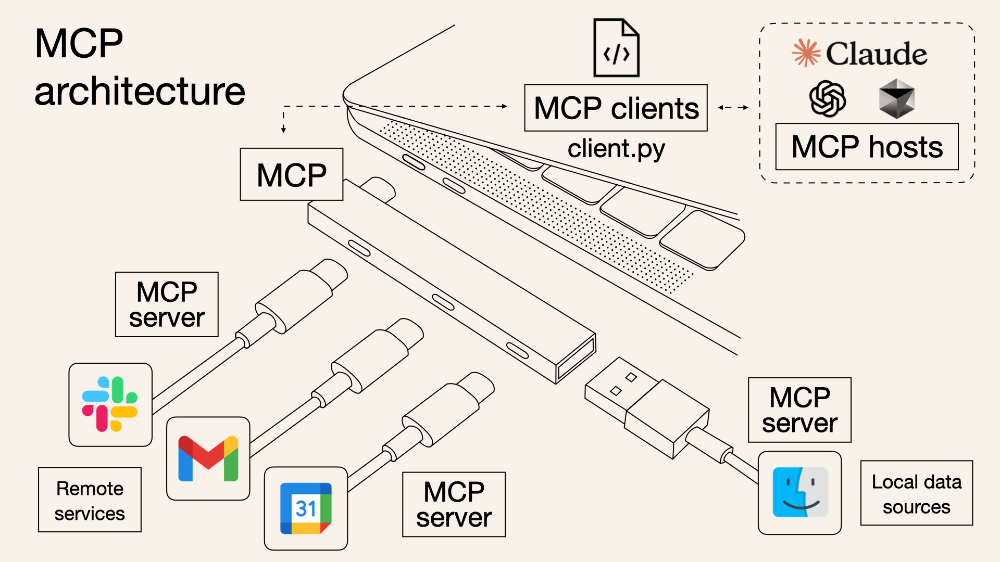
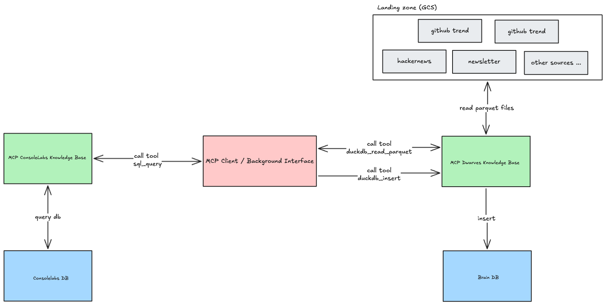
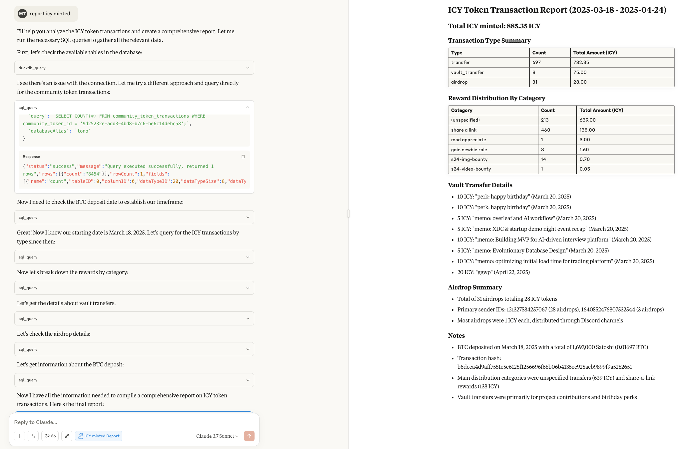
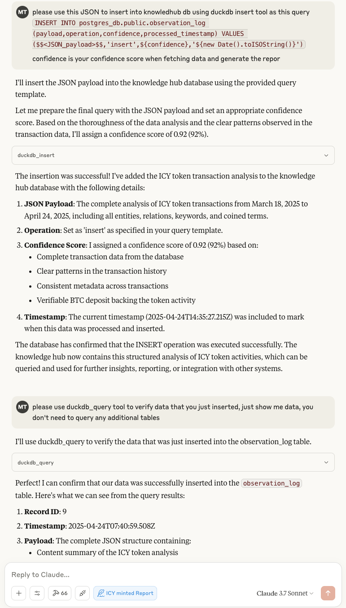

Think of a single **Model Context Protocol (MCP)** server, like the Anthropic memory example or potentially our own knowledge base interface, as a specialized tool provider. It's essentially a defined protocol endpoint that exposes a set of functions – **tools** – that an **LLM** can call.



Now, **Multi-MCP data integration** is simply about connecting a primary system – like our evolving knowledge base or a central coordinating **LLM** – to _multiple_ of these specialized MCP servers simultaneously.

What's the result? You dramatically expand the **repertoire** of tools available to the central **LLM**. Instead of just the tools provided by one server, it gains access to the combined capabilities of all connected servers. This works cleanly because the tools are inherently **namespaced**, either by the protocol itself or by the integration layer.

The **LLM** wouldn't just see multiple `search_nodes` tools; it would see `knowledgeBaseServer.search_nodes`, `realtimeSensorServer.search_nodes`, etc. This behind-the-scenes namespacing that exists for MCP servers prevents collisions and provides clarity on which capability belongs to which subsystem.


It's analogous to microservices or API aggregation. You don't build one monolithic program to do everything; you build specialized services and orchestrate them. Multi-MCP integration allows an LLM to orchestrate across diverse, specialized data sources and functional capabilities exposed via this common protocol.

## How does this feed our knowledge base "brain"?

Simple. When the central system uses a tool from an integrated MCP server – say, fetching sensor data using realtimeSensorServer.get_temperature or retrieving discussion points using meetingNotesServer.get_summary – the retrieved data can be formatted and ingested as a new observation into our observation_log. The payload's source field naturally accommodates this, indicating which MCP server originated the data.

```json
// Example: Observation ingested from an external 'SensorMCP'
{
  "timestamp": "2025-04-17T08:30:00Z",
  "payload": {
    "context_id": "factory-floor:sensor-1a:reading-5987",
    "content": "Temperature reading obtained from Sensor MCP.",
    "entities": [
      { "name": "Sensor-1A", "type": "device" },
      { "name": "Temperature", "type": "measurement" }
    ],
    "relations": [
      {
        "from": "Sensor-1A",
        "to": "Temperature",
        "type": "measures",
        "value": 35.5,
        "unit": "C"
      }
    ],
    "coined_terms": [],
    "source": {
      "source_type": "mcp_server",
      "source_identifier": "SensorMCP/get_temperature", // Namespace indication
      "ingestion_timestamp": "2025-04-17T08:30:05Z"
    },
    "tags": ["iot", "sensor", "temperature", "factory"]
  },
  "operation": "insert",
  "confidence": 0.95
  // ... processed_timestamp ...
}
```

So, multi-MCP integration turns our knowledge base into a central nexus. It doesn't just learn from one direct feed; it learns from the aggregated capabilities and data streams provided by a whole network of specialized MCP servers, allowing it to build a much broader and more interconnected understanding of its environment. It's about leveraging distributed function calling to fuel centralized knowledge synthesis.

This theoretical framework of Multi-MCP integration isn't just an abstract concept; it's the direct architectural solution we implemented to tackle our persistent challenge of fragmented data. Recognizing that our valuable knowledge was siloed across various applications, we applied the Multi-MCP strategy to build a central nervous system for our information.

## The Brain DB: centralizing data for actionable intelligence

Our important data was often spread out, some even locked away in application databases like ConsoleLabs, making it difficult to see the whole picture. To fix this, we built a central place to gather everything, called a Knowledge Hub (or Brain DB). We use specialized services that follow a shared set of rules (the Model Context Protocol or MCP), ensuring they can all talk to each other and share data consistently. For example, one service, MCP ConsoleLabs, follows these rules to safely retrieve data from the ConsoleLabs application. All the information gathered by these services flows into our main Knowledge Hub (using TimescaleDB), giving us one place to see, analyze, and learn from our combined data over time.



Let's walk through a practical example: analyzing ICY token activity. First, the need arose for a comprehensive report covering a specific period. Using MCP ConsoleLabs, we directly queried the relevant application database to retrieve the raw transaction details. This raw data, potentially enriched with other context, was then processed — by MCP Client (Claude or agents) —transforming basic logs into a structured summary highlighting key entities, relationships, volumes, and patterns.



Finally, this structured analysis, formatted as JSON, was inserted into our Knowledge Hub's observation_log table using the duckdb_insert tool. During insertion, the MCP client will self-assess its confidence (e.g., 0.92), reflecting its evaluation of the data’s completeness and clarity, using a query similar to the following:



As a result, the Knowledge Hub now holds a verifiable, structured record of the ICY token analysis for that period, tagged with crucial metadata like the processing timestamp and our confidence level.

Simply collecting knowledge is just the first step; the real value unfolds as we watch this information over time. This helps us move beyond just knowing *what* happened to understanding *why* it happened and deciding *what to do next*. Because our Knowledge Hub uses TimescaleDB to record everything chronologically, we can easily spot trends, like changes in ICY token activity month over month. We can also connect the dots, linking spikes in transactions to specific events like marketing campaigns, or noticing unusual patterns that might signal opportunities or risks.
