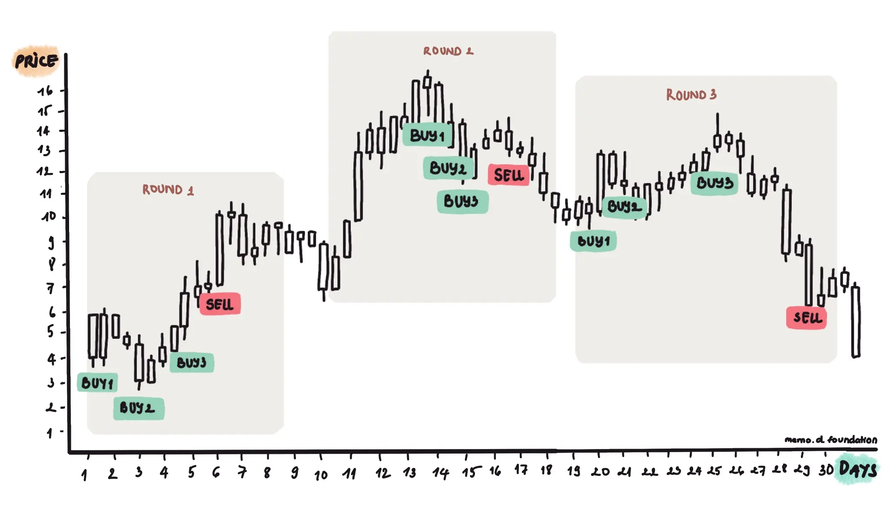
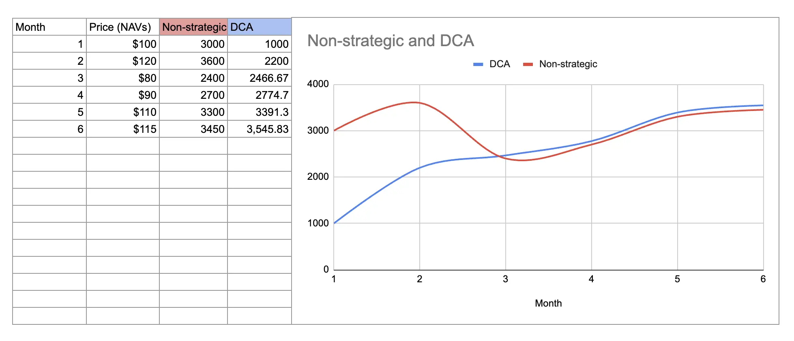

Hey peeps! Ever heard of DCA (Dollar-Cost Averaging)? It's like the hottest strategy in town, and for good reason - it can seriously boost your chances of crypto success. This article is your one-stop shop for all things DCA. I'll break down what it is, the different ways you can do it, and some mistakes to avoid so you can DCA like a pro.

## What is the deal with DCA?

Dollar-Cost Averaging (DCA) is a simple yet powerful investment strategy that can help you minimize risk and maximize long-term returns. With DCA, you **invest a fixed amount of money into an asset** (crypto, stocks, funds, etc.) **at regular intervals, regardless of the current market price**. The goal is to accumulate as much of the asset as possible over time. This strategy is suitable for all investors, especially beginners.

In simpler terms, it's about throwing some money into crypto at regular intervals, no matter if the price is mooning or going down. This way, you average out the cost over time and snag some sweet profits in the long run.

While not a new concept, DCA has been proven effective for decades in traditional markets like stocks and gold. In the high-potential crypto market, DCA has become even more popular. The mentality of "buying more when the price is down" is very common among crypto enthusiasts, especially when the market has been skyrocketing in recent years. While "bottom fishing" can be tempting, DCA is the key to safe and effective investing in a volatile market like crypto.

## How DCA Works

To better understand how this investment strategy works, let's look at an example:
Suppose an investor decides to invest $3,000 over 6 months by buying $1,000 of a specific asset for the first **3 months** and applying the DCA strategy. However, if you want to see the powerful impact of cost averaging, check out the difference between cost averaging and not using the strategy (when you invest the entire $3,000 in month 1).

The scenario would be as follows:

From March onwards, you can see that DCA has increased in value compared to not having a strategy. **This is because the more money you invest at once, the more risk you are exposed to market fluctuations.**

- When investing without a strategy, the $3,000 is subject to the entire decline of March + April and has to take the rest of the time to recover.
- With the DCA strategy, you can minimize the loss by 20% and take advantage of it to catch the bottom and collect more assets.

To implement DCA, follow these steps:

1. Choose the right investment asset for DCA
1. Decide on the investment amount per period
1. Identify your maximum acceptable loss
1. Choose an investment frequency (weekly, monthly,…)
1. Define entry, profit-taking, and stop-loss points

> **Note**: While DCA can be a good strategy, there can be more transaction fees compared to a one-time investment.

## DCA in Practice

In theory, DCA helps you buy an asset at different prices, thereby minimizing the risk of market fluctuations. However, in practice, traders and investors apply DCA in many different ways, specifically as follows:

**DCA in a Bull Market**

This strategy is a way of investing in a rising market by buying a fixed amount of an asset at regular intervals, such as every month. This means that you will buy more of the asset when the price is low and less of the asset when the price is high. The average purchase price will increase over time.

- **Pros:** Buy with the mindset of "making a profit". You aim to buy low and sell high for maximum profit. While buying at higher prices increases your average cost, there's still room for profit if the price keeps rising. This approach lets you potentially maximize your gains.
- **Cons:** Buy more at higher prices can hurt your profit potential. Remember, the crypto market is known for big, unexpected crashes, especially after periods of strong price increases.

Since 2021, this has perhaps been the strategy adopted by large investment funds, such as MicroStrategy, BlackRock, and Fidelity, if you often follow articles on the allocation of capital flows from investment funds.

**DCA in a Bear Market**

DCA in a bear market is the opposite of DCA in a bull market. When falling market, investors buy more of an asset when the price is low and less when the price is high. The average purchase price will decrease over time.

- **Pros**: You can buy assets at lower prices, which could mean higher profits when the market recovers. And regular investing helps you avoid trying to time the market, which can be risky.
- **Cons**: The risk of this method is that hard to know when to buy. It's tough to know when the market will hit its lowest point, so you might buy too early or too late. Prices could keep falling, even if you're buying regularly.

[El Salvador has been consistently "buying the dip"](https://www.thestreet.com/investing/el-salvador-buys-the-dip-again#:~:text=At%20500%20coins%2C%20this%20purchase,150%20bought%20in%20September%202021.) in Bitcoin throughout 2021-2022, driven by the belief of its leaders in Bitcoin's growth. CoinDesk estimates that El Salvador currently holds 2,381 Bitcoin in its treasury, worth a total of $147 million. Most recently, the country said that if it sold all of its Bitcoin now, it would make a profit of over 40%, or $41.6 million.

**DCA for the Long Haul**

A simple way to invest that's perfect for people who want to put their money away for the long term and don't want to worry too much about the ups and downs of the market. It's like putting money in a savings account, but instead of just earning interest, you're also buying shares of an asset, like stocks or cryptocurrency.

- **Pros**: Don't need to be an expert to use this strategy. You can start investing with even a small amount of money. The market has always gone up in the long run, so this strategy can be a good way to grow your wealth over time.
- **Cons**: The price of your investment could go down in the short term, so you could lose money. If you lack knowledge and experience, you will be easily scared by price changes. This can cause you to sell your investments when the market goes down.

Crypto prices can go up and down quickly, making this strategy tricky to use. Still, some traders have pulled it off in the short term to buy at the best prices.

**Flexible DCA**

The flexible DCA strategy takes regular DCA to the next level. You can adjust your investment amount based on the market's ups and downs. So, if the market is falling, you can invest a little more to buy more when prices are low. And when the market is rising, you can invest a little less to avoid buying at high prices.

- **Pros**: You can change how much you invest based on the market and your own finances. This strategy can work for both beginners and experienced investors.
- **Cons**: To make the most of this strategy, you should have some basic understanding of the financial markets.

**Comparison table:**
| Bull Market | Bear Market | Long Haul | Flexible |
| --- | --- | --- | --- |
| Invest in a rising market | Invest in a falling market | Believe that the market will always trend upwards in the long run | Invest based on the market
| Buy a fixed amount of it at **regular intervals** (daily, weekly, monthly,…) | Buy **more of an asset** when the price is low and less when the price is high | Buy a fixed amount of it over a **period** of 3-5 years | Adjust your amount based on the market's ups and downs
| The average purchase price will **increase** over time | The average purchase price will **decrease** over time | Invest without worrying about market ups and downs | The average purchase price will **increase** or **decrease** gradually depending on market trends |

### Can DCA be applied to anything?

Hell no! While DCA is a simple and easy-to-understand strategy, it's not a magic bullet for beating the market. Many investors combine DCA with portfolio diversification to reduce risk.

**DCA is best suited for low-risk assets such as:**

- Bitcoin
- Ethereum
- S&P 500 Index Fund
- ETFs
- Retirement funds (e.g., 401(k))

**Common mistakes when using DCA:**

- **Leverage trading:** Leverage trading (such as margin, futures, etc.) is already inherently risky, as traders use more money than they have. Combining it with DCA amplifies this risk. It's recommended to only use DCA for spot trading.
- **Low-liquidity altcoins:** Even Bitcoin, with its high trading volume, experiences significant price fluctuations. Low-liquidity altcoins pose even greater risks. These altcoins may be poorly designed or pump-and-dump schemes, requiring thorough research before investing.
- **Altcoin/BTC pairs:** While experienced traders may profit from this approach, altcoin/BTC pairs expose you to two layers of volatility: altcoin/BTC pair fluctuations and BTC/USD fluctuations. This can lead to double losses if you use your losing BTC to buy a falling altcoin/BTC.
- **Meme coins:** Meme coins are essentially overpriced jokes. View them as a portfolio diversification tool rather than a DCA strategy target.

Bear in mind that before you start DCAing during a downturn, ask yourself: "How much risk can I handle?" Only DCA with money you can afford to lose, and be prepared for the possibility that some of it might not come back.

Overall, DCA is a long-term investment strategy. Don't get discouraged by short-term market fluctuations. Stay disciplined and consistent with your investments, and you'll be well on your way to achieving your financial goals.

