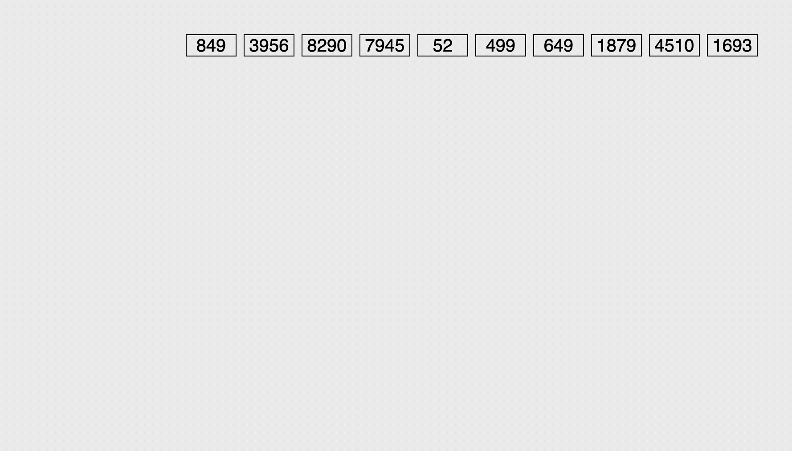

> Radix Sort is a non-comparative sorting algorithm that sorts integers by processing individual digits. Unlike comparison-based algorithms (like Quick Sort or Merge Sort), Radix Sort groups numbers by their individual digits.

## Key Concepts

- **Digit Positioning**: Radix Sort processes digits from the `least significant digit (LSD)` to the `most significant digit (MSD)`.
- **Stable Sorting**: It maintains the relative order of records with equal keys.
- **Counting Sort as a Subroutine**: Radix Sort often uses Counting Sort for sorting digits, ensuring stable sorting at each digit level.

## Steps of Radix Sort

- **Determine the Maximum Number of Digits**: Find the maximum number in the array to understand the number of digits.
- **Sorting by Each Digit**: Use `Counting Sort` to sort based on each digit's place value
  - Initialize Buckets: create an array of buckets for each digit from 0 to the radix minus one (e.g., for decimal numbers, you need 10 buckets).
  - Distribute the Numbers: start with the LSD and move towards the MSD. distribute each number into the corresponding bucket based on the current digit
  - Collect Numbers: collect numbers from the buckets and update the list in the new order
- **Repeat for Each Digit Position**: Continue the process for each digit until all positions are sorted.

## Big O notation

If we take

- `n` is the number of elements
- `k` is the number of digits in the largest number

the time complexity for Radix sort will be `O(n×k)` and the space complexity will be `O(n+k)`

## Advantages

- **Efficiency**: Linear time complexity O(n×k) when k is the number of digits.
- **Predictable Performance**: Performs consistently regardless of the input data's initial order.

## Disadvantages

- **Limited Scope**: Primarily useful for integers or fixed-length strings.
- **Memory Usage**: Requires additional memory for the Counting Sort process.

