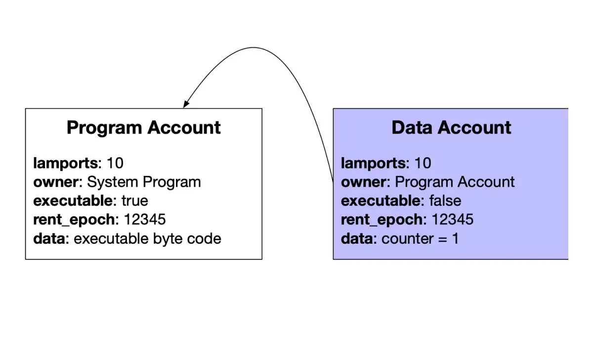

Unlike most blockchain, Solana separates logic and data into two separate components: Program and Account. What that means is that instead of storing data inside variables internally, Programs interact with external data stored in Accounts with the ability to mutate them.

## Account model

There are 3 kinds of accounts:

- Data accounts store data (which we use the most).
  - System owned accounts.
  - PDA(Program Derived Address) accounts.
- Program accounts store executable programs.
- Native accounts that indicate native programs on Solana such as System, Stake and Vote.

Each account has an address (usually a public key) and an owner (address of a program account). The full field list an account stores is found below.

| Field      | Description                                    |
| ---------- | ---------------------------------------------- |
| lamports   | The number of lamports owned by this account   |
| owner      | The program owner of this account              |
| executable | Whether this account can process instructions  |
| data       | The raw data byte array stored by this account |
| rent_epoch | The next epoch that this account will owe rent |

## Ownership rules

There are a few important ownership rules:

- Only a data account's owner can modify its data and debit lamports.
- Anymore is allowed to credit lamports to a data account.
- The owner of an account may assign a new owner if the account's data is zeroed out.

Technically, the Programs are special kinds of Accounts marked as `executable` whose entire purpose is to store the compiled code of Program. The program accounts do not store state.

For example, if you create a counter program that lets you increment a counter, you must create two accounts, one account (account A) to store the program's code (`executable = true`), and one (account B) to store the counter value and account A must be the owner of account B.

## Rent

- Storing data on accounts costs SOL to maintain, and it is funded by what is called `rent`.
- An account is considered rent-exempt if it holds at least 2 years worth of rent. Currently, all new accounts are required to be rent-exempt.
- Use the `getMinimumBalanceForRentExemption` RPC endpoint to calculate the minimum balance for a particular account size.
- If the account does not have enough to pay rent, the account will be deallocated and the data removed.

## References

- https://docs.solana.com/developing/programming-model/accounts
- https://solanacookbook.com/core-concepts/accounts.html

